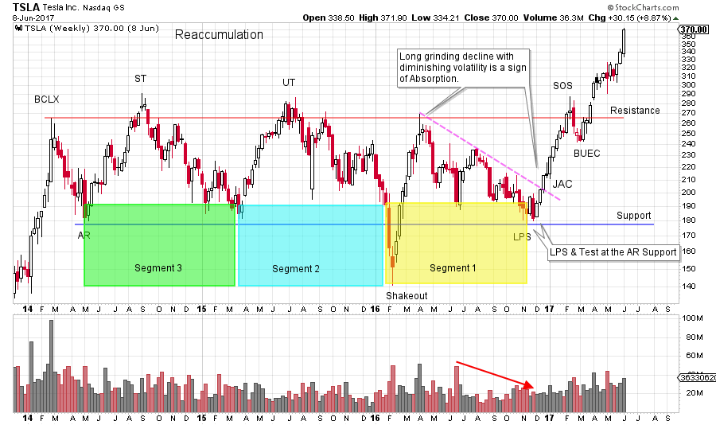
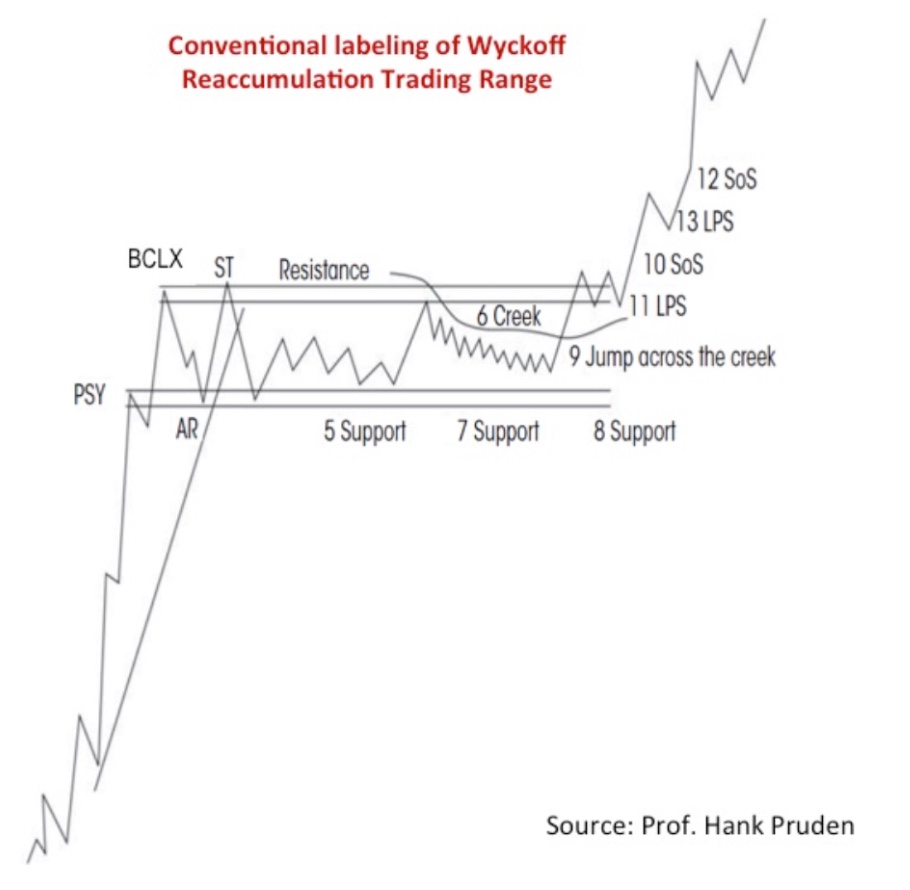
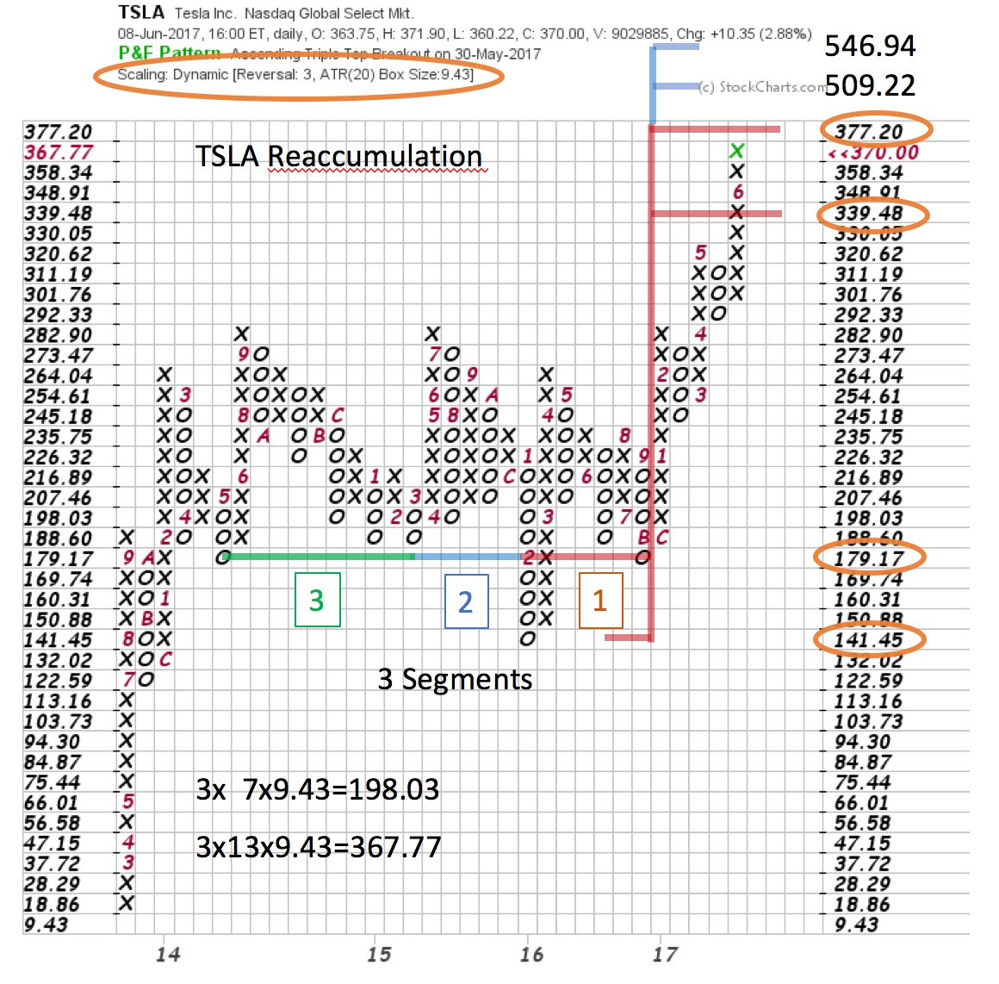

# Shorts Find TSLA Shocking

URL: https://articles.stockcharts.com/article/articles-wyckoff-2017-06-shorts-find-tsla-shocking/
Date: June 10, 2017 at 08:00 AM
Author: Bruce Fraser

Tesla has just achieved a market capitalization that is larger than either Ford or General Motors. Currently Tesla manufactures just two different models (with a third on the way). How is it possible that Tesla has a valuation that exceeds these two Detroit behemoths? As a Wyckoffian I will tell you that I have no earthly idea. Could an analysis of the charts reveal the intentions of the large informed interests (the Composite Operator)? Is Tesla done going up, or is there more charge in the batteries to propel this stock price higher?

Tesla has been ‘climbing the wall of worry’ for a number of years. Recently short sellers have been squeezed by a stellar rally that has taken TSLA out of a multi-year trading range and into a new markup phase. In early 2016, we studied the Point and Figure Distribution Paradox (click here for a link) with TSLA as our case study. We managed to publish this study the week of the Shakeout low for TSLA. There was three confirming PnF counts which nested in the same price zone plus a Climactic Shakeout of the multi-year trading range. Let’s bring the TSLA chart studies up to date as much has happened since this original post.

---

We will not reprint the original charts here, but it is recommended that you start with a study of this prior post.

(click on chart for active version)

Once the Shakeout was reversed, a dynamic rally unfolded that went nonstop to the Resistance line. Thereafter, a decline ensued where TSLA drifted downward for eight months to the Support line. Volume generally diminished during the final descent, indicating the supply of stock for sale was being systematically absorbed. Note in the Reaccumulation schematic below how the final decline toward Support is drawn out and lacks volatility. This is evidence that absorption is nearly complete and a sign of the intention of the Composite Operator (C.O.). Any doubt this is Reaccumulation (in contrast to Distribution) is cleared up when a quality rally lifts TSLA in a Jumping action back to the Resistance line. A Sign of Strength (SOS) forms followed by a shallow, and brief, reaction into a BUEC (Backup to the Edge of the Creek). TSLA is now poised on the Springboard for a Jump into a new uptrend.

How much of a charge is in the PnF batteries? Three Segments are now evident in the Reaccumulation. The PnF construction method is 3 box reversal and ATR (20) scaling. Segment 1 (brown line) projects a count to 339.48 / 377.20. Segment 2 (blue line) projects to 509.22 / 546.94. TSLA’s stock price is accelerating into the Segment 1 PnF count objective now. Reaching an objective does not necessarily mean the end of the advance. A ‘Change of Character’ in the vertical bar chart would need to be detected. At a minimum, a Buying Climax followed by an Automatic Reaction and then a Secondary Test would likely result in a pause in the advance.

If a Reaccumulation does form here, a PnF reconfirming count to the Segment 2 objective would be nice, but not necessary. Also, a Reaccumulation could take months to a year or more to complete, prior to the next leg up to the Segment 2 PnF objective. Distribution is possible after a stopping action and we would depend on our Wyckoffian tape reading skills to provide advance warning. In the meantime, ‘the trend is our friend’.

All the Best,

Bruce

Homework: Count the 3rd segment. Study the PnF chart in the prior TSLA post (click here for a link). Note that each move was preceded by a Cause forming. As Wyckoffians we expect a Cause to precede an Effect. Large Causes lead to large Effects. Small Causes lead to small Effects. Continue to develop this very powerful Wyckoff skill.

For additional reading on the subject of Cause and Effect (click here and here and here).
