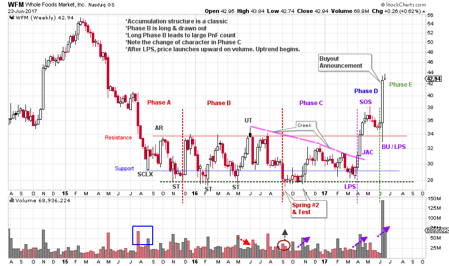
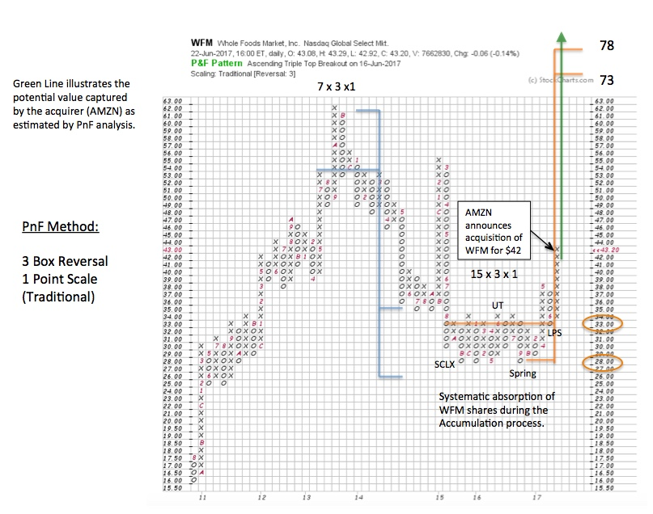
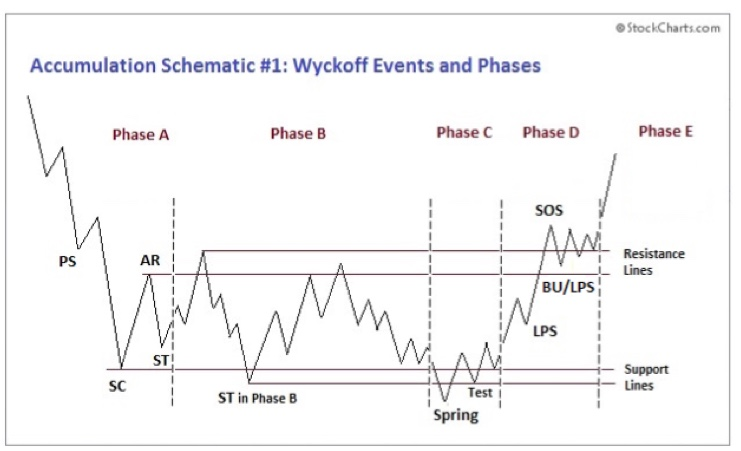

# WFM Is Swallowed Whole

URL: https://articles.stockcharts.com/article/articles-wyckoff-2017-06-wfm-is-swallowed-whole/
Date: June 26, 2017 at 03:11 PM
Author: Bruce Fraser

Whole Foods Market agreed to be acquired by Amazon.com, Inc. on June 16, 2017. This ‘disruptive’ move by Amazon.com roiled the retail stocks, which were already sagging badly. The price drops extended throughout the retail brick-n-mortar stocks. Investors in these retail stocks feared that AMZN would strategically leverage the acquisition with a physical presence at every WFM store location.

As Wyckoffians our mission is to discover and follow in the footsteps of the large Composite Operator (C.O.). The C.O. conducts campaigns in stocks that have the potential to move in a sustained and significant upward manner. They help this process along by absorbing a significant amount of the available shares of stock (during Accumulation) and removing them from the market. The C.O. community, in aggregate, will wait for much higher prices before they will be willing to sell any of their shares. With stock in the strong hands of the C.O., it means a marginal increase in demand will dramatically lift a campaign stock into a new uptrend. Wyckoff’s approach was to look for the footprints of the C.O. in the price and volume action on the vertical bar chart. And next, to estimate the potential extent of the move with Point and Figure analysis.

---

Whole Foods Market is an interesting case study because the C.O. was pre-empted in their attempt to campaign WFM by the AMZN buyout proposal. It is not often that the C.O. gets out maneuvered, but it appears to have happened here. Let’s look at the charts and try to back into what took place.

(click on chart for active version)

In the Accumulation structure, we look for the activities of the C.O. absorbing shares in anticipation of a new sustained uptrend. Phase A is the stopping of a bear market downtrend. An Automatic Rally (AR) and Secondary Test (ST) set the conditions for a new range bound market for the stock. Phase B is interesting because it is long in duration. Four distinct drives from Resistance to Support take place over 9 months. Much stock is changing hands as a result of all of this volatility. Weak hands are selling and strong hands are absorbing. Note the sudden jumps and drops while no price progress is taking place, a classic Phase B characteristic. A result of such volatility is the building of a significant Point and Figure (PnF) count. Phase C, which is typically the briefest, is also long. Note the distinct difference in the behavior of price (and volume) from Phase B to C. Where B is volatile and abrupt, C is calmer. During Phase C, price lives in the bottom half of the Accumulation range and there are only two moves, one up and the other down (over 7 months). The message here is that most of the available supply of WFM stock has been absorbed. The C.O.’s trick is to keep the price in the bottom part of the range. This is very discouraging to the retail owners of WFM who doggedly held on to their shares throughout the 2015 decline and subsequent Accumulation. Frustration and capitulation is setting in and many are giving up and selling. The #2 Spring begins Phase C and results in 8 weeks of probing the lows of the Support area. The rally that follows has promise with big bullish up bars and expanding volume. But it stops about halfway into the range, makes a lower high, and grinds back downward toward Support. Compare this Phase C decline to the Phase B declines. It drifts down slowly and volume is modest. This is a huge tipoff that WFM is nearly fully absorbed by the large C.O. interests. We label the May ’17 test of the Spring low as a Last Point of Support (LPS). The Jump that follows removes any doubt about what was brewing during the 20 months of trading range that preceded this ‘change of character’. The hot pink line is an estimation of where the rolling, overhanging Resistance has been forming and which we call a ‘Creek’. The ‘Jump Across this Creek’ (JAC) is on expanding price spread and rising volume. Phase C concludes when price is ready to Jump from trading range to trend.

The three classic places where Wyckoffians look to initiate trades and add to their positions are; 1) the Test of the #2 Spring, 2) the turn off the LPS low (Jumping the Creek in this case) 3) the Backup after the SOS (BU / LPS). Phase D is where it becomes apparent that a large supply to demand imbalance exists and the result is leaping prices up and out of the Accumulation and into a new uptrend (Phase E). Now it is time to take a PnF count of the entire Accumulation and estimate the upside potential for this new emerging Wyckoff Campaign.

With our PnF Horizontal counting technique, we can estimate the price objective generated by the Accumulation range evaluated in the bar chart above. Once price has Jumped the range, final counts can be taken. In this case it is estimated that a potential of 73 / 78 is possible. The ‘countline’ is 33, which suggests a campaign potential of 40 to 45 points. Another way to think of this is; how much of a discount is WFM trading at (assuming PnF objectives as a measure of full value). The prior peak was at 62 and new PnF objectives seem reasonable and attainable. When a large enterprise such as AMZN evaluates the strategic benefits of a merger with WFM, a purchase price of the entire company in the low 40s is a bargain akin to the deals consumers enjoy when they order goods online. At a $42 purchase price, we could argue that AMZN is getting a $31 to $36 discount from full price in the purchase of Whole Foods Markets (based on PnF estimates). We can only imagine the changes AMZN has planned that will further enhance the value of WFM as one of their cornerstone assets.

It is not often that the C.O. gets ‘short-changed’ in one of their campaigns. Here is an example of how that can happen. When a large enterprise buys out an entire company at the breakout point where new uptrends are born (Phase D & E), the C.O. is preempted. They have been scooped. The C.O. may be the apex-predator of the Wall Street ocean, but there is an even larger creature out there. The drama we are seeing with AMZN and WFM is such an example. An event like this is rare, but it does happen. We as Wyckoffians will sometimes hook the big fish, only to see it ripped away in dramatic fashion. All of which evokes the thought: ‘I think we need a bigger boat’.

Compare the Phases of this schematic to the WFM chart above. Note the similarities and the differences. Observing these distinctions is another step toward your Wyckoff Mastery.

Amazon.com is making a cash offer for Whole Foods Markets and thus it is trading near the cash purchase offer of $42 per share. The WFM board of directors appears to have embraced this offer. There is some buzz that other offers are brewing from other bidders, this is beyond our ability to know and therefore this trade is likely concluded. But it is a classic case study.

All the Best,

Bruce

Additional Reading:

Review of Accumulation with Schematics (click here)

Publishing schedule: Wyckoff Power Charting will not publish this upcoming holiday weekend. Happy Independence Day.
