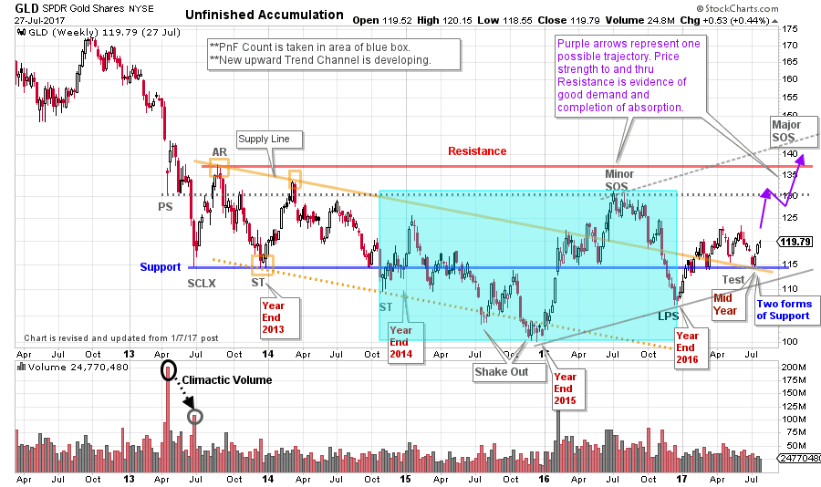
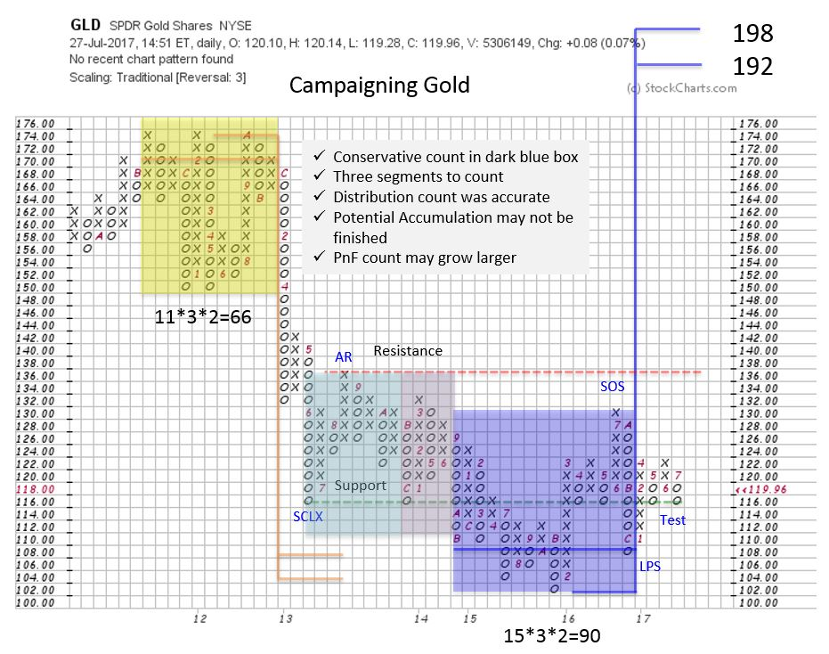

# Campaigning Gold

URL: https://articles.stockcharts.com/article/articles-wyckoff-2017-07-campaigning-gold/
Date: July 29, 2017 at 12:05 PM
Author: Bruce Fraser

The Wyckoff Method is designed for the campaign oriented trader. Discipline, patience and vision are the skills required to conduct a bull or bear campaign from start to finish. Wyckoff provides outstanding tools for executing on such a trading orientation. Point and Figure offers a technique for estimating the extent of a price move. Trendline analysis has unique methods for examining and gauging the quality of the unfolding trend. Accumulation and Distribution analysis helps to determine the readiness of price to emerge into a fresh new uptrend or downtrend. Combining these skills makes for a sturdy approach to campaign a trend from start to finish.

---

A recent case study of ours is the gold market. Gold (GLD will be used as a proxy for gold) stopped a major downtrend in 2013 with a Selling Climax (SCLX). Thereafter a multiyear trading range formed. In prior posts, we have studied GLD with an eye toward it being in a very long-term Accumulation. We called it an ‘Unfinished Accumulation’ in a January of 2017 post (click here for a link). Only upon the completion of the Accumulation will the long term markup phase begin. The goal of the campaigner is to invest near the start of the markup phase as the Accumulation is coming to a conclusion (classically Phase C, D & E). Let’s bring GLD up to date and gauge whether GLD is still under Accumulation, and if it is any closer to being campaign worthy.

(click on chart for active version)

A minor Sign of Strength (SOS) formed at the Resistance line drawn at Preliminary Support (PS). Wyckoffians are on the lookout for a Last Point of Support (LPS) after a SOS. A 6-month decline concluded at the end of 2016 which we label a LPS. In the January post we were looking for a rally above the Support line as a critical indication of unfolding Accumulation. And this occurred in the rally after year end. GLD climbed above Support and the Supply Line of the trend channel during this 2017 rally. Wyckoffians expect a rally and then a Test to follow the LPS. And a super-duper Test followed. This was a Test with three dimensions. First, GLD corrected back to the Support Line after getting above it in the first half of 2017. Second, price corrected back to the Supply Line which became key Support (and the Supply Line precisely crossed the Support line at the moment of the Test). Third, the Test clocked in at the end of the second quarter. The decline into the second quarter end was much smaller, when compared to the year-end 2016 selling into the LPS.

What to look for next? GLD continues to hover near Support and in the bottom half of this multi-year trading range. Completion of Accumulation would result in a robust rally to Resistance. GLD price needs to work up to the Resistance line in a steady advance. This is a sign that Absorption is nearly done and the balance of power resides with the Composite Operator (CO). The purple arrows illustrate a possible trajectory for GLD. Now that the old quarter has ended, selling has subsided. Wyckoffians will study the tone of the rally that appears to be unfolding. Worrisome signs would include; a slow advance with numerous corrections, inability to rally above the minor SOS, or a failure back below the Support level. Ideally, a brisk advance to and through Resistance sets up a Major SOS. Thereafter a pause (either a BU or another LPS) is expected, but not necessary.

A modest risk buy zone would be on the turn up from critical Support with stops below the LPS (or Test) lows. Future investment tranches would be placed on a scale up as GLD is demonstrating it can mark up and out of the Accumulation area.

In assessing a campaign we start with a conservative PnF count. In the near term GLD is expected to prove itself by getting above the Resistance line at about 137. But the conservative goal is determined by the count in the blue box (192 / 198). The campaigner must determine if this profit goal is worthwhile. Note that two additional segments are highlighted which increases the count potential. Wyckoffians will generally pencil in these counts but focus on the conservative objectives initially.

It takes a certain kind of trader to conduct Campaigns. It is often like watching ‘paint dry’. And not every trader is interested in this approach. There are tools and skills in this approach that will be useful to all Wyckoffians. Also, these techniques can be used very effectively for campaigning in smaller timeframes (such as daily and intra-day periods).

An excellent campaign case study can be found in Dr. Hank Pruden’s essential book ‘The Three Skills of Top Trading’ (Wiley 2007). The ‘San Francisco Company’ case on page 161 is a classic. We will do more on the art of the campaign in future posts.

All the Best,

Bruce

Announcement: ‘Best of Wyckoff 2017 Online Conference’

Spend the day with this legendary collection of Wyckoff and Technical Analysis experts; Dr. Hank Pruden, David Weis, Dr. Gary Dayton, Todd Butterfield, Stephanie Kammerman, Corey Rosenbloom, Roman Bogomazov and your devoted blogger (me). The entire day will be recorded and available for review. For more information and to register now, please click here.
