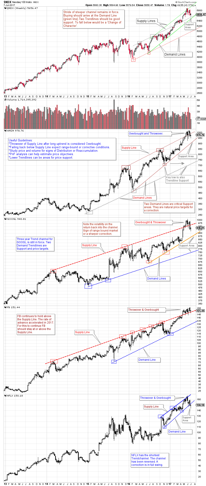

# FANGtastic Trendlines

URL: https://articles.stockcharts.com/article/articles-wyckoff-2017-07-fangtastic-trendlines/
Date: July 08, 2017 at 12:20 PM
Author: Bruce Fraser

The Wyckoff Method for constructing Trendlines is unique. They inform our analysis and support sharper tactics. Trendlines and Trend Channels bring a chart to life. We have used significant amounts of ink drawing and discussing trendlines in this column (below are links to prior columns on Trendline construction and analysis). Continue to practice identifying the stride of the advances and declines on your favorite charts using these techniques.

Each Wednesday afternoon, Roman Bogomazov and I conduct a Market Outlook and Stocks Review session online. We analyze the major market indexes as well as oil, gold and other futures contracts and leading stocks from a Wyckoffian perspective. Our goals are to strengthen traders’ real-time processing of market conditions, including building alternative price scenarios and crafting the best trading tactics under each scenario. To learn more about these sessions, please click here.

---

The study below comes from our Market Review sessions. It is a Trendline analysis of the NASDAQ 100 and four FANG stocks. These FANG stocks, in unison, became ‘Overbought’ above their respective ‘Supply Lines’ after multi-year uptrends. For a number of weeks these FANG stocks persisted in an Overbought condition above their Trend Channels. Recently three of the four FANG stocks dipped below their Supply Trendlines and back into their Trend Channels. What might we expect if price stays below these Trendlines? Is it the start of a correction for these FANG stocks? Can the Trendlines help to determine the depth of a correction?

(click on chart for active version)

Two Trend Channels are at work with the NASDAQ 100 Index (NDX). Most recently the NDX became overbought above the steeper of the two channels and had a Throwover of the major channel. Currently NDX is above the major channel. Staying above the Supply Line of this channel would argue the steepening rate of the advance is still in force and the uptrend can continue. We see two Trendlines just below NDX’s current position. These represent important forms of Support. Continuation of the uptrend will likely depend on NDX bouncing off these Trendlines. To dip below them would put the NDX at risk of a correction.

There are numerous FANG style stocks. Here we look at four iconic examples (FB, AMZN, GOOGL, NFLX). Their uptrends are very long in duration, and well defined. Wyckoffians use Trendlines and Channels to characterize the nature of advancing and declining trends. Demand and Supply lines become reflecting barriers of Support and Resistance as prices stair-step along in their trends. Here we can see this phenomena in action.

Each of these stocks has become Overbought by jumping above the Supply Line of their Trend Channels. Three of the four FANG stocks profiled are back below their Trend Channel Supply Lines (while NDX is still above). Only FB remains above, which makes it the strongest of the four. NFLX has corrected through its channel (which is smaller). Falling back into the Trend Channel after becoming Overbought suggests some form of correction is taking place for these FANG stocks. If these stocks can quickly get back above their Trendlines then their upward path can continue. Useful tools for determining the potential extent of a correction are Point and Figure analysis, and Demand Line studies.

The charts above is annotated. Please take time to study them individually. Note how the Trendlines bring each chart to life. Consider tactics. Zoom in and try to determine if Distribution is forming. What would need to happen to reestablish each stocks uptrend?

All the Best,

Bruce

Additional Resources:

Making the Trend Your Friend (click here)

The Unfriendly Trend (click here)

Trendapalooza (click here)
