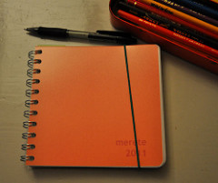
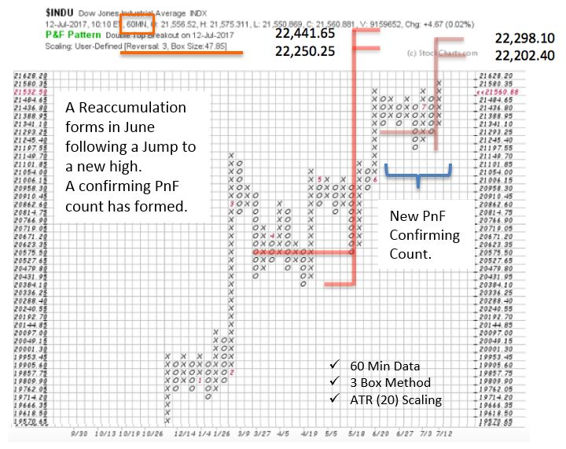

# Point & Figure Diary

URL: https://articles.stockcharts.com/article/articles-wyckoff-2017-07-point--figure-diary/
Date: July 15, 2017 at 11:44 AM
Author: Bruce Fraser

Regular readers have been following the epic saga dating back to 2011, when Dr. Hank Pruden published his Point and Figure (PnF) count for the new bull market. This count projected to a range of 17,600 to 19,200 for the Dow Jones Industrial Average ($INDU). When this objective was met we said: ‘But wait, there is more’. Almost exactly a year ago, in this blog, we revisited the original Accumulation and found that an additional count could be added to the PnF price objective. The 17,600 to 19,200 count was very useful as the $INDU was stopped in this range for more than two years. That range produced a Stepping Stone Reaccumulation PnF count. The larger Accumulation count and the new Reaccumulation count approximately confirmed each other (click here to review these PnF charts). The cluster of count objectives target 22,000 to 24,500. As we move toward these price targets, new Reconfirming counts continue to be generated. This brief update is to illustrate a new count that arrived in the month of June since our last post on this topic (these PnF counts can form quickly). Links to the prior posts are below.

---

We use 60-minute data and ATR (20) scaling to generate this PnF study. In the month of June, a Reaccumulation formed matching the previous and larger PnF count. Recall that when the Reaccumulation count approximately matches the prior count the trend is often set to resume. This week $INDU jumped to a new high just as the most recent Reaccumulation equaled the prior objective. This is an obscure timing tool that often comes in handy (click here for more on this technique).

As the Dow Jones Industrials stair steps upward, it is appropriate to ask if the count generated from the chart above is the final high? Recall that our price objective window reaches to nearly 24,500. We will continue to use our Wyckoff tool box of chart analysis, trendline studies and Point and Figure counts to light the way to the conclusion of this campaign, wherever it may take us.

All the Best,

Bruce

Additional Reading:

Point and Figure Pie in the Sky? (click here for a link)

More Pie. Bigger Sky! (click here for a link)
