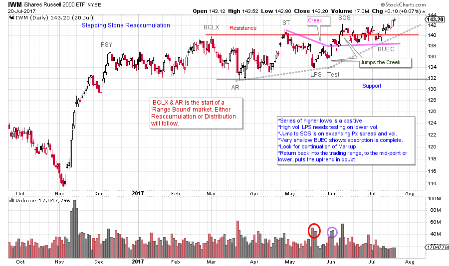
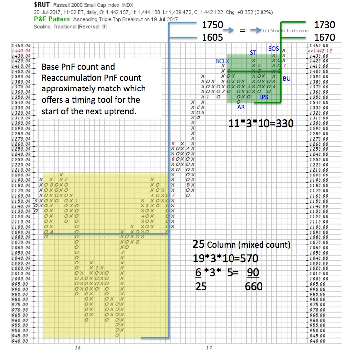

# The Hustling Russell

URL: https://articles.stockcharts.com/article/articles-wyckoff-2017-07-the-hustling-russell/
Date: July 22, 2017 at 08:00 AM
Author: Bruce Fraser

Wyckoffians need to stay flexible and be willing to change their minds. It is an acquired skill to re-analyze charts with fresh eyes. We should practice this each day. Recently we studied the mid-capitalization and the small-capitalization indexes (click here for a link to the post). Here let’s re-analyze the Russell 2000, with fresh eyes.

---

These smaller-cap index uptrends stopped in December 2016. Meanwhile large-cap growth stocks have enjoyed stellar performance in 2017. The advent of a weak dollar and emerging leadership of international stocks suggest a new rotation. Will this shift begin to benefit smaller stocks (represented here by the Russell 2000)?

(click on chart for active version)

Let’s take a fresh look at the Russell 2000 (we will study the IWM ETF to view the volume). The climactic rush upward in December is labeled Preliminary Supply (PSY). The thrust into March is the Buying Climax (BCLX) as it is followed by a ‘Change of Character’ price drop as volume expands and price volatility is evident. This is an indication that new Supply is present. Resistance and Support are now set. A ‘Range Bound’ market is beginning. The prior post ended at the Last Point of Support (LPS) where a rally to resistance was anticipated. The LPS decline is accompanied by high volume, which suggests large sellers are still present. This LPS is a higher low, a clue that a Stepping Stone Reaccumulation (in contrast to a Distribution) could be forming. The Test that follows is on lesser volume, thus the sellers are becoming exhausted (and another higher low). The rally following the Test is on good volume and widening spread. This is a Jump Across the Creek (JAC). Two good things follow. First a higher high pushes price into a Sign of Strength (SOS). Secondly the Backup to the Edge of the Creek (BUEC) is very shallow. Now IWM is lifting away from the Resistance area. Following a BUEC we would expect ease of movement into a new uptrend.

This Range Bound market appears to be resolving into a new uptrend. Next, we would look for IWM to demonstrate relative strength leadership vs. the S&P 500 and the Dow Jones Industrials to confirm this new trend and rotation of emphasis. Now let’s seek guidance from Point and Figure (PnF) analysis for potential price objectives.

A base forms (yellow box) between 2015-16 and projects to 1605 / 1750. A deep base results in a wide price target. The Reaccumulation (green box) now approximately confirms the base count. We watch for the uptrend to resume when the Reaccumulation count matches the base count. And that appears to be happening. Note that the Reaccumulation PnF count is taken back to the decline following the BCLX. There is still room to run in this bull trend for the Russell and it seems the markup phase out of the Reaccumulation structure is just beginning.

Caution is warranted if $RUT returns back into the middle area of the current trading range. Failure back into the trading range after a Jump out would be an important Sign of Weakness. A drop back below the Resistance line on expanding volume and widening price spread could be an Upthrust After Distribution (UTAD). This condition is the completion of Distribution and the start of a markdown phase. Be on the alert for this sudden and unexpected change of character.

What is our lesson here? An important stopping action (PSY, BCLX, AR) will result in either a Stepping Stone Reaccumulation (continuation of the trend) or Distribution (trend reversal). Often it is in the second half of the trading range structure when the market tips its hand. Being willing to continually approach these junctures with fresh eyes will keep Wyckoffians nimble and ready to act when the time is right for a trendless market to become active.

All the Best,

Bruce

Announcement: ‘Best of Wyckoff 2017 Online Conference’

This day-long virtual conference will deliver an all-star cast of world class Wyckoffians into your home or office. If you cannot be there for the live presentations on August 19th, all attendees will have access to the videos for one year. For more information and to register now, please click here.
