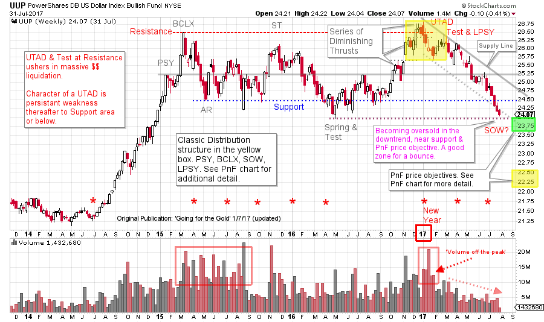
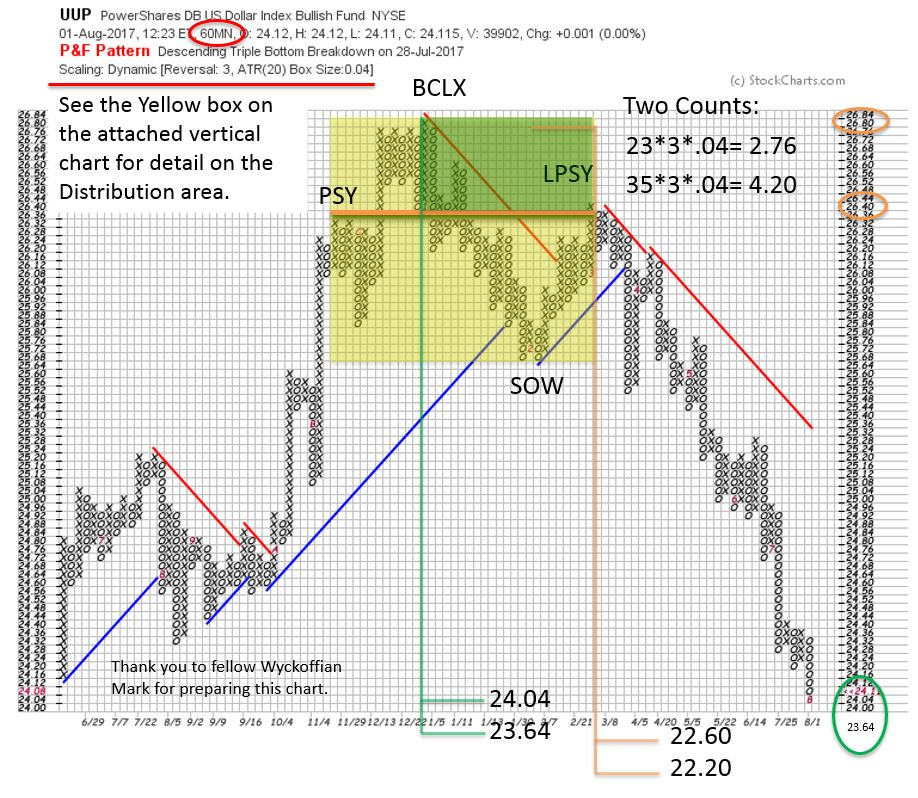

# A Dollar for Your Thoughts

URL: https://articles.stockcharts.com/article/articles-wyckoff-2017-08-a-dollar-for-your-thoughts/
Date: August 01, 2017 at 08:27 PM
Author: Bruce Fraser

The dollar has been sinking since the end of 2016. Recently there has been much attention and commentary from the financial community on the impact of this weakness. A falling dollar typically helps U.S. exporters by lowering the price of their goods in world markets. A lower dollar imports inflation by raising the price of the many goods manufactured overseas and sold in the U.S. Rising inflation can have an effect on the level of interest rates. These effects typically manifest over many months, and sometimes years of currency weakness. If there is a change in the winds for the currency markets, it is just beginning. Let’s have a Wyckoffian look at the dollar and try to sort out the present position and probable future direction of this important currency.

---

(click on chart for active version)

On January 7th, 2017 (click here for a link) the dollar was evaluated in a post about Gold. Resistance was formed by a Buying Climax (BCLX) in the first quarter of 2015. Using the Dollar Index (UUP) as a proxy for the currency we evaluated a weekly chart. UUP had become range bound after the BCLX and the Automatic Reaction (AR). An Upthrust formed at the end of 2016 upon a throwover of the Resistance line. At the time, we looked for upcoming dollar weakness to put a floor under the weak gold market and to help catalyze a rally. And that did happen. But there is more!

Note the volume on the turn down off the Upthrust peak, it is very high. ‘Volume off the peak’ is an indication of Distribution and active selling by the Composite Operator (CO). In February ’17 a rally of low quality, on less volume, demonstrates a lack of demand for the dollar. We label this both a ’Test’ of the UTAD and Last Point of Supply (LPSY). We must always be alert for an Upthrust After Distribution (UTAD) because it is an exhaustion move (like a Spring during Accumulation). A UTAD completes Distribution; price weakness follows and is persistent to and often through the Support area. And that is just what happens next. A trend channel (Supply Line) can be drawn from the UTAD which contains the price action of UUP to the Support area. Note that the dollar’s decline began accelerating. Now UUP has thrown under the trend channel while accelerating downward and is in the range of two important Support lines. Volume is diminishing during the late stages of this decline, which shows selling is moderating. A rally is possible soon.

The decline from the UTAD is more intense than either prior decline in the trading range. We will closely study any rally that follows. If there is very little lift in the rally, but more of a pause, then UUP is likely hovering under the ICE. This is a position of weakness and typically the downtrend resumes quickly (after a few days to weeks). A rally to the mid-level of the trading range is likely a LPSY. The rally to the LPSY will typically take longer, and appear stronger. This LPSY scenario will likely result in another leg down and out of the Distribution area. Either of the above events could indicate that the dollar is in a new bear market.

This Point and Figure (PnF) chart isolates and evaluates the area around the UTAD. Two PnF counts form there. The smaller PnF is in the range of being fulfilled now. An accelerating decline, Support at the bottom of the trading range and a PnF count being completed is a combination for a short term low forming. The larger PnF price objective is substantially below the trading range. Even if this larger PnF objective could be reached, an intervening rally (as addressed above) is likely to occur.

The red asterisks on the vertical chart indicate the end of a quarter coinciding with a turn up or down in the UUP. Not every quarter brings a reversal. But there are a number of meaningful turns that coincide with quarter end. The most dramatic being the UTAD clocking in at the end of 2016.

The bullish case would require UUP to stabilize somewhere in this area, and have a steady rally back to the Resistance area, thus retracing all the ground lost in the first half of 2017.

If either of the bearish UUP scenarios develop, look for the classic measures of inflation to heat up in the months ahead.

All the Best,

Bruce

Announcement: ‘Best of Wyckoff 2017 Online Conference’

Spend the day (August 19, 2017) with this legendary collection of Wyckoff and Technical Analysis experts; Dr. Hank Pruden, David Weis, Dr. Gary Dayton, Todd Butterfield, Stephanie Kammerman, Corey Rosenbloom, Roman Bogomazov and your devoted blogger (me). The entire day will be recorded and available for review. For more information and to register now, please click here.
