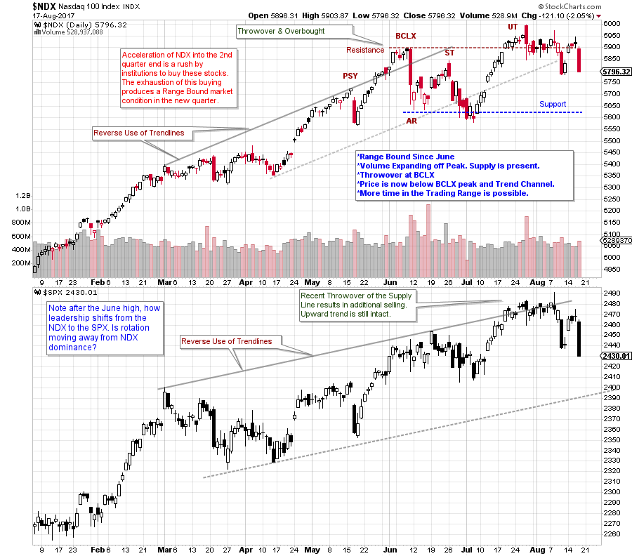
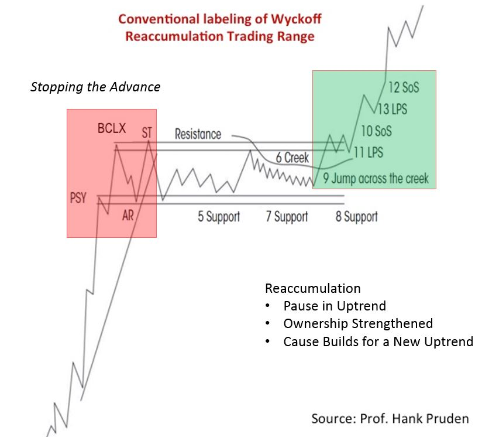

# Range Bound NDX

URL: https://articles.stockcharts.com/article/articles-wyckoff-2017-08-range-bound-ndx/
Date: August 18, 2017 at 07:00 AM
Author: Bruce Fraser

Mr. Wyckoff called his charting methodology ‘Tape Reading’. Determining the present position and probable future direction of prices from their own action. Prices have tendencies which can be detected on the charts. Context is the idea that recent price action will provide clues about what to expect next. This is at the core of how to use and profit from the Wyckoff Method.

In our Market Outlook and Stocks Review webinars (Wednesday 3pm PDT), Roman and I work with our attendees to develop mastery around anticipating the tendencies of the markets. One of the most valuable mastery skills is identifying (early on) when a trending market becomes a ‘Range Bound’ market. In the June Market Outlook sessions, we began observing a ‘Change of Character’ in the Nasdaq 100 Index. This change of context, we concluded, would have consequences for the action of this index for the weeks, and possibly months to come. Let’s review how the Wyckoff Method informs our analysis and tactics with a case study of the current position of the NASDAQ 100 (NDX) Index.

---

(click on chart for active version)

A ’Reverse Use of Trendlines’ establishes an upward stride and a trend channel. A Throwover (and Overbought condition) of the channel is accompanied by a rush upward into a Buying Climax (BCLX). This crescendo of the NDX arrives after a long uptrend. Note the minor test of the BCLX four days later. Then a massive down bar jolts the NDX with a return back into the channel. This is a ‘Change of Character’ and Wyckoffians would conclude that a ‘Range Bound’ market will likely follow. Resistance is formed by the BCLX and Support by the low of the Automatic Reaction (AR). Volume is high off the peak and indicates the presence of Supply. Large interests and possibly the Composite Operator (C.O.) are selling large amounts of stock. We look for three general scenarios to accompany a new Range Bound environment. First is a pause in the uptrend, called a Reaccumulation. Second is a reversal into a bear market decline through the process of Distribution (rarer as bear markets do not come along often). Third is an intermediate decline that does not interrupt the major bull market uptrend. In all cases the uptrend is paused for some period of time. Reaccumulation is most common as it is a pause in prices that eventually resumes into a fresh uptrend, and tends to happen repeatedly in a bull market. But, we must be on the lookout for scenarios 2 and 3.

Note how NDX slightly exceeds the AR defined Support Line but then it holds at the July low (which is also a breach of the trend channel). A rally follows with 12 up days to the Resistance defined by the BCLX. This rally has climactic qualities and is not sustainable. Then an Upthrust and an outside reversal bar in late July concludes the advance. This is latent Supply which reemerges with a bulge in volume. This indicates that selling and Supply is not yet exhausted.

How can Wyckoff help to determine what to do next? Whether Reaccumulation or Distribution, a Range Bound market begins the same basic way with a climactic stopping action and the presence of active supply (selling). If Reaccumulation is forming there will be evidence of selling becoming exhausted and the renewed absorption of these shares near the completion of the Reaccumulation. Look for volatility to diminish, over time, as the trading range matures. If Distribution is forming volatility will continue and volume will remain high as price drops toward Support (this can happen repeatedly). Now, we need to see if NDX can decline toward Support. We will watch for how quickly it declines and if volume expands. Generally diminishing price spread and modest volume would be a bullish sign. A higher low above the early July low would also be constructive for a Reaccumulation. Distribution would likely produce price lows below the Support line and the prior lows and would be labeled a Sign of Weakness (SOW).

Recently NDX was hovering around the BCLX level. This is important Resistance. It would be better to initiate buying closer to Support or after a robust Jump above the trading range. If NDX can Jump up and out of the current trading range a new uptrend could be beginning. Diminishing volatility and volume after the Jump out would be good evidence of the completion of absorption. If Distribution is forming we would look for a SOW (possibly more than one) followed by a rally (possibly more than one) into a Last Point of Supply (LPSY).

Range Bound markets can go on and on. Point and Figure count objectives grow bigger during these periods of trendless prices. If Reaccumulation is forming then stock is going from weak hands to strong (absorption). The C.O. will do all it can to keep prices trendless until every share is vacuumed up before prices begin rising. Whether Distribution or Reaccumulation is forming, Context provides a road map for what to expect next as conditions unfold.

All the Best,

Bruce

For more on Distribution (click here and click here)

For more on Reaccumulation (click here and click here)

Announcement: ‘Best of Wyckoff 2017 Online Conference’ (this Saturday)

Spend the day (August 19, 2017) with this legendary collection of Wyckoff and Technical Analysis experts; Dr. Hank Pruden, David Weis, Dr. Gary Dayton, Todd Butterfield, Stephanie Kammerman, Corey Rosenbloom, Roman Bogomazov and your devoted blogger (me). The entire day will be recorded and available for review. For more information and to register now, please click here.

Special Offer For Wyckoff Power Charting readers (3 days only)

Market Outlook and Stocks Review (weekly webinars). Readers of Wyckoff Power Charting can take advantage of this special conference offer of two months for $150 (new subscribers only). To read more and sign up click here.
