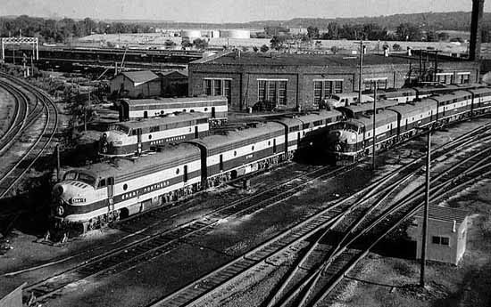
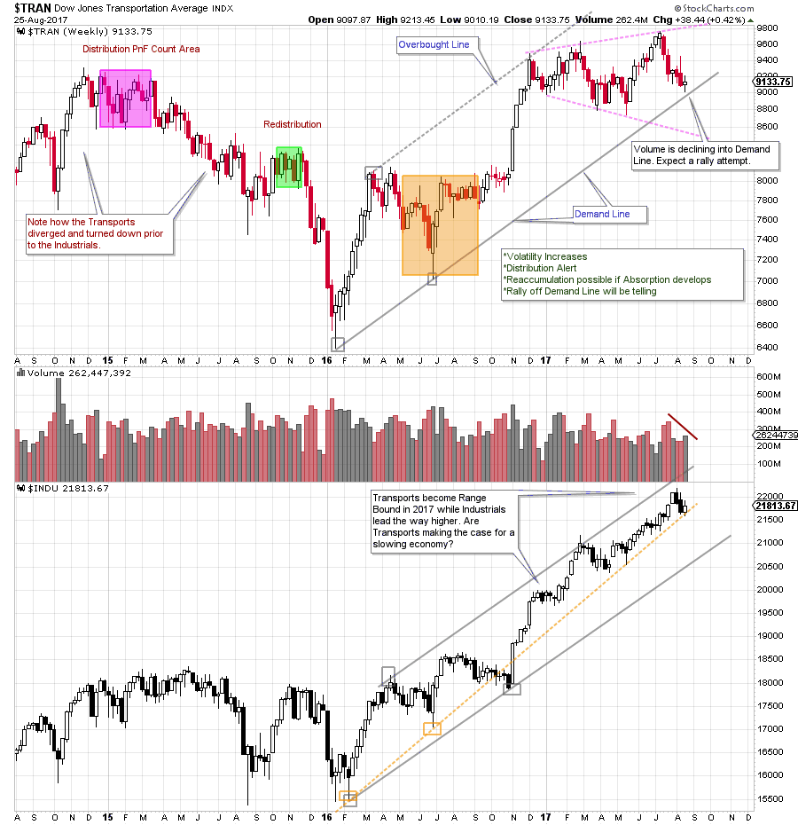
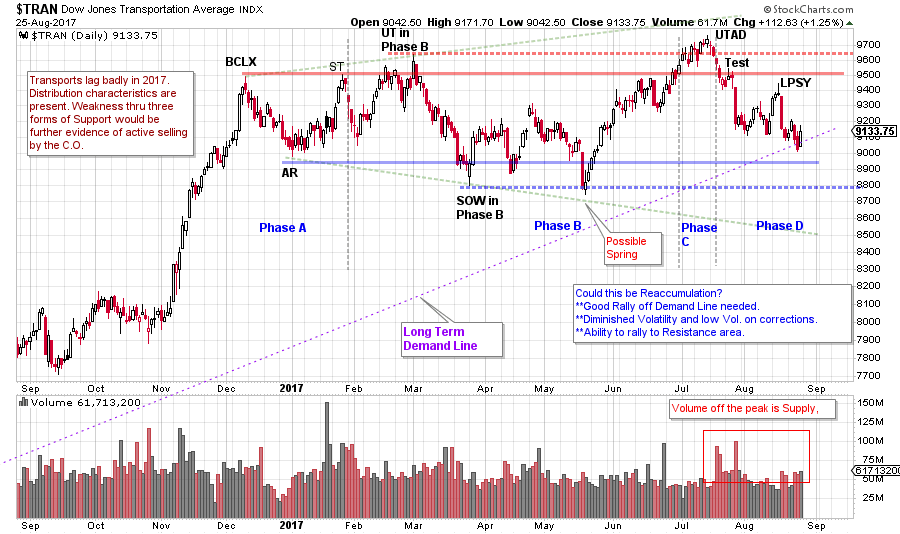
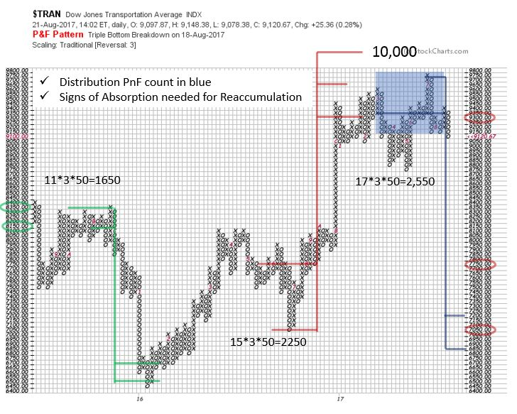

# Transports Hit the Wall

URL: https://articles.stockcharts.com/article/articles-wyckoff-2017-08-transports-hit-the-wall/
Date: August 26, 2017 at 10:20 AM
Author: Bruce Fraser

The ‘Dow Theory’ involves the study and comparison of the Dow Jones Industrial Average and the Dow Jones Transportation Average. When both averages are in ‘lockstep’ in a major uptrend, the market is said to be in a Bull Market. When both are in a downtrend, a bear market is in force. For more on the history and use of the Dow Theory take a minute to read the post ‘How Now Charles Dow? (click here for a link).

The Dow Jones Transportation Average ($TRAN) is often a leading indicator and can tend to turn prior to the Dow Jones Industrial Average ($INDU). The Transports peaked in the last quarter of 2014 and then traced out Distribution. By the end of the first quarter 2015 a downtrend for the Transports was in force that would persist for the remainder of the year. The $INDU continued to form Distribution while the $TRAN was racing downhill. See more detail on this prior period by clicking the link above.

---

Generally, a bull market uptrend is most robust when both the $TRAN and the $INDU are trending together. Such was the case from the start of 2016 to the first quarter of 2017. Then a divergence forms and the Transports become Range Bound while the Industrials march higher. How does this divergence of character speak to the outlook for these important indexes?

(click on chart for active version)

Toward the end of 2016 the Transports climaxed (at the Overbought Line of the Trend Channel) just above the 2014-15 high prices. A Range Bound Transport index followed this Buying Climax with broadening characteristics. The Industrials have pushed higher while crowding up into the Overbought area of the Trend Channel, and is also respecting a steeper trend line. Now the Transports are resting on the Demand Line of the Trend Channel.

(click on chart for active version)

On the daily chart above is a Distribution interpretation. Note the widening swings. Increased volatility during a trading range is a signature of Distribution by the Composite Operator (C.O.). The Transport Index is declining into Support now while the Industrial Index remains near its high prices. Note the low volume on the rally into the Last Point of Supply (LPSY) this suggests lack of demand by the C.O. and has been immediately followed by price weakness. Two scenarios come to mind as Support is approached (and the Demand Line). First is that Support holds and that a good rally is generated back toward the top of the trading range. Then, possibly a case can be made for a Reaccumulation forming. Evidence of absorption will be needed and is not yet apparent. Second is persistent weakness through the Demand Trendline and toward two forms of Support. If the Distribution interpretation above is valid then a Markdown is expected to follow a LPSY. A rally attempt at Support that is of low quality would indicate the absence of demand by the C.O. and continuation of the Markdown would be expected to follow.

A Distribution Point and Figure (PnF) count reveals a price objective comparable to the decline of 2015-16. This prior downward swing was of an intermediate nature and can be studied in more detail by clicking here. Until there is a resolution out of the Distribution area and into a Markdown we will be on the alert for signs of a potential Reaccumulation. Transports move the goods that make the economy go. A vibrant uptrend in the Transports will not only pull the economy forward, but will also lift the stock market as well.

All the Best,

Bruce

Roman Bogomazov will be conducting a complimentary webinar on Monday, August 28th. This is an introduction to his online series: Advanced Wyckoff Trading Course (AWTC) - Wyckoff Structural Price Analysis (3:00 – 5:00 p.m. PDT). For more information and the registration link, please click here.
