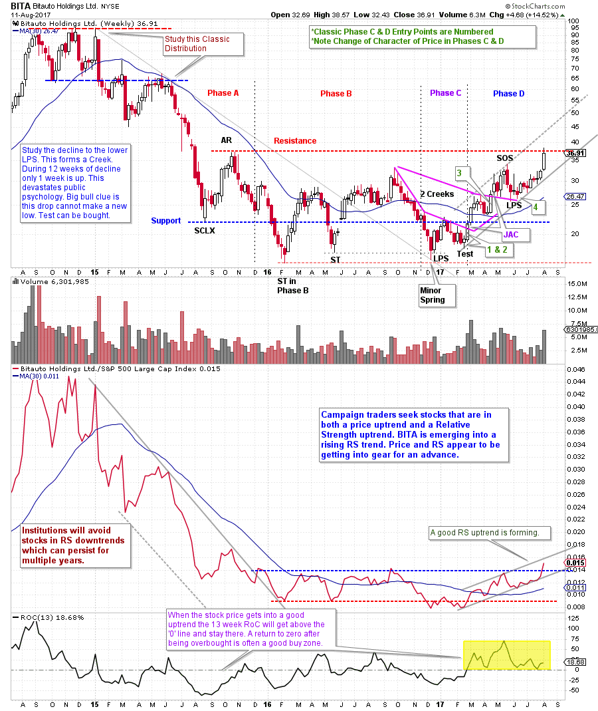
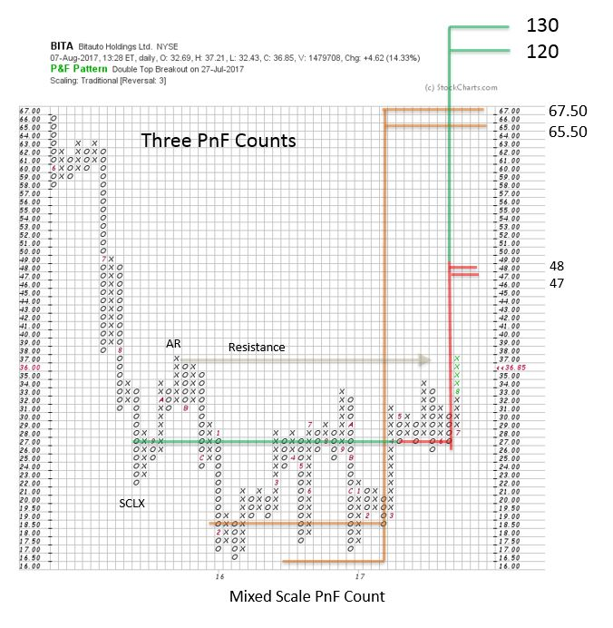

# Wyckoff the International Language

URL: https://articles.stockcharts.com/article/articles-wyckoff-2017-08-wyckoff-the-international-language/
Date: August 12, 2017 at 08:00 AM
Author: Bruce Fraser

Golden Gate University’s technical analysis courses are in demand from students around the globe. The Wyckoff classes that Dr. Pruden and I teach welcomes students from many countries. These students, applying the Wyckoff Methodology, present stock case studies to the class. Often the international students highlight stocks listed on their home country exchange. It becomes evident to the entire class that all auction markets, everywhere, are subject to the principles of the Wyckoff Method. The Composite Operator (CO) influences that produce the effects of Accumulation, Markup, Distribution and Markdown are at work throughout the world. Students soon learn that Wyckoff is an international language. Put Wyckoffians, from the four corners of the world, together in a room and they soon discover they are speaking the same language using charts.

---

Let’s speak chart by evaluating a company based in China. Large capitalization stocks from China have been generally performing well in 2017 (have a look at FXI, iShares China Large Cap ETF to see a very interesting weekly chart).

(click on chart for active version)

Please stop here and study the annotated chart above of Bitauto Holdings (BITA). There has been buzz recently about BITA and other big-cap China stocks (listed on U.S. exchanges). Today let’s focus our attention on tactics for BITA. We have all had the experience of discovering a stock when the best part of its move seems to be over. In the case of BITA, it has rallied to the top of an apparent Accumulation range after a classic Phase C-D advance. For swing traders this rally completes a campaign with a ‘whooping up’ into a Climactic surge to the Resistance line. On this weekly chart there are four noteworthy entry zones on the Phase C-D advance. The Test of the LPS is one. Two is the good demand price bar that crosses the lower Creek (JAC). Three is the bar that crosses the upper Creek. And the fourth is the upper LPS. Stops are placed below the prior low, or two prior lows (for those establishing a longer-term Campaign). In Accumulation, Phase C-D is when Wyckoffians become intently focused on the identification of classic entry zones.

The most recent bar is the first touch of the Resistance line formed by the Automatic Rally (AR). Wyckoffians would expect selling to materialize at Resistance as it is the first time BITA has traded at this price since the start of the Accumulation. With this Climactic thrust to Resistance we expect one of three scenarios. The strongest is a continuation of the advance that clears the Accumulation area. Most likely this would be followed by a period of Backing up to the Resistance area, which becomes new Support. This Backup action would be a classic place to initiate (or add) a position. The second would be a consolidation (Backup) at or below the Resistance line. The less of a pullback the better. The closer the consolidation stays to the Resistance line, the more constructive it is for a continuation of the bull run. This demonstrates that demand is good and that stock has been absorbed and thus is in strong hands. The third is price weakness from Resistance back to the middle of the Accumulation range. Which indicates that there is still a supply of stock to be sold that must be absorbed. The C.O. will allow the price to fall toward Support and then try to determine the extent of Supply. A return back below the mid-point of the range would be a negative and suggest that a return to the Support area is possible. BITA’s earnings report is expected soon and that could put any of these scenarios into play. With the price now extended into Resistance it seems best to wait to initiate new positions until a low risk entry zone presents itself.

Wyckoffians are always thinking in terms of scenarios and developing the low risk idea. This case study hopefully illustrates this type of thinking. If these scenarios don’t unfold as expected, providing us with the opportunity to enter on our terms, we move on to the next good idea. The markets offer endless opportunities.

For those who are Campaign traders, let’s study the Point and Figure chart. How much fuel is in the tank for higher prices? Swing traders take note that PnF analysis can assist in planning intermediate timeframe campaigns.

A Cause is built in BITA. Three PnF counts stand out. With the near-term Jump to the Resistance area a small count (in red) is complete and has a target of 47 / 48. If a quality entry point is revealed in the next few weeks traders could have a potential swing campaign in BITA up to this first PnF objective.

Making a conservative PnF count on the Accumulation area, a price objective is generated to 65.50 / 67.50. The entire Accumulation counts to the objective of 120 / 130. Most Campaign traders would consider this a worthwhile objective. If only the lower objectives are met the Campaigner will have had a successful effort.

The final, and important, consideration is to have the tail wind of a good trending market supporting the rising prices of your campaign stocks. Time your trades to coincide with a rally in the important market indexes.

All the Best,

Bruce

Announcement: ‘Best of Wyckoff 2017 Online Conference’ (only 1 week to go)

Spend the day (August 19, 2017) with this legendary collection of Wyckoff and Technical Analysis experts; Dr. Hank Pruden, David Weis, Dr. Gary Dayton, Todd Butterfield, Stephanie Kammerman, Corey Rosenbloom, Roman Bogomazov and your devoted blogger (me). The entire day will be recorded and available for review. For more information and to register now, please click here.
