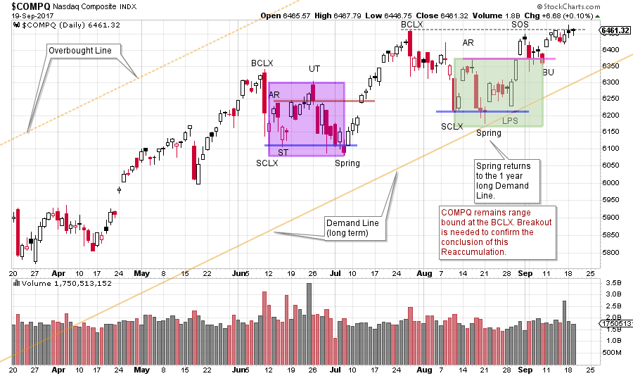
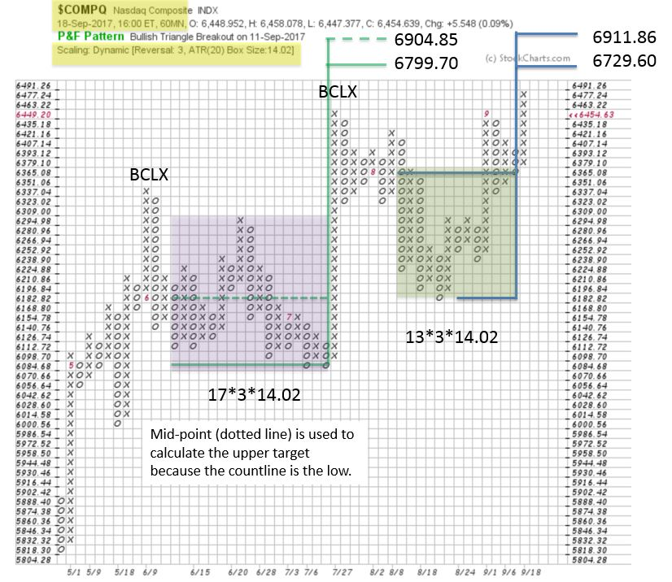

# $COMPQ Up Close

URL: https://articles.stockcharts.com/article/articles-wyckoff-2017-09-compq-up-close/
Date: September 20, 2017 at 07:00 AM
Author: Bruce Fraser

The NASDAQ Composite ($COMPQ) has consolidated since early June. Two very prominent Buying Climax peaks arrived, one in June and the next in late July. They are labeled on the vertical chart and the Point and Figure chart. This has slowed the advance of the $COMPQ to a crawl. Meanwhile two well formed Reaccumulation structures have developed. Which generally means they can be evaluated and Point and Figure counts taken.

Currently the NASDAQ Composite has returned to the July 27th BCLX peak. This Resistance level is in force and holding the index back. Provided that it can break out, there are two PnF price objectives that confirm each other. Let’s drill into this recent price structure and see what is going on.

---

(click on chart for active version)

On the daily vertical bar chart, there is a slight upward tilt to this potential Reaccumulation. Therefore, let’s evaluate it in two parts, each beginning with a Buying Climax (BCLX). The first is a BCLX followed by an immediate Selling Climax (SCLX), and a range bound condition developed thereafter. A volatile decline followed the Upthrust (UT). Note the wide price bars at the end of June, with very little net downward progress. A Spring concludes the decline with good bullish bars on the turn. Traders could have bought these bars with the intention of gauging the quality of the rally back to the BCLX. The second BCLX was more difficult as the Index meanders below the peak before breaking down to the next SCLX. After the range was set by the Automatic Rally (AR), a Spring forms to test the SCLX. The Last Point of Support (LPS) is a very important bar as it attempts to decline (in a successful Test) to the Spring and SCLX and closes nearly on the high for the day. This bar could be bought and then evaluated on the strength of the rally back to the BCLX high. Three very strong bars follow. The Backup (BU) after the Sign of Strength (SOS) is shallow with diminishing volatility. A good turn appears to be forming off the Backup (BU). Now we will watch and judge if the NASDAQ Composite can break through Resistance. There are two PnF trading counts we can take to estimate the near-term potential of a new advance.

Two PnF counts confirm each other. The shaded areas coincide with the same areas on the vertical chart. In this case study, we are focused on the near-term trade potential of the smaller PnF count. A larger PnF count objective is represented by combining the entire structure and we may revisit this in a later post. Here we use 60-minute data with ATR (20) scaling and 3 box reversal method. This time frame matches nicely with the daily vertical chart.

We are trend followers and always give the primary trend the benefit of the doubt. There is Resistance at the BCLX that needs to be overcome. A return back into the range could invoke selling back to the 6180-6070 level. For homework consider how this would change labeling and analysis.

All the Best,

Bruce

Announcement: October Point and Figure Educational Series (click here to learn more)

Join Roman Bogomazov and Bruce Fraser for a three part (six total hours) workshop on how to use the Wyckoff Method of horizontal Point and Figure analysis. Topics include: PnF chart construction methods, generating price objectives from horizontal counts, tips and tricks for counting Distribution, skills for improving count accuracy, and more.
