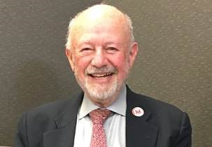
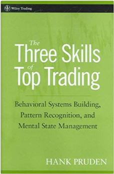

# Dr. Henry O. (Hank) Pruden 1936-2017

URL: https://articles.stockcharts.com/article/articles-wyckoff-2017-09-dr-henry-o-hank-pruden--------------------------------------------------------1936-2017/
Date: September 12, 2017 at 06:40 PM
Author: Bruce Fraser

Technical analysis education suffered a great loss with the recent passing of Dr. Henry O. (Hank) Pruden. A consummate educator, in 1976, Hank combined his incredible capacity for inspiring students with his personal passion for Technical Market Analysis. The result was the very first graduate course, at an accredited university, in the study of markets using chart analysis. Dr. Zahn, Dean of the Business School at Golden Gate University in San Francisco, said ‘Let the Market Decide’ when Hank proposed this innovative new graduate course. Hank’s electric teaching style and unique curriculum made this class an instant hit. The classroom would fill up every semester and students would take the class again and again.

In 1987 Hank took a sabbatical, recharged his batteries, and came back stronger than ever. Hank and I collaborated on the creation of a new class based on the Wyckoff Method (which we team taught). Hank then developed an entire Technical Analysis Certification Program. Students could earn a certificate in Technical Market Analysis or take these courses in conjunction with their M.S. degree.

Dr. Pruden was a prolific writer publishing many papers on technical analysis and peak performance in trading. We have linked to a number of his articles here and hope to make more of them available in the future. In 2007, he published his seminal work “The Three Skills of Top Trading” (Wiley). In it we discover Dr. Pruden’s view of the essential qualities of the consistently successful trader. Dr. Pruden designed the curriculum of the courses at GGU to reflect this world view. In his personal development as a complete trader he came to understand that trading success depends on being competent in these three skills of top trading. His goal was to have every GGU graduate be capable in these important skills. And to have every reader of his book be on the path to trading mastery. His mission was to have every student become the complete trader.

Dr. Pruden is one of those rare people who touched the lives of many in a most personal and positive way. To honor his life and commitment to others, let’s step forward and strive to be the very best complete trader possible. Hank believed we were serving others by following our passions and doing our very best work. Hank showed us how to touch the lives of others through the metaphor of trading mastery.

Celebrate Hank’s life by viewing these two videos:

View a brief bio of Dr. Pruden’s life here. This video was shown at the 2013 International Federation of Technical Analysts (IFTA) Annual Conference in San Francisco when Dr. Pruden received the IFTA Lifetime Achievement Award.

(click here for a link).

Dr. Pruden’s last appearance was a video presentation at the Best of Wyckoff 2017 conference in August. The title of the talk is: Using P&F Charts to Find the Present Position & Forecast the Probable Future Trend of U.S. Equity Prices: Applications of the “Wyckoff Law of Cause and Effect”. Thank you to Roman Bogomazov at wyckoffanalytics.com for generously making this video available for all to see.

(click here for a link).
