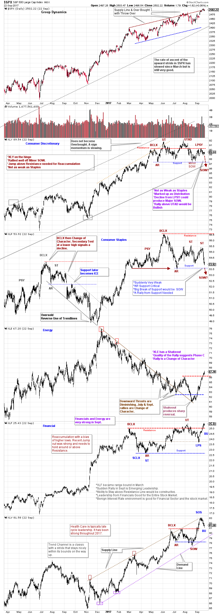

# Group Dynamics

URL: https://articles.stockcharts.com/article/articles-wyckoff-2017-09-group-dynamics/
Date: September 26, 2017 at 03:01 PM
Author: Bruce Fraser

Let’s have a peak at some interesting sectors. At times, sectors can tip us off to the motives of the market. Sectors and Industry Groups have a general tendency to be either early, coincident or late business cycle beneficiaries. This business expansion has certainly been a long one and it appears to have life left in it. We can often tell where we are in the cycle by which sectors are strong and leading, and also by the sectors that are lagging behind.

---

Early business cycle leadership include Consumer Discretionary, Consumer Staples and Financials. Late cycle sectors would commonly include Energy and Healthcare. This is not a complete list and we will visit other themes soon (such as Materials and Industrial sectors). Here let us focus on some recent activity in sectors that might be telling a tale about the current position of the business cycle.

(click on chart for active version)

Five sectors are profiled to the S&P 500 ($SPX) Index. Consumer Discretionary (XLY) and Consumer Staples (XLP) are classic early cycle leaders. Energy (XLE) and Healthcare (XLV) are typically late cycle beneficiaries. And the Financial Sector (XLF) is a special case (normally an early cycle leader).

Compare the Consumer Discretionary and Staples to the $SPX (click here to see David Keller’s excellent evaluation of individual stocks in the Consumer Staples sector). Relative Strength of these sectors is waning. Rotation away from consumer stocks suggest a shift, or rotation, into the later stages of the business cycle. Energy and Healthcare are leading the advance in September. These late cycle themes suggest a maturing economy. The consumer gets financially stretched in the later part of the cycle. These sectors could be indicating consumer exhaustion. But there are reasons to believe the bull market still has life in it.

The Financial Sector (XLF) is leading with a jump to new high prices. This indicates a benign interest rate environment that will not be hostile to consumers or economic growth. Energy stocks (XLE) are direct inflation beneficiaries. In September, they shook off the doldrums and had a terrific rally. Higher oil stocks translate into higher oil prices, which is the fuel of future inflation. But rising energy prices can take months to years to begin flowing through to the prices of goods and services in the economy.

One area where the consumer is not getting a reprieve from rising prices is Healthcare (XLV) costs. Healthcare is a typical late business cycle investment theme. And Healthcare is leadership now. XLV has rallied to the Supply trendline and has turned down. Now that it appears healthcare repeal legislation has failed we will watch the response of this sector. It does not seem that any further attempts at healthcare reform are on the horizon. This may or may not be a surprise to the XLV component stocks.

During the late stages of the typical business cycle, the economy becomes dependent on industrial growth and strong demand for raw and intermediate materials. We will continue to watch the above sectors closely and compare them to the Industrial Sector (XLI) and the Materials Sector (XLB). These sectors should remain in the sweet spot of Relative Strength leadership as this maturing business expansion marches onward.

All the Best,

Bruce

Announcement: October Point and Figure Educational Series (click here to learn more)

Join Roman Bogomazov and Bruce Fraser for a three part (six total hours) workshop on how to use the Wyckoff Method of horizontal Point and Figure analysis. Topics include: PnF chart construction methods, generating price objectives from horizontal counts, tips and tricks for counting Distribution, skills for improving count accuracy, and more.
