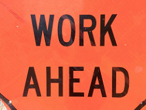
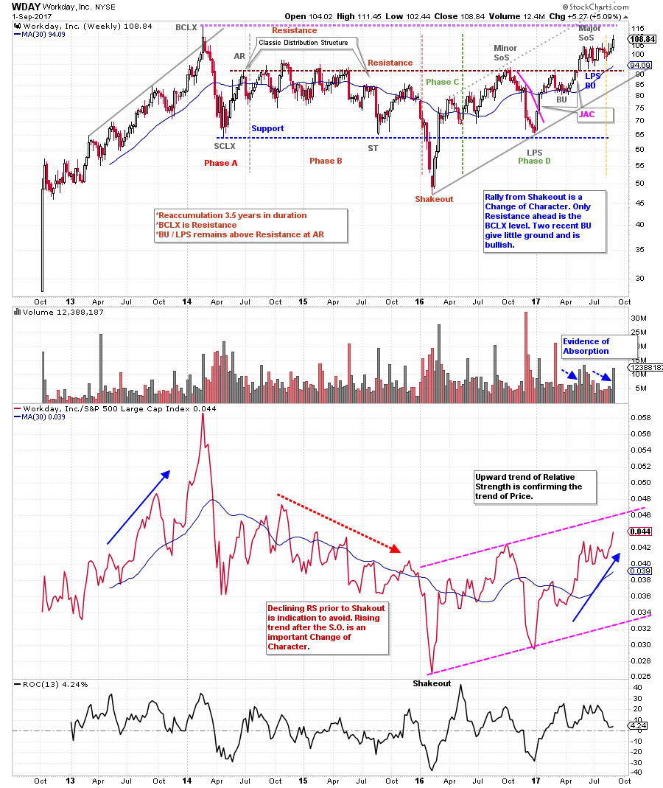
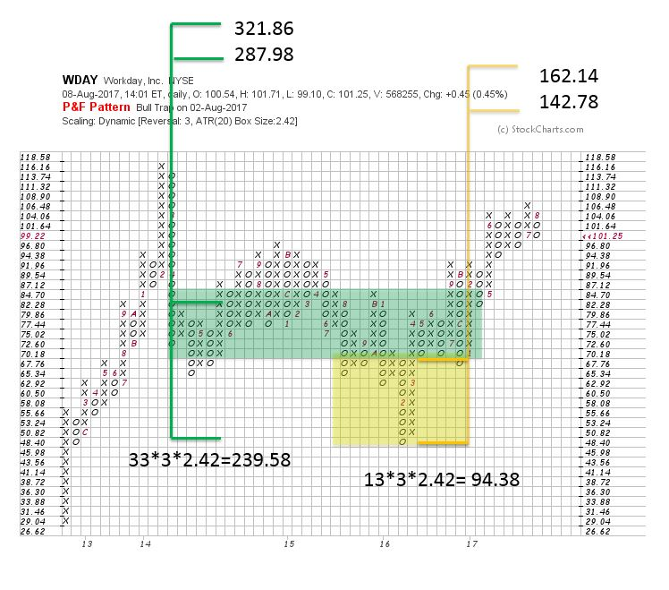

# Working up WDAY

URL: https://articles.stockcharts.com/article/articles-wyckoff-2017-09-working-up-wday/
Date: September 03, 2017 at 02:09 PM
Author: Bruce Fraser

The Wyckoff Method is well suited to the concept of campaigning stocks. When a campaign works, a stock may be held for months to years while participating in a major uptrend. Mr. Wyckoff’s goal was to hold the campaign stock until the chart (tape) indicated selling by the large informed interests (Composite Operator).

In this post, we will study the elements that go into identifying an emerging campaign. The idea of conducting a campaign is to get onboard an emerging uptrend and then to stay on it while the tape suggests the trend is rising. Here we will look for the elements of a campaign trade in the case study of Workday, Inc. (WDAY). In future posts, we will explore how campaigns often end. Here we will consider how they start.

---

(click on chart for active version)

After the IPO, Workday, Inc., emerged into an uptrend that culminated with a Buying Climax (BCLX) in the first quarter of 2014. A massive Change of Character (CHoCH) decline stopped the advance with a SCLX. Analysis suggested a ‘Range Bound’ market for the foreseeable future. That turned out to be 3½ years. Noteworthy was the Distributional structure that followed the SCLX. This Distribution resulted in a classic Shakeout, which was quickly reversed. The Climax bar that arrived at the end of the Shakeout decline was the best opportunity for short sellers to cover their positions (short selling is a tricky business that requires fast action, in many cases). Following the Shakeout was a CHoCH rally all the way to Resistance and a Minor Sign of Strength. This rally was an alert that WDAY was under Accumulation. The decline that followed returned all the way back to Support and set up a Last Point of Support (LPS). An LPS is the beginning of the important rally up and out of the Accumulation area and into Markup. This is the zone where the Campaign oriented investor gets busy building a position. Good demand bars launched WDAY off the Support line and toward Resistance. These bars could be bought with stops below the prior low and Support. After WDAY returned to the top of the trading range a reaction followed that was very shallow and could not return toward Support. This indicated aggressive buying, good demand and the absorption of stock.

Relative Strength (RS) is a very important aspect of a campaign trade. Since the Shakeout, RS made higher lows and moved upward. A Relative Strength uptrend is in force. Now that price is above the Resistance line, Phase D is about to conclude and Phase E is starting (this means the Accumulation phase is ending and the Markup is beginning). The confirmation of a rising price and Relative Strength uptrend is a powerful combination.

The Wyckoff Point and Figure (PnF) horizontal counting technique estimates the upward price potential. Here two counts were taken by segmenting the horizontal price structure. The smaller count (in yellow) is our conservative price objective. With a cooperating stock market uptrend, WDAY has the fuel to reach the 142.78 / 162.14 target price window.

For Campaign oriented investors there is a larger Horizontal Structure that began to form in early 2014. A rule of thumb for Campaigns is a minimum 100% upward potential from the current price (my rule). At the recent WDAY price of approximately $109, and the larger objective of $287.98 / $321.86, this rule is exceeded. We are looking for Campaign potential and are prepared for the unexpected along the way. Horizontal PnF can provide a price objective, but it cannot indicate the time that is needed to achieve the objective. Bear markets can interfere with the upward ascent of the best Campaign stocks. Multiple pauses along the way (we call them Reaccumulations) can stop an advance for many months, and try the patience of any trader / investor.

Point and Figure is a powerful tool as it offers a technique for estimating potential. PnF allows us to determine if this is a Campaign candidate. And while the major uptrend stays in force, our PnF objectives help to keep us in the trade. We set and trail stops upward as the trend matures. This protects the majority of gains if the unexpected happens. Here we have the elements of a Campaign in a real-time case study. Let’s follow WDAY and see how it unfolds.

All the Best,

Bruce

Did you miss last week’s Advanced Wyckoff Trading Course (AWTC) introductory session? You can watch the video recording (click here for a link). For more information about this course offered by Roman Bogomazov and to register before the next class on September 11th, please click here.
