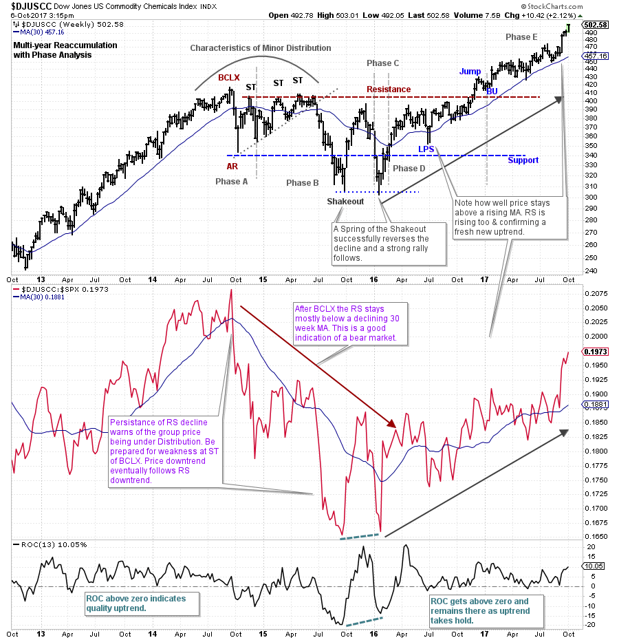
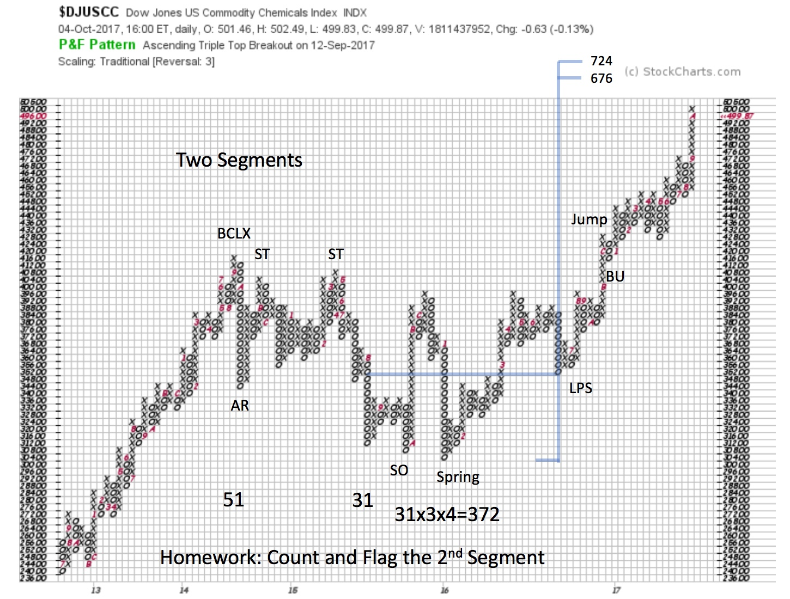
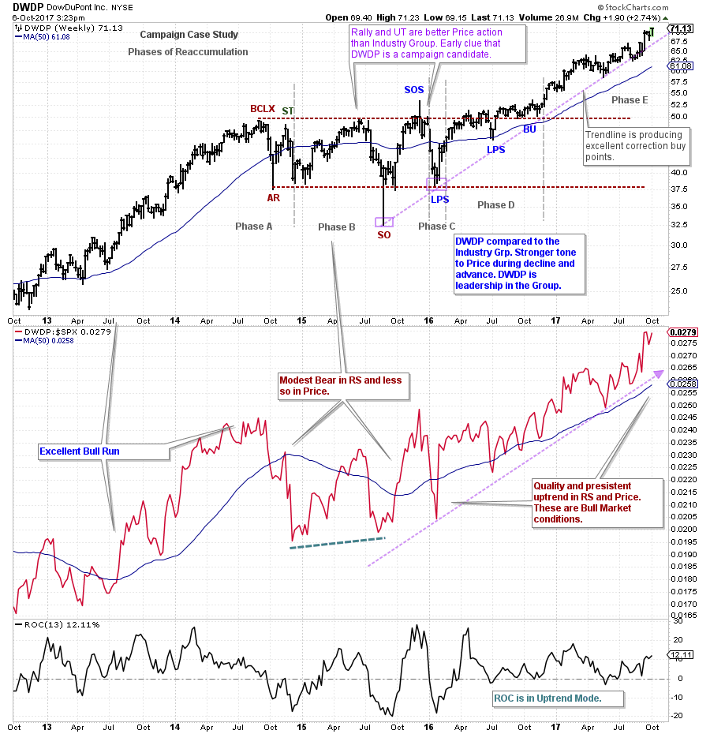
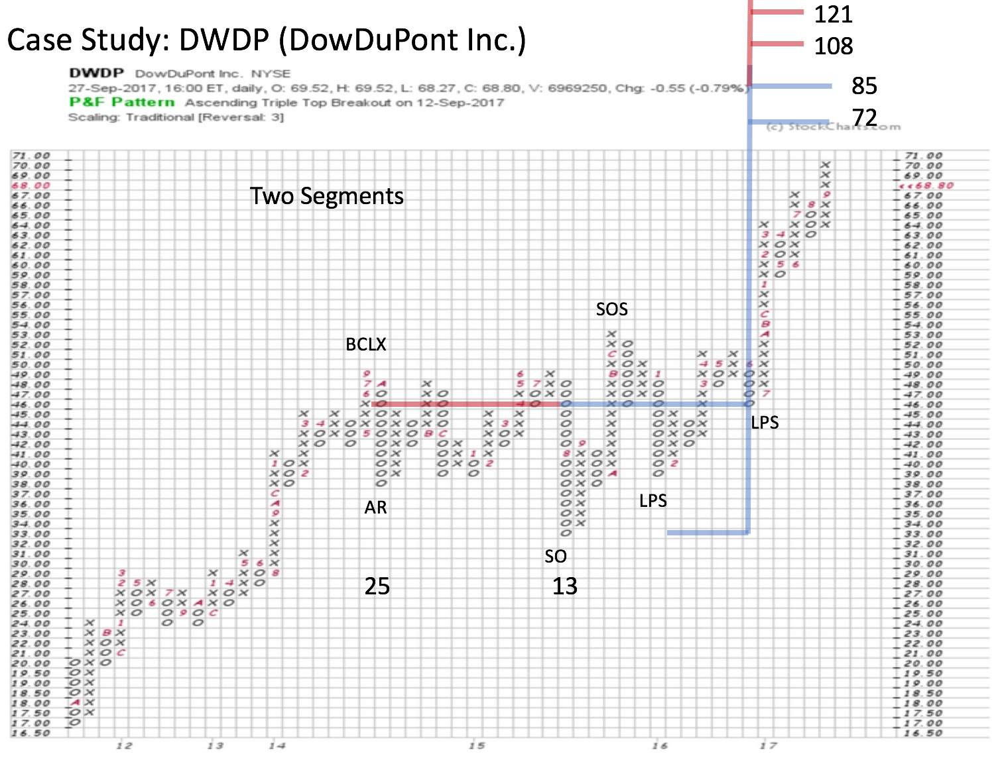

# Chemistry Experiment

URL: https://articles.stockcharts.com/article/articles-wyckoff-2017-10-chemistry-experiment/
Date: October 07, 2017 at 07:00 AM
Author: Bruce Fraser

Two strong sectors in September were Materials (XLB) and Industrials (XLI). During the second half of a business cycle expansion these themes typically do well, and that is the case here. The economy has begun to expand at a faster rate. These industries develop pricing power which allows them to raise prices for their goods at a faster rate than the general economy is growing. These companies now have ‘leverage’ in their business models which make them particularly attractive to investors as the economic cycle accelerates.

---

Commodity chemical stocks have a foot in both the Industrial and the Material sectors of the markets. Industrials because chemical products are needed for the production and maintenance of most equipment used in the economy. The Materials sector as these commodity chemicals are essential materials for the operation of the real production based economy. Let’s conduct a case study on the commodity chemical industry group and profile one of the leadership stocks in the group. Could it be that by combining the Industrial and the Material aspects of the chemical theme, we could have an investing super substance?

(click on chart for active version)

US Commodity Chemical Index ($DJUSCC) has a persistent uptrend into October 2014 and then begins a multi-year Reaccumulation. A very large Cause is generated into the end of 2016. Comparing the Relative Strength (RS) to the weekly price chart helps to keep us on track regarding the direction of the major trend. Study the uptrend prior to the formation of the Reaccumulation. Both Price and RS are clearly rising together. The Buying Climax (BCLX) is subtle on the Price chart and clearly evident on the RS chart. A Change of Character (CHoCH) follows. Note how RS tumbles into a decline after the BCLX. Simultaneously (after the initial drop into the AR), the momentum of price results in three Secondary Tests (ST). During the ST period the RS line can only lift slightly above a steeply declining 30 week Moving Average. Short sellers should study this structure and how it gives an excellent clue to the likely near term direction of price (downward).

The decline into the Shakeout low follows this sequence of Secondary Tests. Weak RS tells us the Composite Operator (CO) is using the Secondary Testing (ST) action as a place to sell and Distribute stock to weaker hands. The rally that follows the Shakeout is a good sign that early demand is present. The Phase analysis is an interpretation of how this Reaccumulation is forming. Note the immense volatility of Phase B with a Shakeout (SO), a big rally and a minor Spring of the SO. Then a rally from the Spring launches the uptrend. This all indicates stock is being Absorbed again by the CO. The rally from the Spring gets price above the 30-week MA and thereafter the volatility diminishes (Absorption is nearing completion). The Jump above the Resistance line is an important commitment of price into an uptrend. This is confirmed by the rising trend of Relative Strength. For Wyckoffian Traders and Campaigners there are multiple entry points. Potential trade entry includes the turn up through the Support line after the Shakeout (for aggressive short term traders). The Test of the Spring and the turn up through the Support line (again more appropriate for traders). The Last Point of Support (LPS) and the Jump and Backup (BU). Each entry place has an appropriate stop placement strategy. Campaigners would also consider retracement back to the Moving Average line as price rises.

The PnF of Commodity Chemical Industry Group is somewhat extended. But there are higher price objectives. Only one segment is counted here (31 columns). Thus, there is major potential in this theme for an ongoing Campaign. For homework widen out this PnF count to gauge the larger potential.

(click on chart for active version)

Any emerging trend in an Industry Group has one or more underlying component stocks that are leading the way upward and forging this new uptrend. Our mission is to find the leadership. Note the early clues to leadership in DowDuPont (DWDP). The decline into the Shakeout (SO) is reversed and closes above Support in the same week. The SO has a good Test and then rallies above the Resistance into a Sign of Strength (SOS). This sequence is a clear improvement over the weaker $DJUSCC. After the Sign of Strength, a quick decline to Support sets up a LPS and then a rally to and through the Resistance. A series of Backups to Resistance from above demonstrates a lack of volatility and completion of Absorption. DWDP is ready to move up and away from the Reaccumulation area. At the second LPS, price and RS are firmly in their co-uptrends. Every return back to the Trendline represents a place to initiate or add to existing positions. The trend has now extended away from the moving averages and thus could be approaching an overbought condition. What does the Point and Figure chart tell us about potential price objectives?

Two segments can be counted in this classic PnF case study. The SOS following the Shakeout is a clearly evident Change of Character in this PnF. DWDP price can be seen as pivoting into a Springboard at the LPS level of $46, which is the countline. The PnF chart illustrates with clarity these key chart points. A beautiful Catapult Wall follows the Springboard and price rallies from 47 to 65 in an uninterrupted advance. The dilemma now is that price and RS are accelerating into the lower PnF segment price objective at 72 / 85. Could this result in a Reaccumulation forming prior to an advance to the higher segment PnF count? Or could DWDP keep marching to the bigger price objective? What would you need to see to suggest one of these scenarios versus the other? How would you trade either scenario?

With the Wyckoff Method, we can see a case for the Commodity Chemical Group and DWDP being in a major uptrend. The stock and the group are leading the market higher also. Leadership tends to persist for months and often years. Which other stocks in this group are leadership?

All the Best,

Bruce

Announcement: October Point and Figure Educational Series (click here to learn more)

Join Roman Bogomazov and Bruce Fraser for a three part (October 20, 26 and November 2) workshop on how to use the Wyckoff Method of horizontal Point and Figure analysis (six total hours). Topics include: PnF chart construction methods, generating price objectives from horizontal counts, tips and tricks for counting Distribution, skills for improving count accuracy, and more.
