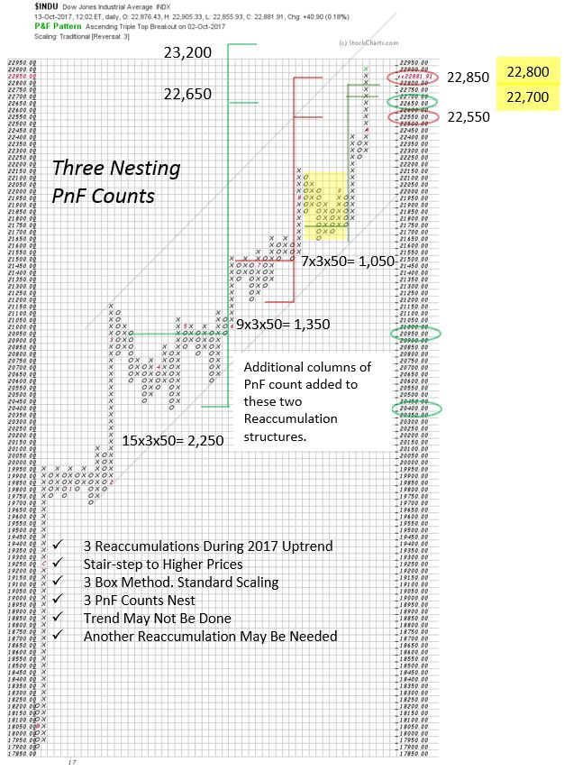

# Dear Point and Figure Diary

URL: https://articles.stockcharts.com/article/articles-wyckoff-2017-10-dear-point-and-figure-diary/
Date: October 15, 2017 at 04:00 PM
Author: Bruce Fraser

Dear Point and Figure Diary,

As you know, I made an entry into your pages on July 15th of this year (click for a link). At the time, it appeared that two Reaccumulation Point and Figure Counts (PnF) were stacking up. This suggested another rally phase ahead in the Dow Jones Industrial Average ($INDU). I tend to be conservative in my counting, and that was the case then. But, after making this diary entry, in the second half of July additional columns materialized and increased the count objective. This spurred me to reassess the prior (and bigger) count (March to June period). In the PnF below are the updated count objectives and a third Reaccumulation count.

---

I remind myself that the purpose of PnF is to establish a hurdle rate of return for a potential move. At the time of the prior diary entry $INDU was about 21,560 and PnF objectives reached to about 22,200 to 22,440. For trading purposes this was a very worthwhile objective. And with the subsequent widening of the counts, new price objectives reach as high as 23,200. This is very good news. And at this time the markets are moving upward (marking up) easily into these price objectives.

Three PnF Reaccumulation counts in succession all nest in approximately the same price zone. Though minimum objectives have been reached, higher targets are possible. What might happen next?

A Wyckoffian would expect a climactic surge, followed by an Automatic Reaction (AR) which begins a range bound market. We do not have that yet. An AR would be evidence of the Composite Operator (CO) actively selling stock into the market and this Supply being able to overcome the prevailing uptrend, temporarily. Therefore, I will stay with the trend until a sequence of Buying Climax, Automatic Reaction and Secondary Test of the high, stops the advance. I will stay on my toes in this new quarter as earnings are released. Because I am a trend follower, I will let the tape tell me where price wants to go.

My concluding diary note is that trends can go on and on. When the next range bound market occurs, it can result in either a Reaccumulation or Distribution. I will expect a meaningful PnF count to form at the conclusion of a new Cause. But time will be needed for either of these scenarios to materialize.

Thank you Diary, for helping me to organize and clarify my thinking.

All the Best,

Bruce

Announcement (starts this week!): October Point and Figure Educational Series (click here to learn more)

Join Roman Bogomazov and Bruce Fraser for a three part (October 20, 26 and November 2) workshop on how to use the Wyckoff Method of horizontal Point and Figure analysis (six total hours). Topics include: PnF chart construction methods, generating price objectives from horizontal counts, tips and tricks for counting Distribution, skills for improving count accuracy, and more. Each session will be recorded for later review and for those unable to be at the live webinars.
