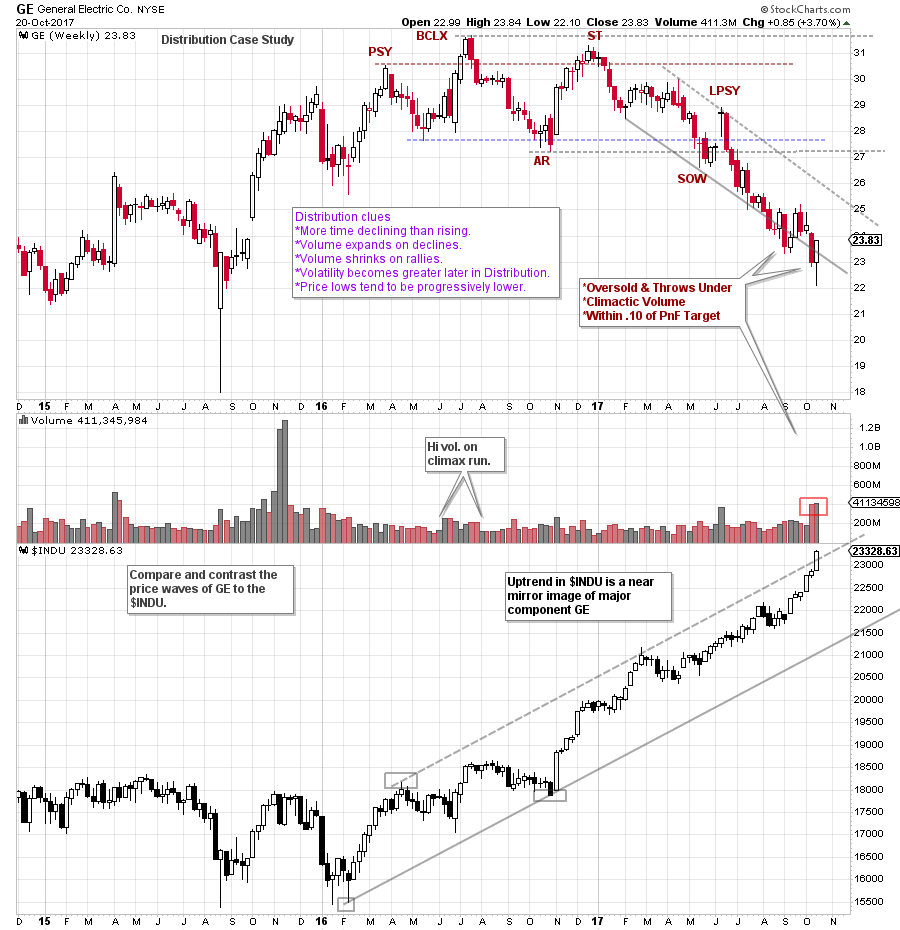
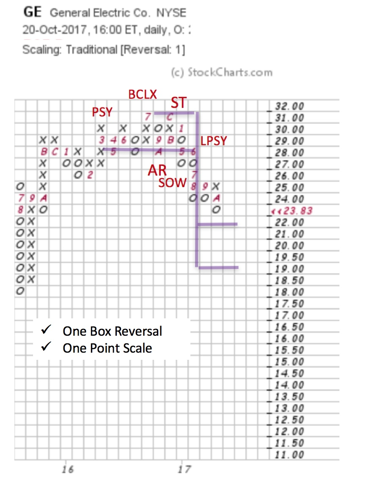

# GE's Wild Ride

URL: https://articles.stockcharts.com/article/articles-wyckoff-2017-10-ges-wild-ride/
Date: October 22, 2017 at 08:00 AM
Author: Bruce Fraser

General Electric (GE) is a venerable old company in the Dow Jones Industrial Average. It was formed (Thomas Edison was the most famous of its founders) in 1892 and in 1896 it was among the first 12 stocks in the newly formed Dow Jones Industrial Average. Now GE is the last remaining of the original Dow Jones Industrial stocks, and it continues to be among the dominant industrial companies in the world.

XLI, the Industrial Select Sector SPDR Fund (GE is a major component), has been among the sector leaders of the last year. Meanwhile GE has been on a wild ride that has veered significantly from XLI and the Dow Jones Industrial Averages. Let’s focus a Wyckoffian lens on the GE stock chart.

---

(click on chart for active version)

GE led the Dow Jones Industrials ($INDU) in 2015. Three higher peaks starting in late 2015, and into mid 2016 were encouraging for GE. During that time $INDU remained range bound. After the BCLX there was a role reversal between GE and $INDU. Note the weakness of GE after the Buying Climax (BCLX) into the Automatic Reaction (AR). Volume was also generally high on this weakness to the AR, a subtle clue of emerging Distribution. As GE was making a lower low at the AR, the $INDU was near the prior highs and preparing for an important Jump which became the springboard to a year long uptrend. While $INDU was embarking on this new uptrend, GE was diverging into a classic Distribution structure.

After the AR, a rally formed into year-end for both $INDU and GE. While $INDU Jumped out of an Accumulation and was in an important new uptrend, GE made a noticeably lower peak at the Secondary Test (ST) of the BCLX and stalled. The decline from the ST to the Sign of Weakness (SOW) was nearly 5 months in duration. A general rule of Distribution is that volatility increases as the formation matures. Wider swings develop in the second half of the Distribution process. This indicates that stock is in progressively weaker hands. A classic ‘tell’ is lower lows forming as the Distribution structure matures. At the Automatic Reaction (AR) and the Sign of Weakness (SOW), GE’s stock price did just that.

After a SOW a rally of poor quality is expected which is called a Last Point of Supply (LPSY). This is the final rally attempt after which Distribution is concluded and the markdown begins. Note the change of character in price after the LPSY in GE. Price moved easily downward. A remarkable contrast is noted between the downtrending GE and the uptrending $INDU. At this time GE and $INDU are near mirror images. Currently, $INDU is Throwing Over an extended uptrend channel, GE is simultaneously throwing under (an Oversold condition) a downtrend channel. It is an odd sight to have a key bell-weather stock performing so counter to the important Dow Jones Industrial Average in which it is a component.

A One-Box reversal Point and Figure (PnF) provides the detail to see and count the Distribution formation of GE. We identify the LPSY that follows a SOW and count to the left to the Preliminary Supply (PSY). A count objective of $22 / $19 is generated from a 9 column Distribution count. As of the last post on the vertical chart, GE was within 10 cents of touching the $22 level and this may constitute fulfilling the minimum objective.

A sequence of nearly fulfilling the minimum PnF price objective, becoming oversold below the downtrend channel and the formation of a Selling Climax (on large volume) could stop the decline in GE (at least for the time being). GE has a sizeable 4.0% dividend yield. Also, GE is a large and financially sound industrial company. The bottom fishing crowd has likely arrived to lock in this yield and a 'bargain price' (also a Climactic low was generated on Friday’s earnings report). We will watch this Selling Climax area for evidence of important support in the months ahead and for the development of a cause to propel the next move in GE.

All the Best,

Bruce

For additional reading click here and here.
