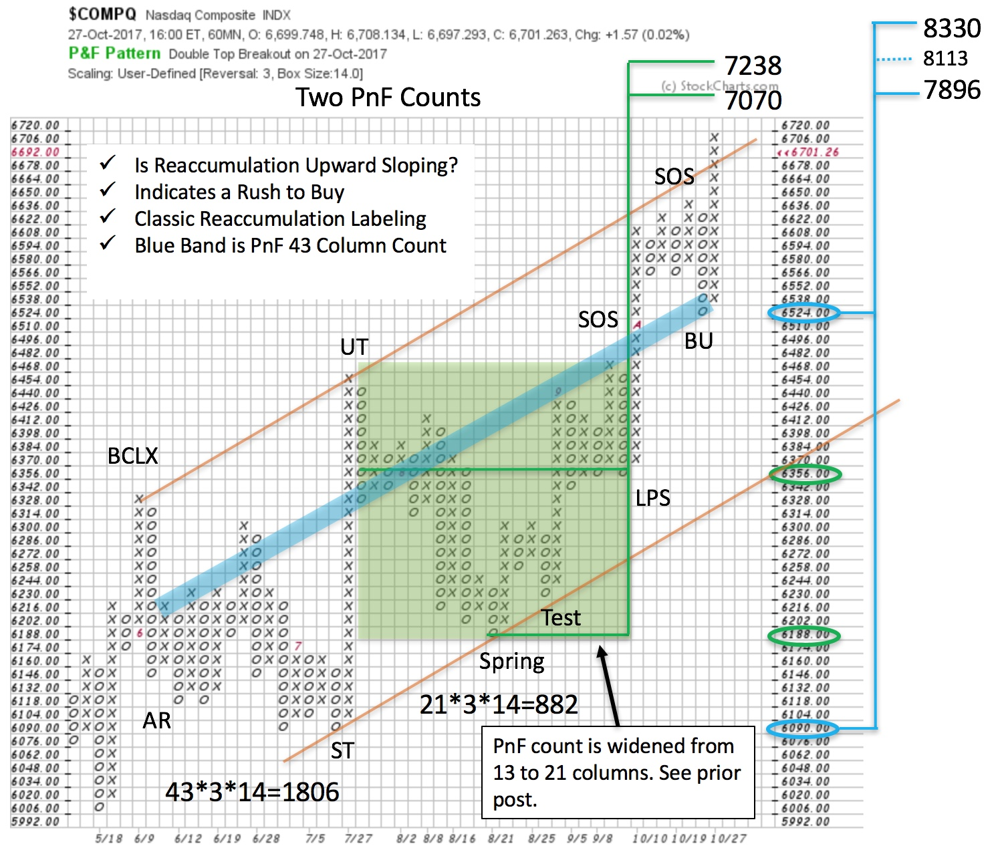
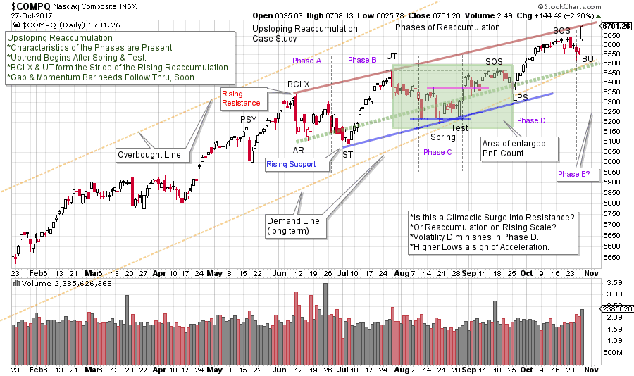

# NASDAQ Composite. Trick or Treat?

URL: https://articles.stockcharts.com/article/articles-wyckoff-2017-10-nasdaq-composite-trick-or-treat/
Date: October 29, 2017 at 02:30 PM
Author: Bruce Fraser

Recently we studied the NASDAQ Composite ($COMPQ) as it appeared to be on the verge of jumping into an uptrend after building a Cause. Now the $COMPQ is within one box of the minimum PnF count of our prior study ‘$COMPQ Up Close’ (click here). We evaluated two trading counts employing intra-day PnF charts ranging from about 6,730 to 6,912. Last Friday’s price surge puts the $COMPQ at a critical juncture. As prices approach PnF objectives, Mr. Wyckoff would advise to ‘Stop, Look & Listen’ to the market to determine its probable future direction. And not to jump to conclusions about the end of a trend as objectives are being reached. Now that our prior PnF counts are near, let’s revisit the NASDAQ Composite and put a new twist on the analysis.

---

In the green shaded area note the count has been widened and thus enlarged (PnF chart below). Two columns on the right were added with new data as the Backup was not finished. Thereafter the rally took hold and the count was widened to include the complete structure (compare to the prior post). The count went from 13 columns to 21, producing 882 $COMPQ points of rally potential. The objective has been raised to 7,070 / 7,238 suggesting additional life in this uptrend.

This up-sloping trend channel is now being thrown over with a price surge. $COMPQ is approaching the PnF objectives generated in the earlier post. A return back into the channel would call for caution. But the last bar was a gap up on the vertical chart with compelling momentum. We will watch for the $COMPQ to possibly carry this surging momentum higher.

(click on chart for active version)

Let’s introduce a new concept. We must thank Prof. Bogomazov for championing, and improving this technique, which he teaches in his ‘Advanced Wyckoff Trading Course’ (click here to learn more). It is a Reaccumulation structure that is ‘upsloping’. It has all of the elements of a classic horizontal Reaccumulation (which we have studied at great length). The difference is that it is forming on a rising scale. From this phenomenon, we would conclude that the Composite Operator (CO) is in a rush, with other large institutional Accumulators, to build a position and thus the structure has a definite rising quality to it. Each low is a higher low as large buyers are impatient and willing to bid up the stock or index. In the case of $COMPQ, after the Spring the rate of advance is accelerating. Notice how, from the BCLX to the BU, the Phases of Reaccumulation follow the classic textbook characteristics, but on an upslope.

Phases A & B are volatile in both directions. The red Resistance line is drawn from the Buying Climax (BCLX) to the Upthrust (UT) and the Support line is parallel and begins at the low of the Secondary Test (ST). Phase C is the final test of the Support area prior to the beginning of the Phase D rally. A shallow Spring temporarily drops below the rising Support line on high volume, so a Test is expected. In a normal horizontal Reaccumulation this would not be called a Spring as it is a higher low. In the context of this rising structure, the case is made that a Spring of the rising Support line is the event that defines Phase C. Demand is good following the Test and suggests Phase D is ahead. The Sign of Strength (SOS) and the Last Point of Support (LPS) are a classic change of character as $COMPQ shows little capacity to sell off as it had during each of the declines since the BCLX. After the Spring event the index moves up easily and resists declining, indicating that Absorption has been occurring and is nearly complete.

Phase E is price leaving the Reaccumulation area and moving into a new uptrend. Friday’s sharp jump suggests the start of Phase E. Supporting evidence for this would be $COMPQ following through above the Resistance line and then staying above it. Tactics are straight forward here as a sudden return back below Resistance would indicate that Friday’s surge has climactic qualities. Stops can be kept close (under the BU is one place to consider).

Estimating a PnF count objective, on a rising Reaccumulation, is a non-traditional technique. See the thick blue line on the PnF chart. Counting from the Backup (BU) to the decline off the BCLX produces 43 columns of count and generates 1,806 points of potential. From the low at 6,090 and the countline at 6,524 a wide range of objectives are produced. The mid-point is also calculated. This provides objectives of 7,896 / 8,113 / 8,330. If and when PnF objectives are achieved we stop, look and listen to the market for evidence of changing conditions.

Case Study Notes: Normally we would break up any large count into segments. We have effectively done that with the first segment PnF count (green shaded area) of our upsloping case study. Segments become our ‘active’ counts until the price target is met or exceeded. Then we consider the next segment. Thus, the active count in this uptrend is this first segment. You are encouraged to count each of the segments in this upsloping structure. Additional Reaccumulations should materialize as an uptrend matures and this will help point the way to the conclusion of the move.

Not all Reaccumulation and Redistribution formations are horizontal structures. It could be that a tilting character is a tip off to how the resulting trend will unfold. We will add this analytical nuance to the Wyckoff toolbox and study more examples of them in the future.

All the Best,

Bruce

Announcement: I will be a guest on MarketWatchers LIVE with Erin Swenlin and Tom Bowley on November 1st from 12-1:30pm EST. Fellow Wyckoffians, I look forward to being with you on Wednesday during market hours. If you cannot make our live Wyckoff discussion, a recording will be available until Friday. See you then. (click here for more information)
