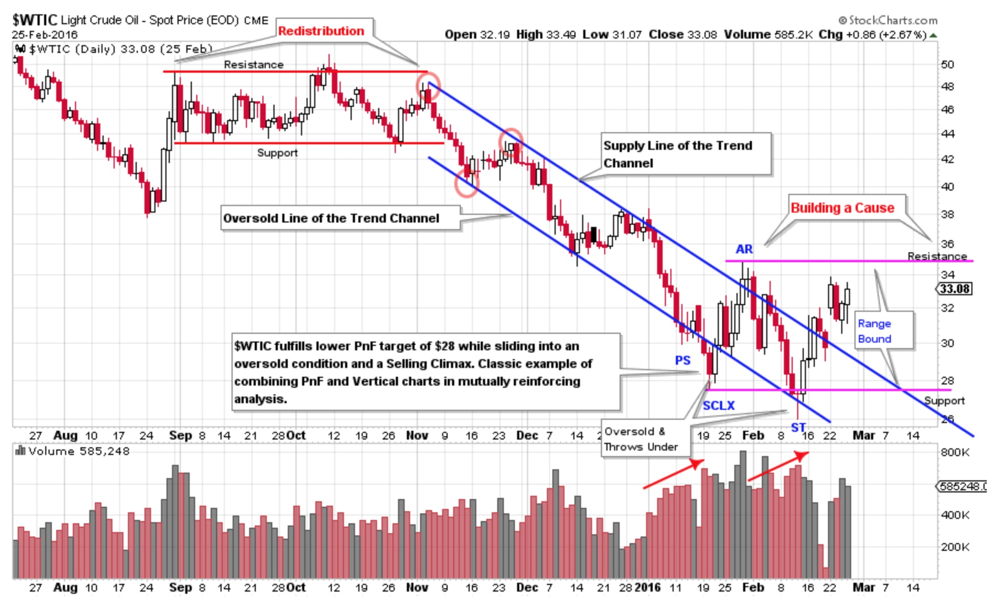
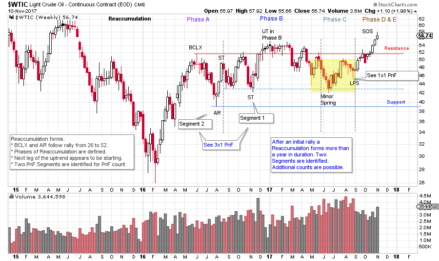
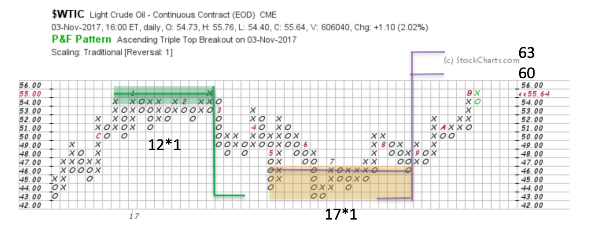
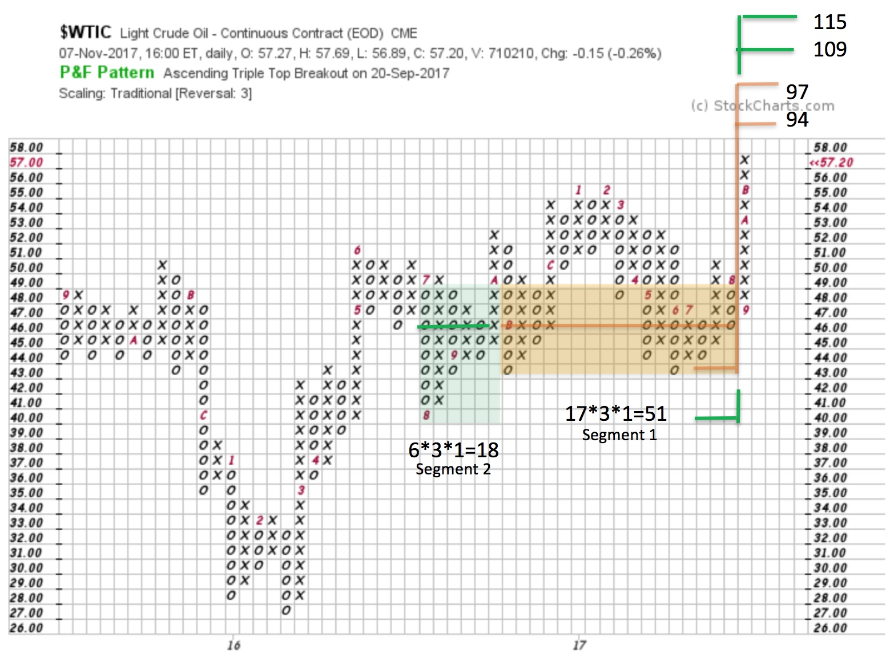

# Crude Oil Runs with the Bulls

URL: https://articles.stockcharts.com/article/articles-wyckoff-2017-11-crude-oil-runs-with-the-bulls/
Date: November 11, 2017 at 08:00 AM
Author: Bruce Fraser

Crude Oil lends itself to Wyckoff Analysis and has the capacity to trend for long periods of time. Take some time now and review a case study on the long swings for this important commodity (click here for the study). Note how well the Point and Figure charts have been working at generating accurate price counts. A worthwhile practice is to review the price history of the instruments you are trading and the precision of the PnF counts in these prior swings. From these studies, you can learn the behavioral tendencies of prices and nuances in counting characteristics.

---

In the ‘Crude Oil Update’ post (click here for a link) note how the Markdown concludes in early 2016. At that time, we called for “Building a Cause’ and that subsequent Cause is what we are studying here. Causes can take a very long time to form. While big Causes generate large PnF counts, we wonder if that is the case here. Let’s have a look.

Here is a (classic) study of the final downtrend into a Selling Climax (SCLX) and the start of a Cause building process for $WTIC. This chart was lifted directly from the ‘Crude Oil Update’. Below we jump to a weekly chart to evaluate what happened next.

(click on chart for active version)

The initial rally was nearly a 100% move into early June 2016. Crude did the majority of the Accumulation work thereafter in a range bound structure between 40 and 55. There is ongoing evidence of Absorption of $WTIC over the course of 2016-17. Now $WTIC is committing to the uptrend with a decisive rally to new recovery high ground. Note the delineation of the Phases within the Reaccumulation structure. All Phases appear to be complete and thus we expect the next leg of the uptrend has started. Next, we turn to the Point and Figure (PnF) charts to estimate the potential extent of the move generated during the Reaccumulation.

One box reversal PnF method typically is employed for swing trading price objectives. The Upthrust (in Phase B) produces a Distribution count of 12 points to 43, which is an exact hit. There an Accumulation forms (this all occurs within the trading bounds of the larger Reaccumulation, see vertical chart above). A PnF count generates a trading count (see yellow shaded box on the vertical and PnF charts above) to 60 / 63 which propels $WTIC out of the Reaccumulation range. $WTIC has accelerated once it cleared the Resistance area and appears headed to these price targets. Note how well the 1 box PnF is helping to navigate the bounds of the trading range.

Is Crude Oil a campaign worthy trading theme? Using a 3 box PnF of $WTIC we will count the Reaccumulation in two segments. The 3 box reversal method provides the scope and the perspective to count the entire price structure. Segment 1 generates 51 points of count and projects to 94 / 97. Adding Segment 2 an additional 18 points are added to the Segment 1 count for a total of 69. This produces an objective of 109 / 115. An objective of about 100% from current price levels. We can’t know if or how long it would take for this price objective to be reached. There is plenty of fuel in the tank (is that a pun?) to propel Crude Oil much higher.

Wyckoff tactics would suggest that once a breakout has occurred that a return to the prior Resistance area in a Backup (BU) would be a classic place to enter or add to positions. Old Resistance becomes new Support, and we would be on the lookout for this once the current rally is concluded. If $WTIC runs straight to the 60 / 63 target another Reaccumulation may form without returning back to the prior breakout area. In either case Crude Oil appears to be in the midst of another important bull run.

All the Best,

Bruce

To see prior posts devoted to Crude Oil click here and here and here
