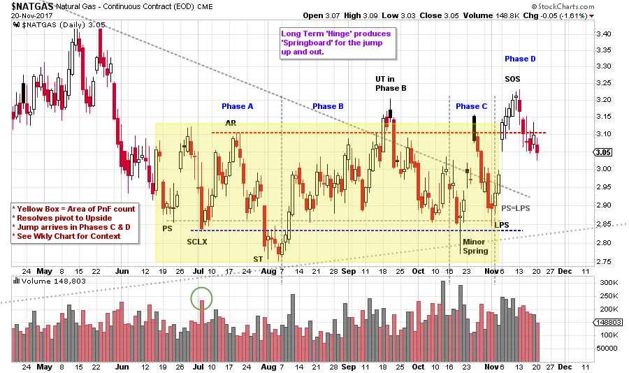
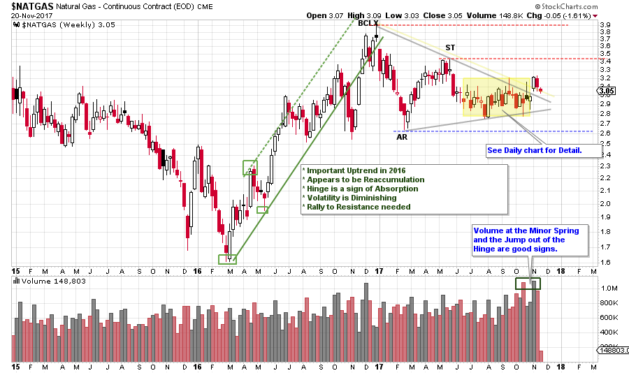
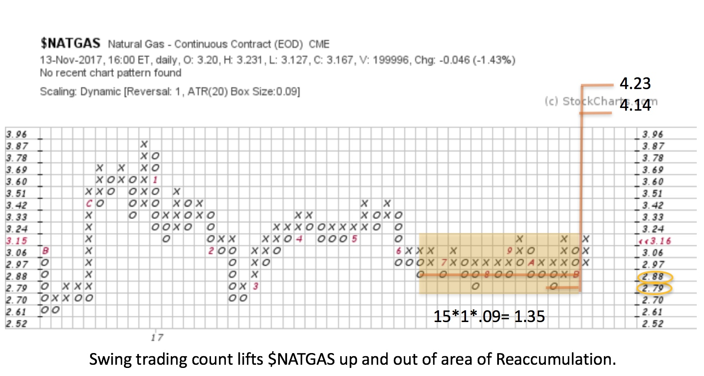

# Natural Gas Follows Crude?

URL: https://articles.stockcharts.com/article/articles-wyckoff-2017-11-natural-gas-follows-crude/
Date: November 20, 2017 at 04:37 PM
Author: Bruce Fraser

In the prior post, we evaluated Crude Oil which appeared to have completed a Reaccumulation. Natural Gas has a family resemblance to Crude Oil, but seems to be in a slightly different position. Early in 2016 $NATGAS and $WTIC began important rallies that lasted through the year and then entered large trading ranges. Please take a few minutes and compare $WTIC (click here for a link) and the $NATGAS charts below.

---

(click on chart for active version)

As expected, volatility is high in Phases A & B. Volume at the Selling Climax (SCLX) spikes and important price support is marked on the chart. The Secondary Test (ST) Springs the low and this begins a steady rally to an Upthrust (UT) in Phase B. We must always brace for sudden and quick turns in Phase B, as happens after the UT. As $NATGAS approaches Support volatility diminishes (price bars narrow and momentum slows). The Support line is broken for one bar and forms a big tail and closes the session above Support (this is an important bar). Immediately $NATGAS leaps to resistance (five bars). Take time to compare this October rally up to Resistance to the August to September rally. In the latter, Resistance turns back $NATGAS abruptly then a Last Point of Support (LPS) makes a higher low (note that LPS=PS). The next rally has a gap, this is a rush to buy $NATGAS. Now the rallies are fast and dynamic. We look for Support on the current pullback at the top of the gap area and the 50% retracement of the prior rally. The halfway point is 3.039 and this is also the area of the gap, where $NATGAS is as of this writing. Current price weakness should stabilize soon. Continued weakness below this area would argue the Accumulation is not complete. The current interpretation is for a Phase D & E rally and thus a turn up would be expected soon.

Converging Trendlines show a hinge or pivot that contains $NATGAS during 2017. The rally in Phase C bulges out of the hinge area and then returns back in for a LPS. The rally that follows jumps $NATGAS up and out of the Hinge and this coincides with Phase D (nice synchronicity!).

(click on chart for active version)

Two important features on this weekly chart. First is the big rally of 2016. Secondly, the hinge that formed during the 2017 Reaccumulation that followed the BCLX. The yellow shaded area is seen in more detail on the daily chart above. A jump of the downtrend line of the Hinge has occurred on volume. A rally toward Resistance by $NATGAS would suggest the unfolding of Phase D & E on the daily chart.

Compare $NATGAS weekly to Crude Oil ($WTIC) in the prior post. Both initiated rallies at the beginning of 2016 and then entered trading ranges. Crude Oil appears to be ahead of Natural Gas as it has jumped out of the trading range and is above Resistance. This is not the case with $NATGAS which has two levels of Resistance to overcome to breakout. Crude Oil is leading the way here. Let’s count the Point and Figure chart of $NATGAS now that the Hinge has been jumped (yellow shaded area).

Now that $NATGAS has turned up and out of the Hinge area and is trying to rally away from the Accumulation area let’s take a PnF count. The 15-column count (1 box reversal, ATR (20) scale) estimates a price objective that exceeds the high of the BCLX. There are additional Segments to count in this Reaccumulation area once, and if, $NATGAS is capable of clearing the current trading range structure.

All the Best,

Bruce

Ps. We will take a break during the upcoming Thanksgiving Holiday week. This break is a great time to review Wyckoff concepts (click here for a link).
