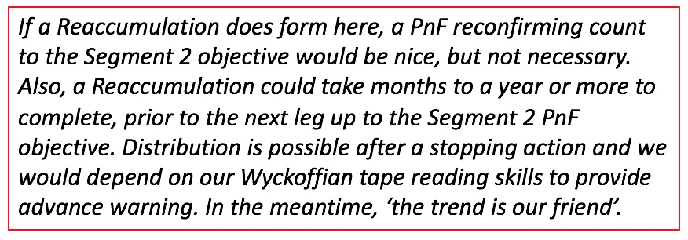
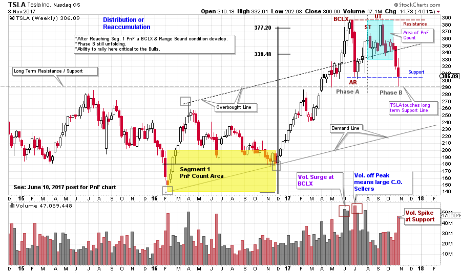
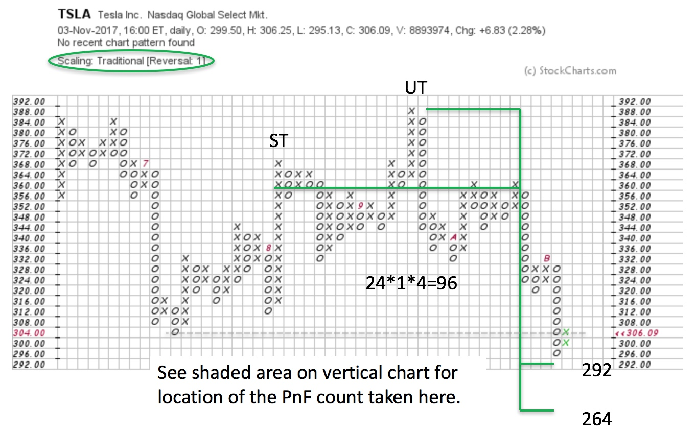

# Tesla Recharging?

URL: https://articles.stockcharts.com/article/articles-wyckoff-2017-11-tesla-recharging/
Date: November 05, 2017 at 12:03 PM
Author: Bruce Fraser

Tesla is proving to be an excellent ongoing case study. We suspect that the Composite Operator (CO) is very active in the electric automobile manufacturer. Please take a few minutes and review two prior posts; ‘The Point and Figure Distribution Paradox’ (click here) and ‘Shorts Find Tesla Shocking’ (click here). In each study, Point and Figure (PnF) analysis lit the way to important turns in the stock. Also, a study of the Reaccumulation area revealed the conclusion of the trading range and the emergence into a new uptrend. PnF counting of Segment 1 of the Reaccumulation generated a target of 339.48 to 377.20. A sharp Phase D/E rally went straight to 386.99 where a high-volume climax stopped the advance. This was a terrific rally from 180 and a classic PnF study.

---

When price accelerates into a Buying Climax (BCLX), combined with reaching PnF price objectives, caution is warranted (same principle for Selling Climax events). An Automatic Reaction (AR) is expected next, and that was the case for TSLA. In two quick weeks TSLA corrected all the way back to 303. The Wyckoffian expectation is for a Range Bound market next. A Secondary Test (ST) rally is what followed (these three points are labeled on the vertical chart). The Support line was drawn on the AR low and the Resistance line on the BCLX high to establish the boundaries of the range. What generally follows is a volatile and trendless period that will result in a Reaccumulation for the next rally phase or Distribution for a bear market decline. The Wyckoffian’s task is to determine which of these two outcomes is unfolding.

Here is what we concluded in the prior post as TSLA was reaching the 377.20 Segment 1 PnF objective;

Four months into this range bound market is TSLA ready to begin its next important move? Currently it is way too early to determine the direction of the next trend. Here is why. TSLA has had its primary uptrend stopped by the BCLX and AR. Volatility is the signature of an emerging trading range and that is certainly the case here. The high volume off the Resistance area, as price declines, is evidence of CO selling. Reaccumulation would be indicated by the price declines moderating and volume diminishing on each successive drop to support. Distribution would be indicated by bigger swings and high volume as price travels deeper into the trading range. Currently price conditions are inconclusive to either outcome, but there are early indications and a checklist for what to expect going forward.

(click on chart for active version)

As a trading range develops, volatility is typically high, such is the situation here. In Reaccumulation evidence of absorption is needed. The first decline from BCLX to AR took only two weeks with surging volume. The drop from Upthrust (UT) to Support took seven weeks and volume was diminished. A subtle, but useful, clue of potential absorption. The negative is the decline following the UT is deeper than the drop after the BCLX (a sign of increased volatility as the trading range matures). The most recent price bar has a surge of volume and a big tail (and a touch of the long term Support). If this is CO buying then a rally back toward Resistance should follow within a few weeks. There would be ease of movement upward within the trading range. The declines that follow this rally would have diminished volatility and shrinking volume.

If Distribution is forming, expect the rally from Support to be of low quality (the rally lacks volatility and volume dries up during the advance). The stopping area could be around the mid-point of the range (Overbought line of the trend channel could play a role). If price continues downward from here, falling decisively below Support, the inability to get back into the trading range would make TSLA vulnerable to a major Markdown.

We use one box reversal PnF charts to generate trading counts. TSLA generated a trading count of 24 columns and reached the Support area at 264 / 292. The recent drop came within one box of the minimum PnF count. Further weakness is possible into the lower target range. Which could produce a Spring / Shakeout.

Tesla stock has tumbled into Support (and toward PnF count objectives) on bad news. Production delays for the Model 3, wider than expected losses in the third quarter, and the potential loss of electric car tax credits in the proposed tax bill all piled onto the stock price at the recent lows. Time will tell, but important lows are made on bad news. We have a plan for continuation of Reaccumulation or the onset of Distribution. Once weakness is exhausted, we will watch for successful testing of the lows and then for the quality of the subsequent rally.

All the Best,

Bruce
