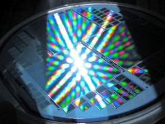
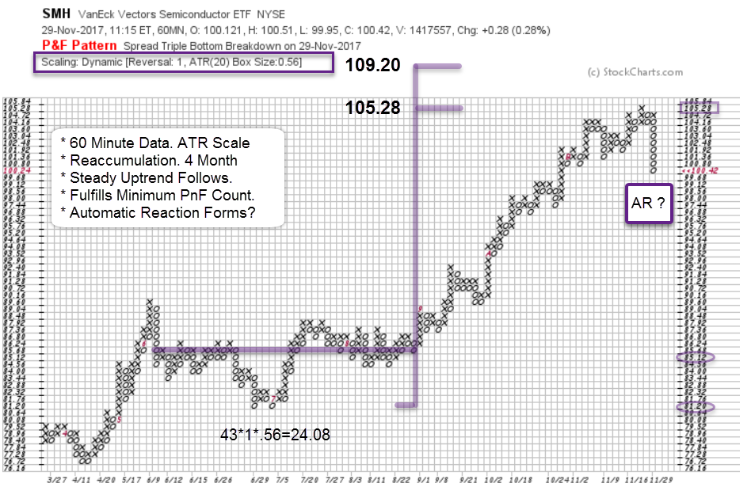
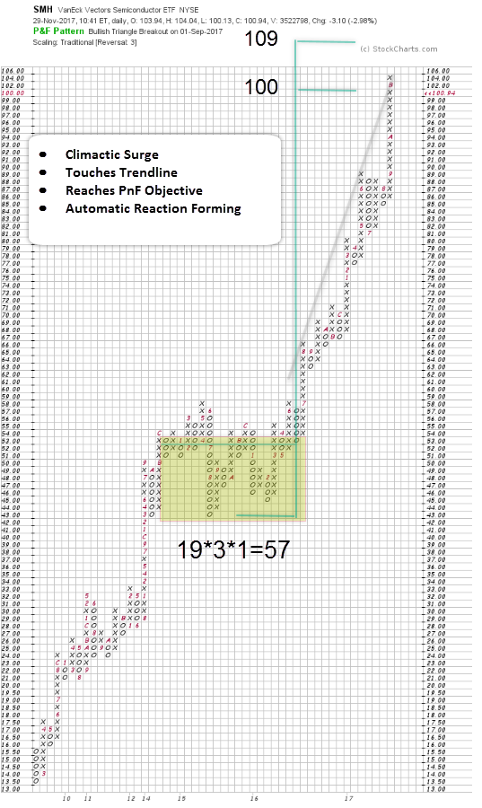
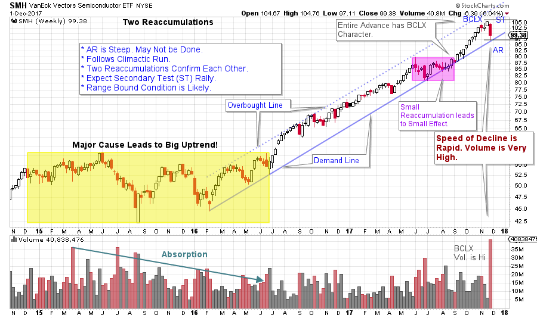

# Do Semiconductors Still Compute?

URL: https://articles.stockcharts.com/article/articles-wyckoff-2017-12-do-semiconductors-still-compute/
Date: December 02, 2017 at 08:00 AM
Author: Bruce Fraser

Semiconductor stocks have been top performers throughout most of 2016 and 2017. Often a strong Semiconductor group performance encourages speculation across the entire stock market and that has certainly been the case in 2017. Preceding the current 21-month uptrend in the Semiconductor ETF (SMH), a Reaccumulation formed and built a Cause for this advance. It seems as though semiconductor stocks always go up, but that Range-Bound Reaccumulation lasted more than 18 months. As a group these stocks were trendless for a year and a half.

A smaller Reaccumulation formed from June until September of 2017. Thereafter the trend resumed and SMH began climbing even faster, rising for 11 of the next 13 weeks (could this be a Climactic conclusion to the advance?). Let’s analyze the Point and Figure (PnF) counts for the large and small Reaccumulation areas and determine how much of the count objective has been spent on this uptrend.

---

A Reaccumulation formed from June to September of this year. Using 60-minute data and ATR (20) scaling this Cause can be counted. With a 1 box reversal method, 43 columns are counted with a.56 price scale. This projects to 105.28 / 109.20 for a swing trading price objective. On November 21st SMH made a high of 105.67 fulfilling the minimum objective of this price projection. Wyckoffians look for three primary events as Point and Figure projections are being reached. Climactic behavior with surging price thrusts on expanding volume is the first. Followed by sudden and temporary price weakness that seems to come all at once (unexpected volatility) which is called an Automatic Reaction (AR). And third, ideally, both of these events are occurring into PnF price objectives. Each of these conditions can be identified in the recent price activity of SMH.

A larger Cause formed from late 2014 to 2016 and can be counted using three box reversal methodology and traditional scaling (chart above). For the SMH, 57 points of price potential are generated (yellow box). A projection to 100 /109 is more than a 100% advance from the launching area of the completed Cause. At the recent high price of 105.67 SMH has, so far, slightly exceeded the mid-point of the projected range.

It is noteworthy that the recent trading count and the larger PnF count confirmed each other. These two counts nesting and reconfirming each other as SMH has accelerated into a Buying Climax is a trading trifecta.

(click on chart for active version)

The advance into the Buying Climax is steadily and steeply upward. Volume remains high throughout the rally. The sharp reaction (AR) that follows is further evidence of the advance being climactic. The Demand trendline should lend Support to SMH, but may not if Distribution is forming. Once SMH rallies into a Secondary Test (ST), Support and Resistance Lines would be drawn. A BCLX followed by an AR often leads to a Range Bound condition. Thereafter Wyckoffians will study price and volume characteristics very closely to determine if Reaccumulation or Distribution is forming. Typically, our bias is for the prevailing trend, but objectivity is important.

What now? The Semiconductor theme has been significant leadership for the entire stock market since early 2016. If the leadership of this group stalls other groups must rotate in and light the way for the market. A very tall task. Financials, Industrials and Transports might be candidates. The next rally for SMH will be telling. If upward momentum can reassert and drive prices to significant new highs we can happily stay with our long positions. If price stalls near the area of the BCLX peak and returns back below Resistance then a Range Bound condition is likely. SMH could spend months in such a trendless state.

In the meantime, let’s focus our Wyckoffian computing skills on other sectors, groups and themes that could inherit the lead if the trend of Semiconductors short circuit.

All the Best,

Bruce

Meeting Announcement: TSAA-SF will host a meeting at Golden Gate University. Miguel Cota, Vice President, Blackrock will present "Careers are not Linear - from Music to Finance" on December 2nd, 11am-12:30pm, Room 5215. For more information: TSAASF.org
