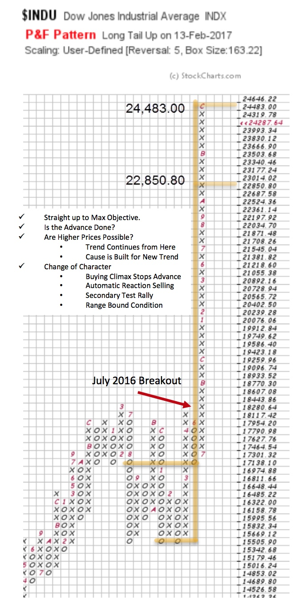
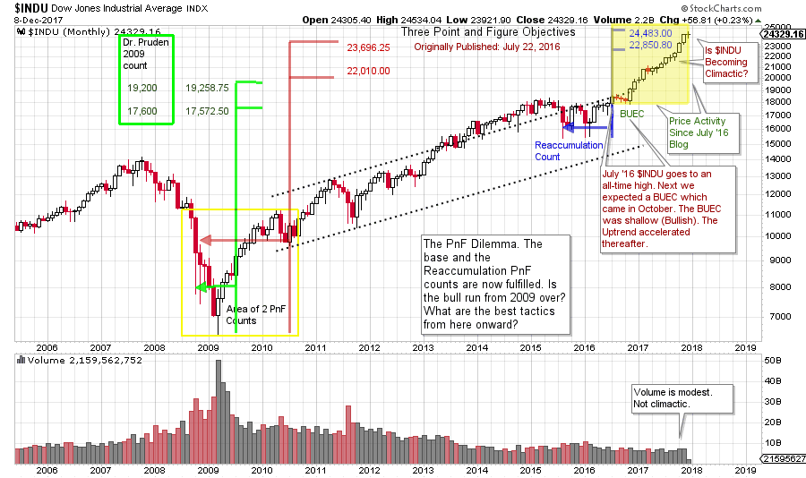

# Dow Jones Industrials PnF Dilemma

URL: https://articles.stockcharts.com/article/articles-wyckoff-2017-12-dow-jones-industrials-pnf-dilemma/
Date: December 10, 2017 at 08:00 AM
Author: Bruce Fraser

Horizontal Point and Figure (PnF) analysis offers a method for estimating the potential extent of a move. The dilemma is what to do when the price objective has been met. Should there be an automatic response of reducing position size in the price objective zone? Are there more dynamic strategies to consider? With the Wyckoff Method, we combine ‘tape reading’ skills of the vertical charts with the PnF count objectives. Though we have a dilemma of ‘what to do’ when these two skills converge, what a thrill it is to have all the elements come together in a well conceived campaign.

---

Currently a dilemma is setting up in the Dow Jones Industrial Average ($INDU) as it has just fulfilled an important PnF price objective. Let’s rewind to the summer of 2016 when the $INDU was stalled in a range-bound state for a year and a half. Wyckoffians know that trading ranges build the fuel for the next price movement. In this case we were looking for a Reaccumulation to be completed and then for a resumption of the uptrend. At the completion of the Reaccumulation, a PnF count was taken and projected upward. This count was published in the July 22, 2016 blog ‘Point and Figure Pie in the Sky?’ (click here for a link). In it we review Dr. Pruden’s legendary bull market PnF count (which had just been fulfilled) and then we considered whether this count could be made larger. Please take some time now to review the charts within that post.

The highest price in the range of these $INDU PnF objectives has just been reached. Therefore, we have a dilemma. What to do now?

This is a 5 box reversal PnF chart, which is akin to a monthly vertical bar chart. This Reaccumulation count confirmed the base (Accumulation) count and $INDU then began the new uptrend. We have studied the benefits of Reaccumulation confirming counts and it worked beautifully in this case. Note that the $INDU marched right to the highest count without interruption. This dramatic uptrend can be seen above.

Does the fulfillment of the highest PnF count call for the end of this juggernaut of an uptrend? Not at all, but we need plans and a framework for what could happen next. The Wyckoff Method is our framework and this dictates our plans.

We think of the stopping of the trend as a three-step process. In the case of an uptrend: a Buying Climax (BCLX) is the acceleration of price into exhaustion and a stopping action. An Automatic Reaction (AR) is a bout of selling that tends to be intense and swift, but short lived. The third step is a rally back toward the peak of the BCLX and is a Secondary Test (ST). This is a range-bound condition that typically leads to Reaccumulation or Distribution (and the start of building a cause for a future move).

(click on chart for active version)

Can a monthly vertical bar chart help in our analysis? On it are three marked PnF counts (all discussed in the July 22, 2016 post). Note that Dr. Pruden’s first bull market count was fulfilled at the start of the eighteen month Reaccumulation (in green). The expanded (Pruden, Bogomazov, Fraser) count (in red) extended the bull market as high as 23,696.25. The Reaccumulation count (blue) confirmed this with a 22,850.80 to 24,483.00 objective. Note the final bars of this magnificent advance. They accelerate. Is this a Buying Climax?

Let’s take an inventory of current conditions. Two defining PnF counts have been fulfilled, the bull market Accumulation Count and the Reaccumulation Count (to the top box, so far). Accelerating bars at the end hints of a potential BCLX into these PnF counts. What to expect next? Wyckoffians always respect the greater trend. A pause into year-end would not be a surprise. Wyckoffians are on the alert for a ‘Change-of-Character’ and that would be a bout of weakness, on volume, that would be described as an Automatic Reaction. October started the acceleration of the potential BCLX advance for $INDU. To retrace most of the October-November advance would constitute a Change-of-Character and an AR. A 5-box reversal of the uptrend would be the first PnF decline (a print below 23,666.90 would create a down column in the PnF chart). After an Automatic Reaction (AR), a rally into a Secondary Test (ST) would then be expected. Selling at the BCLX is speculative, but appropriate for some. The Secondary Test (ST) provides important additional Tape Reading information, making it a tactically appropriate location to initiate, or continue, selling. Buying on the turn of the AR offers the benefit of the reemergence of upward momentum. We then judge the quality of the rally toward either new high prices or the price Resistance of the BCLX area.

A shallow pause here without the dramatic AR would be bullish for higher prices, as it indicates that Composite Operators (CO) are not yet in a selling mood.

So now we have a few big, early clues: potentially climactic rally (into year-end) and multiple PnF objectives met. We have generated scenarios for what could happen from here. For homework generate daily and weekly charts of the $INDU and enhance this analysis by zooming into the detail of the smaller timeframe.

All the Best,

Bruce
