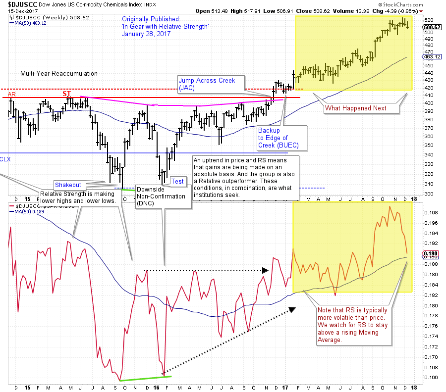
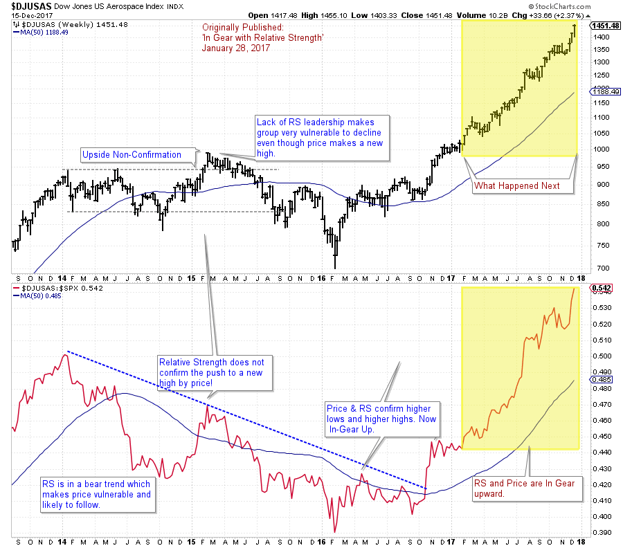
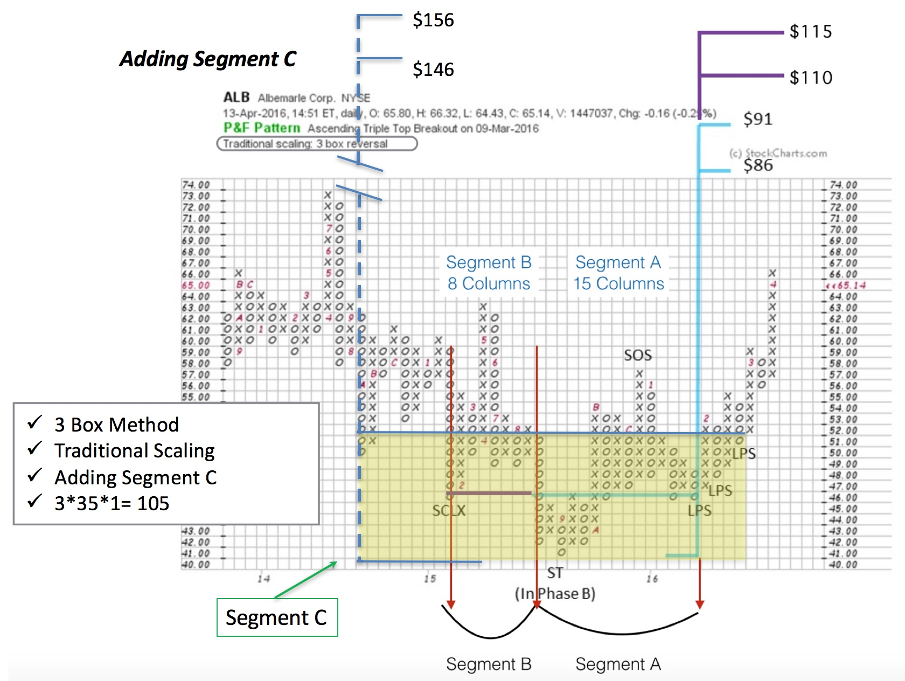
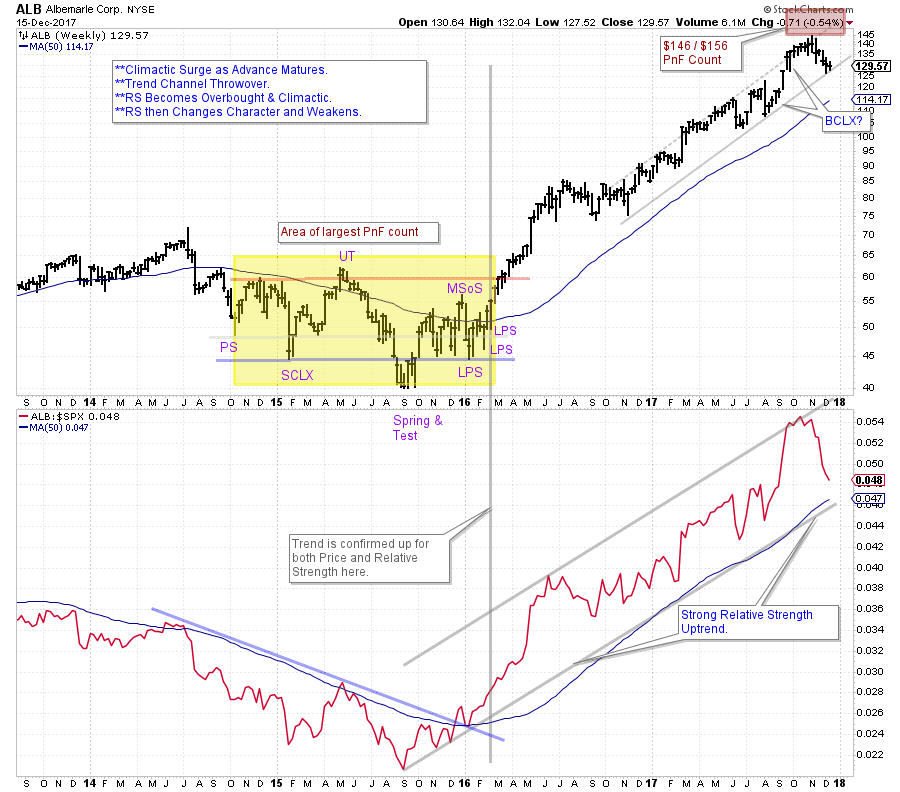

# Year-End Cleanup

URL: https://articles.stockcharts.com/article/articles-wyckoff-2017-12-year-end-cleanup/
Date: December 16, 2017 at 12:20 PM
Author: Bruce Fraser

Two favorite tools of Wyckoffians are Relative Strength analysis and Point and Figure (PnF) charting (Horizontal Method). As the year comes to a conclusion let’s reflect back on some case studies and bring them up to date.

‘In Gear with Relative Strength’ (click here for a link) profiled two Industry Groups (US Aerospace & Commodity Chemicals) as emerging market leadership. Relative Strength analysis was the basis for this conclusion. Both of these Industry Groups were entering into confirmed uptrends in price as well as Relative Strength. Take some time now and review this post.

---

(click on chart for active version)

A classic Jump above the Accumulation area, followed by a mild Backup (BUEC) signals the completion of Absorption of stock by the Composite Operator (CO). This combined with a confirmed uptrend in Price and Relative Strength sets up ideal conditions for a robust uptrend.

(click on chart for active version)

US Aerospace Relative Strength leaped out of a downtrend during the fourth quarter of 2016 with such a jolt that the Moving Average turned up shortly thereafter. By the time this chart was published the uptrend had been in force for more than three months. But the best was yet to come. Relative Strength and Price, in gear together, is a strong brew. Aerospace is unleashed in 2017.

Albemarle (ALB) is a stock we have been following for a while (click here and here for links). Segmenting PnF counts has been an emphasis with ALB. It is time to add Segment C to the Accumulation count. An objective of $146 / $156 is generated. ALB is a dramatic case study of the value of the horizontal PnF method. We began this study when ALB was Jumping out of the Accumulation area above $63. What has happened since?

(click on chart for active version)

A robust uptrend is supported by clear Relative Strength leadership. The largest PnF count reaches $146 / $156 which is near the highest print of $144.63. Now we see a sharp return of RS to the lower bounds of the trend channel (and the MA(50)). There is also a climactic surge of the stock price in the fourth quarter. The next rally will be telling. ALB has been a wonderful case study.

All the Best,

Bruce

Announcements:

My colleague and fellow Wyckoffian Roman Bogomazov and I will be conducting our first “Wyckoff Market Discussion” webinar of the year on January 3rd, 3:00 – 5:00 pm (PST). In this session, we will examine market scenarios for 2018, as well as prospects for outperformance by specific sectors, industry groups, and stocks. To register for this free webinar, pleaseclick here.

Roman Bogomazov will be conducting a complimentary webinar on Monday, January 8th. This is an introduction to his online series:Advanced Wyckoff Trading Course (AWTC) - Wyckoff Structural Price Analysis (3:00 – 5:00 p.m. PDT). For more information and the registration link,please click here
