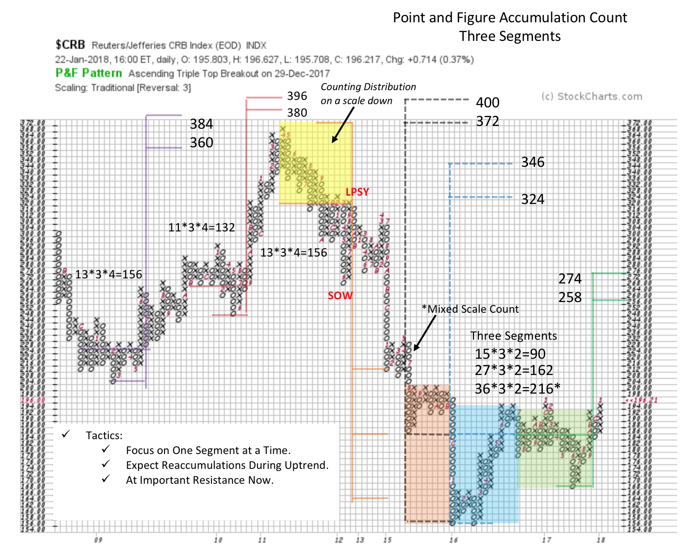
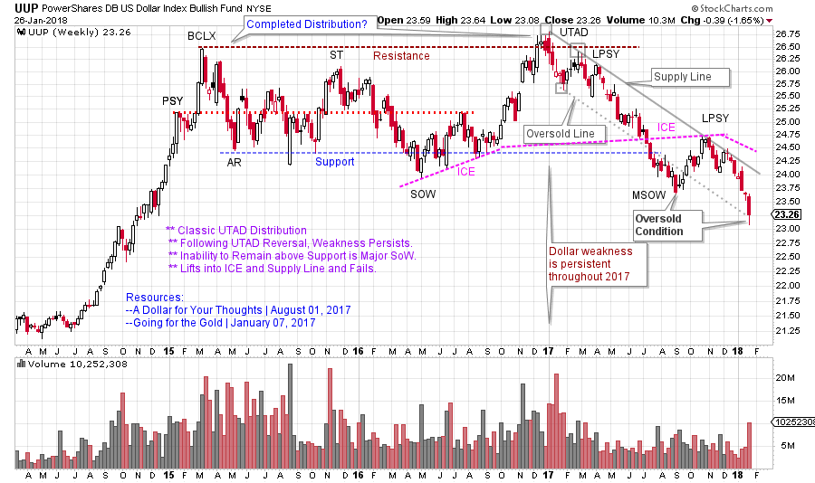

# Inflation Incubation

URL: https://articles.stockcharts.com/article/articles-wyckoff-2018-01-inflation-incubation/
Date: January 27, 2018 at 08:00 AM
Author: Bruce Fraser

Our resident Intermarket and Business Cycle experts, John Murphy and Martin Pring, have done a masterful job of evaluating the recent emergence of commodity prices. One proxy for commodity prices, the Commodity Research Bureau Index ($CRB), has come to life after a decade long downtrend. Is this evidence of an early, and important, uptrend in the price of commodities? We will eagerly await future posts from Mr. Murphy and Mr. Pring about this critical investment sector. In the meantime, let’s study a Point and Figure chart (PnF) of the $CRB for potential price objectives.

---

We are very interested in the $CRB horizontal PnF count objective that appears to be currently forming. A good practice is to go back into prior periods and take counts. When we see prior counts working we gain confidence. $CRB has been forming Accumulations and Reaccumulations since 2008 that have been effective. The 2009-10 Reaccumulation count slightly exceeded the eventual 368 high (it is not uncommon to marginally over and undershoot PnF counts), while the 2008-09 Accumulation count was spot on. Both did a wonderful job of signaling important markups. The inverted ‘V’ top was tricky. Note the Distribution on the way down. Commodities often Distribute on a declining scale off the peak (thus the inverted ‘V’ formations). A very large Sign of Weakness (SOW) forms after the first leg down. A rally recovers all of the SOW and stalls into a Redistribution. We treat the rally after the SOW to be a Last Point of Supply (LPSY). Now count from the LPSY to the peak. This is an advanced PnF concept, and well worth mastering. This technique had good success here as $CRB threw under the low objective by four boxes at the conclusion of the Climax run (and only temporarily remained below).

The Accumulation since 2015 has three countable Segments (so far). A quality lift-off for $CRB began after a climactic rush downward in early 2016. Serious PnF count building followed that initial leg up to 194. Since then 194-96 has been formidable Resistance and $CRB is there now. If $CRB can Jump above the Resistance area, three PnF Segments can be counted. Segment 1 has an objective of 258 / 274. Segment 2 is to 324 /346. The largest count exceeds the 2011 high with an objective of 372 /400.

These PnF counts could become larger. The two classic ways would be to either turn down from here to do more testing (an LPS or Spring typically). The other would be to Jump above Resistance, show strength (SOS) followed by a Backup (BU) to the Resistance area from above. Either of these scenarios would add columns of PnF count. Our conclusion is that a meaningful Cause is present and this could produce a robust markup at any time for $CRB.

A note on the dollar. The dollar has been in a persistent downtrend for all of 2017. After the LPSY in late October the dollar began accelerating downward. Below is a weekly UUP (PowerShares DB US Dollar Index Bullish Fund) chart of the run-up and decline of the dollar. We should keep in mind that a weak dollar typically results in higher rates of inflation as imported goods and commodities become more expensive. And that is likely what $CRB was waking up to as it rallied in the second half of 2017 (click here and here for prior posts on the dollar).

(click on chart for active version)

All the Best,

Bruce

Announcement:

I will be a guest on MarketWatchers LIVE with Erin Swenlin and Tom Bowley on Thursday, February 1stfrom 12-1:30pm EST. If you cannot make our live Wyckoff discussion, a recording will be available. See you then. (click here for more information)
