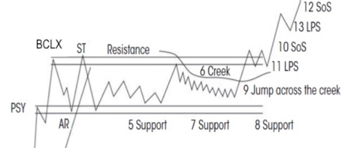
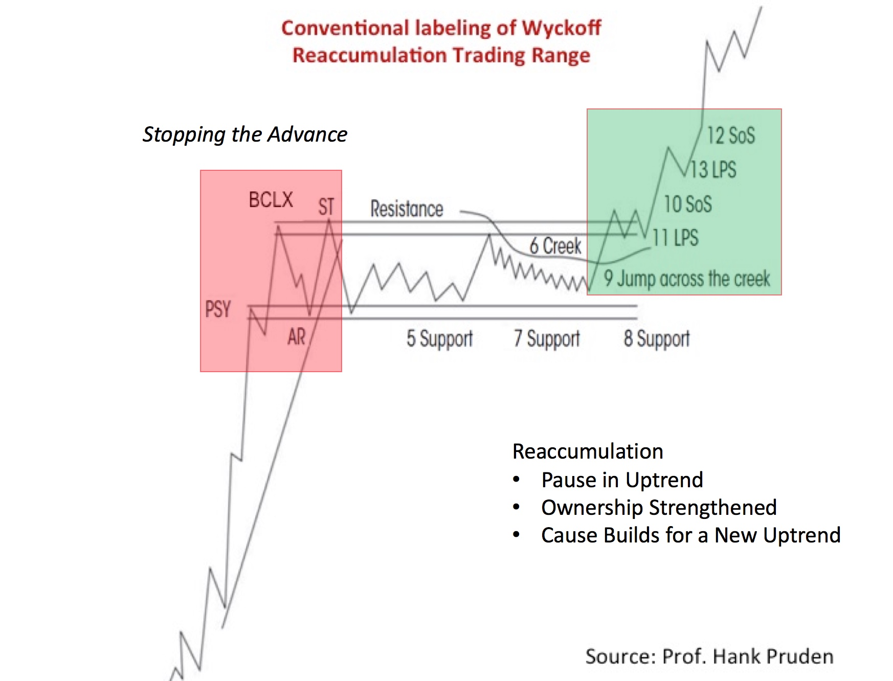
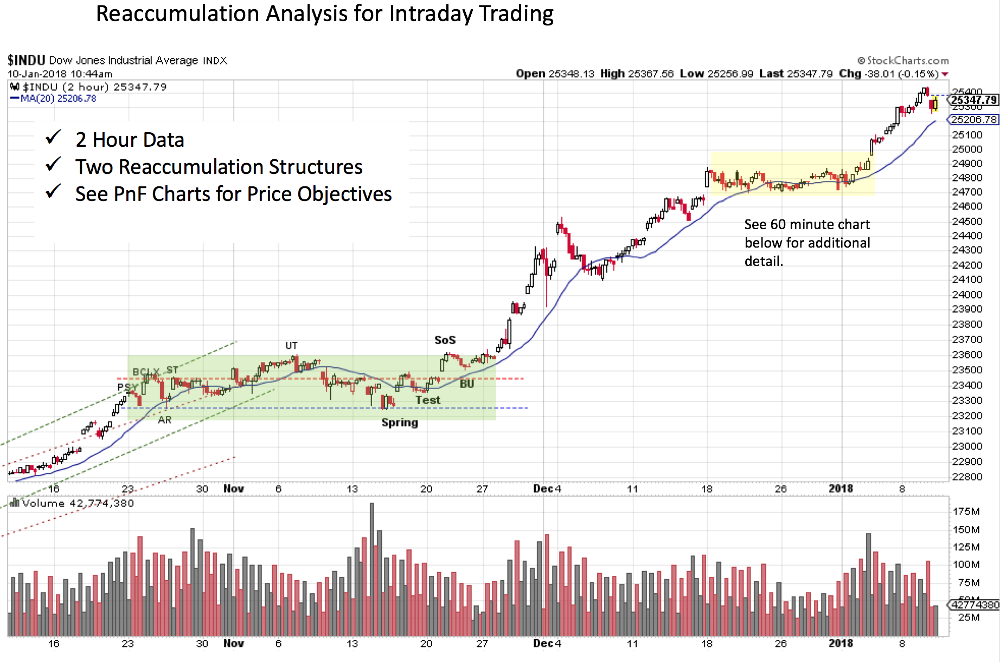
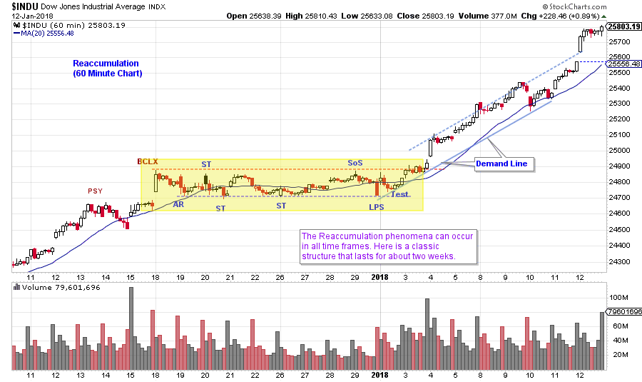
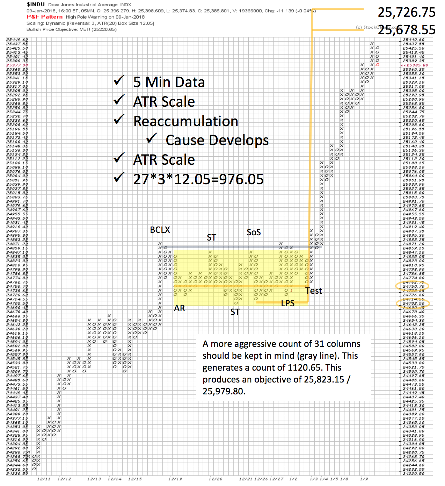
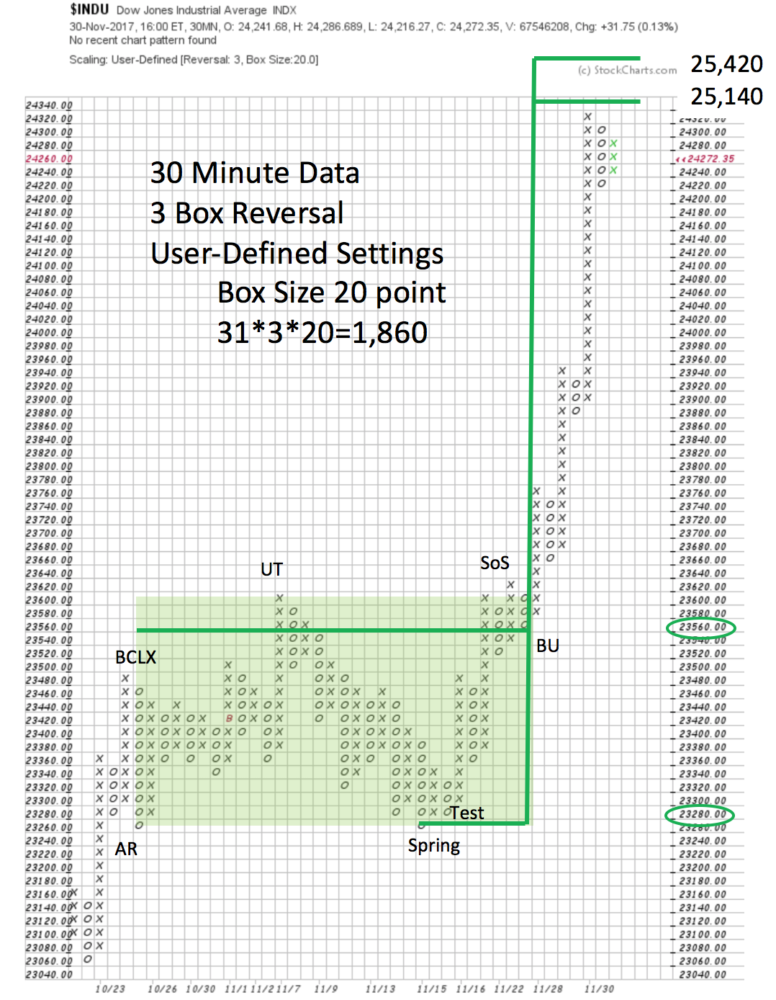

# Reaccumulation Review

URL: https://articles.stockcharts.com/article/articles-wyckoff-2018-01-reaccumulation-review/
Date: January 13, 2018 at 02:22 PM
Author: Bruce Fraser

A big thank you to Erin Swenlin and Tom Bowley for hosting me on MarketWatchers LIVE this past Wednesday. I had a blast being on their excellent (and Live) market program. The Wyckoff topic we covered was Reaccumulation structures. There were a few interesting intra-day charts that we did not have time to show. Let’s look at those charts here and use them for a general review of the very powerful and useful Reaccumulation trading range concept.

---

A Reaccumulation serves the same purpose as an Accumulation with one main distinction. An Accumulation stops a downtrend as the Composite Operator begins the lengthy process of Absorbing shares. This begins with the stopping action of a Selling Climax (SCLX). A Reaccumulation is the process of Absorbing shares during an uptrend. It is a pause in a major uptrend that can take weeks to months (sometimes years) to complete. A Reaccumulation will begin with an acceleration of the uptrend into a Buying Climax (BCLX). A BCLX and an Automatic Reaction (AR) set the Resistance and Support areas of this new ‘range-bound’ condition. The trendless trading range will discourage many traders and they will sell shares to move on to other more active stocks. The C.O. uses the release and availability of shares to add to their positions. Wyckoffians will attempt to identify the footprints of the C.O. in the Reaccumulation process to initiate or add to holdings along with the Composite Operator.

Often traders will misinterpret a Reaccumulation as Distribution. With careful analysis Wyckoffians can learn to make the essential distinction between these conditions. Recall that Absorption results in Reaccumulation or Accumulation, and price action becomes ever less volatile as the structure comes to a conclusion and the uptrend begins. This is because most of the available shares have been removed from the marketplace (think absorption). In the schematic above notice how each of the lows (in the area of Support) are higher than the prior low. It is not uncommon for the lowest price of the structure to be on the AR or the following Test. Thereafter the C.O. is putting bids slightly higher on each subsequent pullback. Reaccumulations can also have a Spring at the conclusion (click here and here and here for prior Reaccumulation blogs).

Normally daily or weekly charts are used for this analysis. But, the Reaccumulation concept also shows up in intraday timeframes. The examples below are using intraday time frames for Wyckoffians that prefer to campaign swing trades that last from days to weeks.

Using a 2-hour chart, two Reaccumulation pauses are evident. Each sets up an attractive swing trading rally. These are often called ‘Stepping Stone Reaccumulations’ as they look like stair steps. The lower one is stopped by a BCLX and AR, beginning a range bound condition. The formation is about five weeks in duration. Note the Spring and Test that results in a ‘Change of Character’ and the beginning of the Markup. An Upthrust (UT) at the mid-point leads to a long grinding decline that returns all the way to the Support line. Such a labored decline suggests that Absorption is occurring on the way down. The ease of the rally that follows the Spring confirms it. Note how the Reaccumulation could be misinterpreted as Distribution.

The second, and smaller, Reaccumulation is a contrast from the larger structure in November. Where the prior had a Spring at the end, this has a series of slightly higher lows (beginning with the Secondary Test). This suggests good demand for the $INDU stocks as the Reaccumulation matures. Once the LPS is confirmed by the Test, a ‘Change of Character’ becomes evident as price moves easily upward to Resistance and then into a new Markup. Now let’s calculate how much fuel is in the tank with a Point and Figure Count (PnF).

The vertical chart was constructed with 60-minute data, the PnF chart uses 5-minute data and ATR scaling. Two counts are taken and generate 976.05 and 1120.65 of rally potential. Note that once the final testing is completed the markup is dramatic. Thus, we see the value of intraday analysis for swing trading Reaccumulation studies. Let’s consider the PnF of the first and larger Reaccumulation to see if these two PnF counts produce a ‘Stepping Stone Confirming Count’.

Here 30-minute data is used to generate the PnF chart. User defined scaling of 20 $INDU points produces 1,860 points of potential. Intraday PnF tends, more easily, to over or under shoot the price objective by some modest amount. The real value of this analysis is to estimate the potential of the rally. In the two cases above the Reaccumulation analysis and the PnF studies lead to two very successful campaign quality rallies. In the larger PnF count, $INDU has exceeded the most aggressive price objective while the other, shorter term PnF count, has just been exceeded and the more aggressive count is close to being met. The Stepping Stone Confirming counts of the two PnF charts produce similar price objectives.

Reaccumulations are encountered with frequency. There will be a number of them in a long bull market. Accumulations come along much less frequently. Reaccumulation analysis is a very powerful tool for shorter term Wyckoff traders using intraday data and analysis.

All the Best,

Bruce
