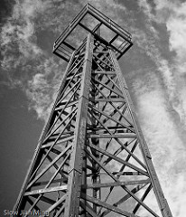
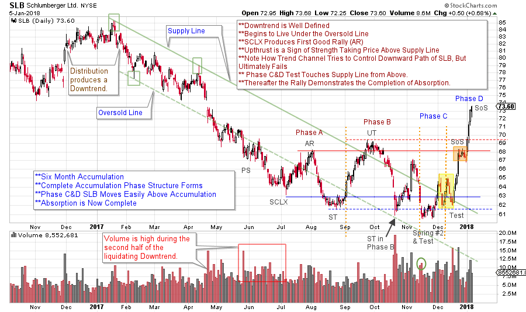
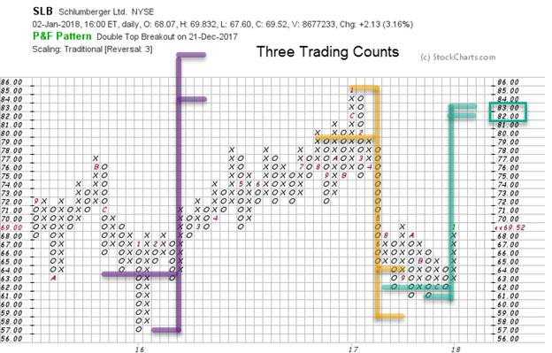

# Schlumberger Rising

URL: https://articles.stockcharts.com/article/articles-wyckoff-2018-01-schlumberger-rising/
Date: January 06, 2018 at 08:00 AM
Author: Bruce Fraser

The Energy Sector lit up the final month of 2017. There are a number of dynamic stocks amongst this theme we can profile. Let’s choose one (and circle back to study others later on). This case study is a good way to begin our posts in the new year. Stocks that are completing Accumulation and Reaccumulation are poised to begin important uptrends. Accumulation is the process of Absorbing available shares of stock, stealthily, in a trendless trading range market. Once Absorption is complete, the stock can then suddenly and unexpectedly change behavior from listless into a ripping uptrend. The Wyckoffian strategy is to wait patiently for this inflection point and then to get onboard. Let’s see if Schlumberger can illustrate these lessons.

---

(click on chart for active version)

For a review go back and study the Accumulation schematics with Phase analysis (click here). Accumulation is a logical and sequential process of stock being transferred from weak to strong hands. Therefore, Accumulation follows a series of steps that can be tracked in the activity of price and volume. Note how price swings are wide and volatile during Phase A & B and this is evidence of large supply hanging over the market. Phase C & early D is notable by the diminishing volatility. SLB hovers near the lows of the Support area and this discourages traders and the public and encourages selling, but it is a very good sign that Absorption is nearing completion (the Composite Operator is a crafty character). The final point to make here is the nature of the dynamic rally that follows the testing of the Spring. Rallies such as this are what Wyckoffians live for. So, the proper interpretation of the completion of the Accumulation area, and the Jump out of it, is an important skill.

The prior Accumulation and Distribution counts work well. The current Accumulation count points to 82/83 and is near the prior 2016-17 high. This count could potentially become larger if SLB returns back to the Accumulation area, producing a Backup (BU) or a Last Point of Support (LPS). Neither of these are required or expected.

The vertical chart of SLB is well annotated to enhance your study. Take time to review it. Commit to identifying these well Absorbed stocks in 2018. There will be countless opportunities to campaign them in the year ahead.

All the Best,

Bruce

Announcements:

I will be a guest on MarketWatchers LIVE with Erin Swenlin and Tom Bowley on January 10thfrom 12-1:30pm EST. Fellow Wyckoffians, I look forward to being with you on Wednesday during market hours. If you cannot make our live Wyckoff discussion, a recording will be available. See you then. (click here for more information)

The Wyckoff Market Discussion is a weekly webinar series devoted to the analysis of current markets using the Wyckoff Method. Roman Bogomazov and Bruce Fraser, internationally recognized Wyckoff Method educators, conduct these discussions. Lock in a special New Year’s rate of $99 per month for these unique educational webinars. View last week’s free session (click here). Click here to learn more.

Roman Bogomazov will be conducting a complimentary webinar on Monday, January 8th. This is an introduction to his online series:Advanced Wyckoff Trading Course (AWTC) - Wyckoff Structural Price Analysis (3:00 – 5:00 p.m. PDT). For more information and the registration link,please click here
