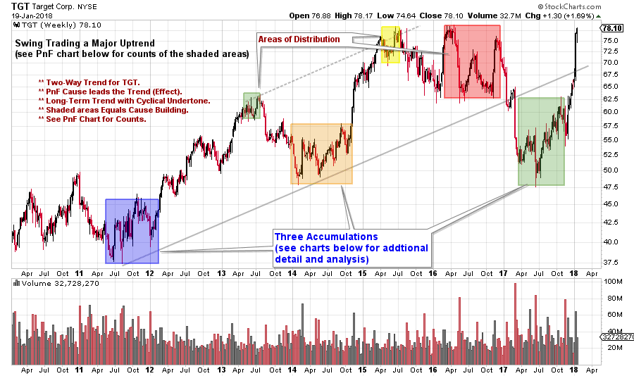
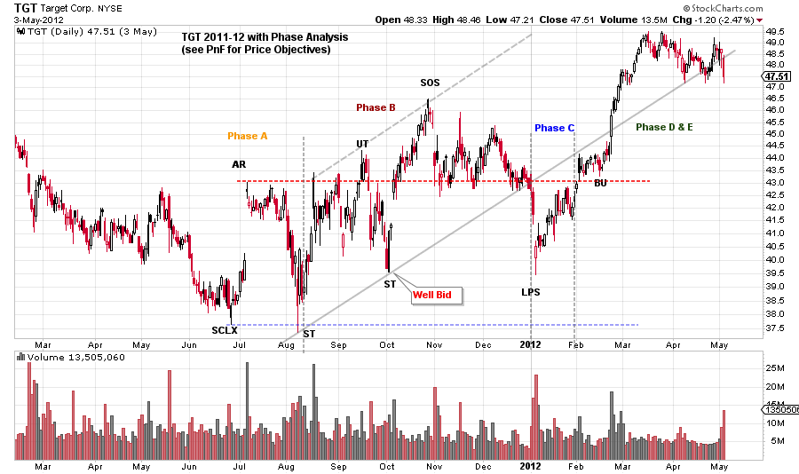
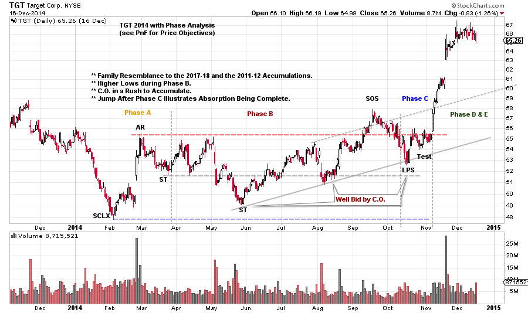
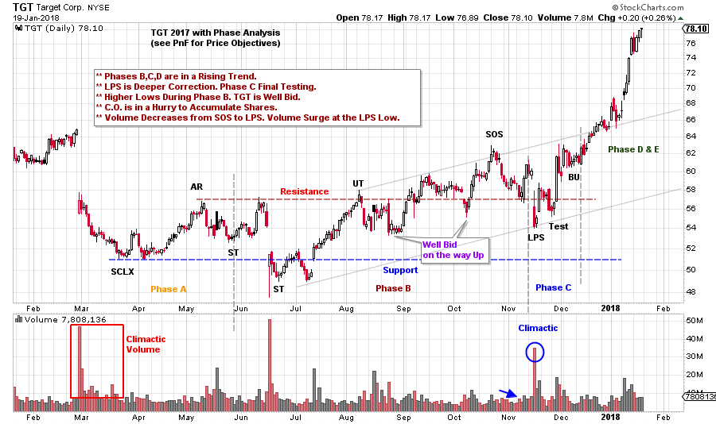
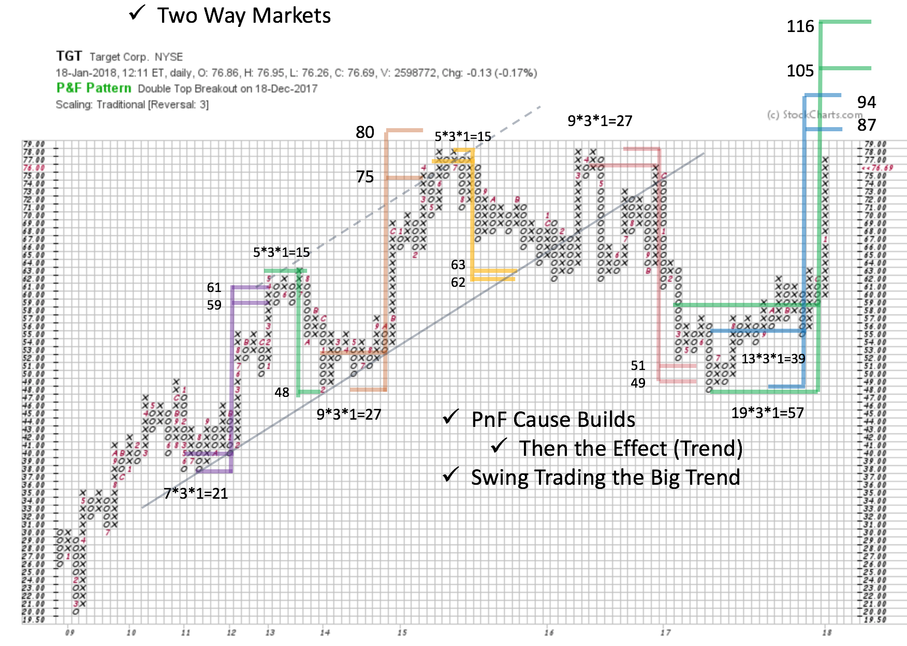

# Swing Trading Case Study

URL: https://articles.stockcharts.com/article/articles-wyckoff-2018-01-swing-trading-case-study/
Date: January 20, 2018 at 05:30 PM
Author: Bruce Fraser

2017 was the year of the ‘Uni-Market’ where leading stocks, industry groups and indexes marched higher from start to finish. Many important stocks got into a lockstep trend beginning in 2016. Two-Way markets are more common and we should see more of this in 2018. Markets are typically a cacophony of cross currents. The ebb and flow of themes that are emerging and submerging constantly. The Wyckoff Method is ideally suited to identifying and navigating profitable and emerging trends. Let’s conduct a Swing Trading case study on one stock that has been in a long-term trend with a pattern of cyclicality within the trend and see how the Wyckoff Method can assist us.

---

(click on chart for active version)

Most large trends take time to unfold and have cyclical internals. Target Corp. (TGT) has been such a stock and is the focus of our case study. As Wyckoffians, our contention is that important trends are preceded by a period of preparation, or Cause building. The footprints of the Composite Operator (C.O.) are identified in the vertical bar charts. It takes time for the C.O. to Accumulate their line of stock. We call this Absorption. The shaded areas above are periods of absorption that can be tracked and measured with Point and Figure Charts (PnF). We will focus on the Accumulation periods here. You are encouraged to study the Distributions.

(click on chart for active version)

Here is the 2011-12 Accumulation with Phase analysis. TGT has a Selling Climax (SCLX) following a classic markdown. The Automatic Rally (AR) sets the level of Resistance and the SCLX the Support. Generally, TGT stays around this trading range, but the Accumulation does have an upward bias. Note the rising scale of the TGT trend in Phase B. This shows urgency by the C.O. to Accumulate shares. This is likely because the major trend is up and prior Absorption (before 2011) has made TGT shares scarce and difficult to buy. After the Sign of Strength (SOS), there is a more important decline into a Last Point of Support (LPS). After the LPS there is a Change of Character as TGT price marches up and out of the Accumulation area and a new markup begins. This cyclical period of Absorption takes a full year to complete.

(click on chart for active version)

After a robust uptrend for TGT following the prior Accumulation a period of Distribution and downtrend follows. This concludes with a SCLX in early 2014. A range-bound condition follows for most of the year. Note that the SCLX is the low and an upward price tilt forms. We suspect the C.O. is bidding up prices during Phases B & C. This is another large cyclic pause. Note the similarities to the prior Accumulation. After the LPS, TGT easily marks up. The uptrend is in full force.

(click on chart for active version)

During 2017, TGT enters another Cyclical period of Accumulation after a markdown and SCLX. Clearly there is a family resemblance between each of the Accumulations studied.

A series of higher lows follow the Secondary Test (ST). After the SOS expect an LPS. A trading tip is that each of the LPS examples concludes the decline with a climactic rush downward from the SOS. The turn off the LPS and Test is a classic place to initiate (or add to) a position (stop under the LPS or the next lower low). The Back Up (BU) is tight, dull and quiet and hovering at the level of the SOS. A very good sign for the bulls. A robust markup out of the Accumulation area follows.

This cyclic 2017 decline does differ from the prior two in a notable way. It follows a much larger Distribution and thus the Markdown is larger. As can be seen on the weekly chart, price breaks down and out of the big trend channel before forming an Accumulation. Now TGT is back into the channel and is approaching the high prices of 2015 and 2016. An excellent recovery. The prior highs are likely to be formidable Resistance and TGT could spend some time at this key area. This third TGT Accumulation is the largest and produces two PnF counts above the old highs (see PnF for the counts). A note of caution is that TGT fell out of a five-year uptrend prior to the third Accumulation studied. Therefore, new Distribution could form in the area of the prior high as the major trend has been interrupted.

Using a TGT PnF chart we have a swing trading roadmap. Here are the PnF counts of the three Accumulations studied above and the intervening Distribution counts. A big Wyckoffian takeaway is that all good moves are preceded by a Cause (that can be counted with a PnF chart). Vertical chart analysis and the PnF count method is a powerful combination for investors and traders. Swing traders can position the ebb and flow of prices within the framework of the major trend. Long term campaign traders can use these swings to add to positions and to partially hedge at the extremes.

We are likely to experience more ‘Two-Way’ markets in the year ahead and Wyckoff Method tools are well suited to such an environment.

All the Best,

Bruce

For Additional Review Materials (click here)

Announcements:

I will be a guest on MarketWatchers LIVE with Erin Swenlin and Tom Bowley on Thursday, February 1stfrom 12-1:30pm EST. If you cannot make our live Wyckoff discussion, a recording will be available. See you then. (click here for more information)
