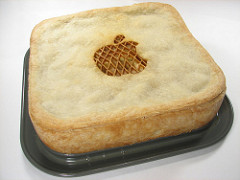
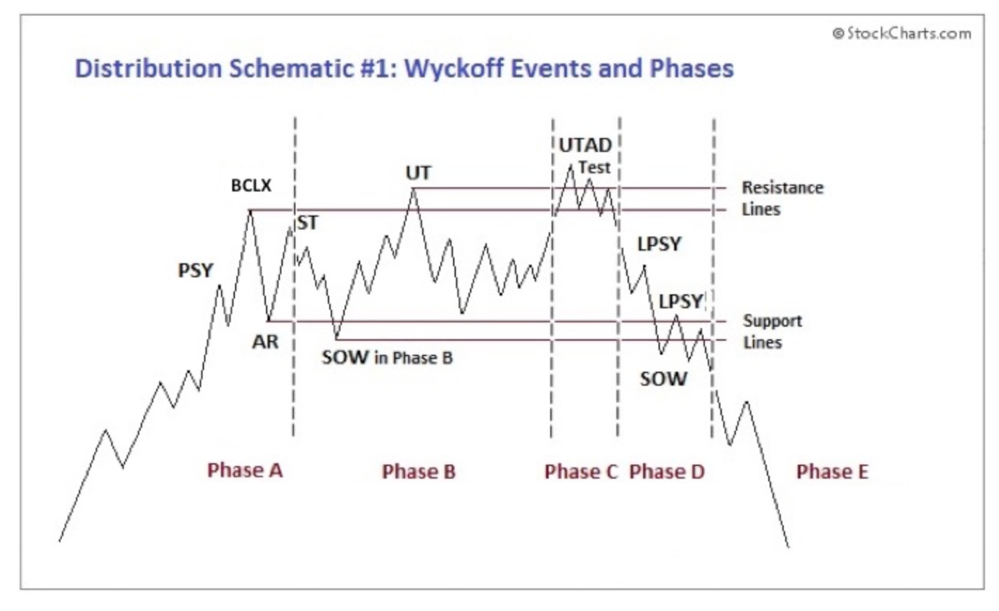
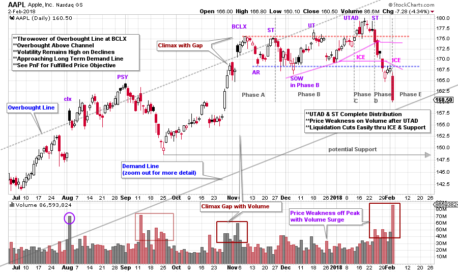
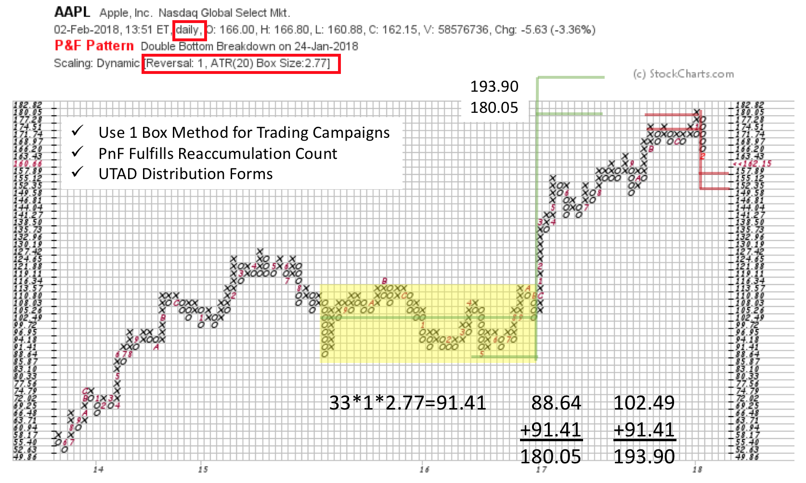

# AAPL Pie

URL: https://articles.stockcharts.com/article/articles-wyckoff-2018-02-aapl-pie/
Date: February 04, 2018 at 02:41 PM
Author: Bruce Fraser

Apple, Inc. has been an endlessly illuminating Wyckoff Method case study during this bull market advance. The ascension of AAPL demonstrates the power of large institutional sponsorship. The top echelon of this sponsorship is what Wyckoffians call the ‘Composite Operator’ (C.O.). The footprints of the C.O. can be identified in the vertical price charts. The objective is to determine the motives of the C.O. (from the price chart) and then to interpret when the stock is ready to emerge into a phase of markup (or markdown). AAPL has been an instructive case study for us as it has very large Composite Operator sponsorship. Such large C.O. sponsorship, Wyckoffians would argue, produces textbook examples of the Methodology. Please take some time now and review prior posts of AAPL during its epic bull run (click here and here and here and here).

---

We now turn our attention to the principles of Distribution. After a period of Markup, the C.O. makes a decision to no longer campaign the stock to higher prices and they systematically remove buying support. This is done through the process of carefully selling their immense holdings. They have the intention of Distributing the stock to the public and other institutions while weakening the stock price as little as possible. Stopping a bull campaign by suspending their buying and then selling their stock holdings, stops the prior uptrend. Above is a schematic of the Distribution process with Phases (click here and here to read more). Let’s attempt to apply these events and Phases to AAPL.

(click on chart for active version)

Note the similarity of AAPL stock to the schematic above. We are seeing the footprints of the C.O. in the price of the stock. Note how the Buying Climax (BCLX) and the Automatic Reaction (AR) establish the range bound condition with Support and Resistance lines. Pay attention to the price reactions off the Resistance line. Volume is high on the declines and price volatility is greater than on the advances. Phase A stops the uptrend (result of initial C.O. selling) and Phase B is a trendless period where the C.O. is stealthily selling their holdings. A Phase C Upthrust After Distribution (UTAD) is a unique event where the price surges to new highs, and in short order fails back into the range of the Distribution (somewhat like an inverted ‘Spring’ during Accumulation). The Secondary Test (ST) of the UTAD and subsequent failure, typically results in a downward cascade of price into a new downtrend. Phase C is this final upward test of the Distribution and the Change of Character into a Markdown. And that is what has happened with AAPL. In the Phase D decline notice the immense volume and volatility, which is evidence of the presence of large Supply.

Make this chart active and zoom out to study the long term trend channel construction. Note the throwover of the Overbought line at the Preliminary Supply (PSY). The gap up into the climax (clx) accompanied by very high volume is an important clue of the C.O. beginning to Supply the market with stock. The next important event is the price weakness and high volume that follows the PSY. This is all evidence of the C.O. beginning to sell in quantity. We will circle back to this structure below. The next Overbought condition is the BCLX throwover and the emerging Distribution. But, as we see, Distribution may have started earlier at the ‘clx’ and ‘PSY’. One last observation is to note the weakness that follows the PSY, it is an important Automatic Reaction. We may need to reconsider the size and structure of the Distribution at a later date as AAPL trading progresses.

A one box reversal Point and Figure (PnF) count of the large Reaccumulation (yellow shaded area) generates a price objective of 180.05 / 193.90 which is an exact hit of the lower target (on the UTAD thrust). An earlier blog published a slightly higher 3-box count. The combination of the trend channel throwover, completion of the UTAD and the PnF count hit is compelling evidence of upward trend exhaustion.

The UTAD produces a PnF target of 157.89 / 152.35 which would put AAPL to the Demand trendline (and possibly through it). After that low a more important rally may follow. Wyckoffians will judge the quality of any subsequent rally for motives of the C.O. and their intention to either further Distribute or Reaccumulate AAPL.

Now let’s circle back to the PSY and the possibility that a larger Distribution structure emerged there. Notice the Support line drawn on the vertical chart at about 148. If a rally begins somewhere near this Support (around 152 possibly) could this result in broadening the Distribution across to the PSY (could the PSY be the more important BCLX)? Thus, a larger PnF count could still be forming. Also, a series of additional rallies and reactions would give the CO more time to complete Distribution.

All the Best,

Bruce
