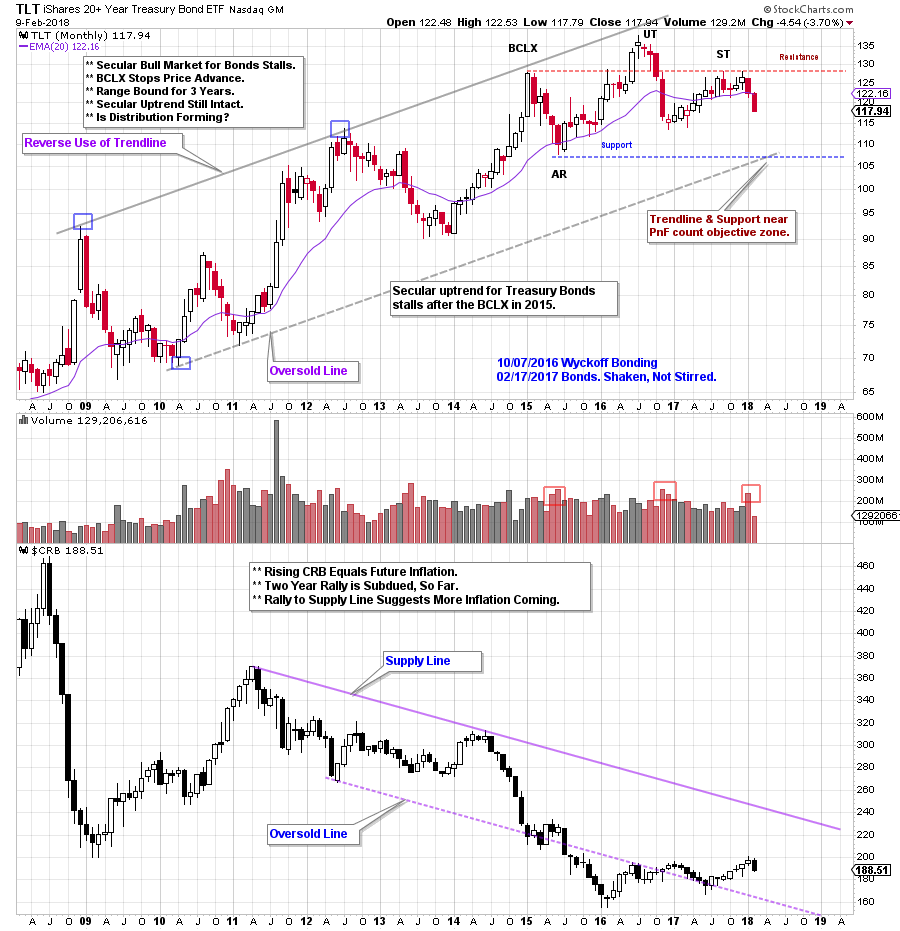
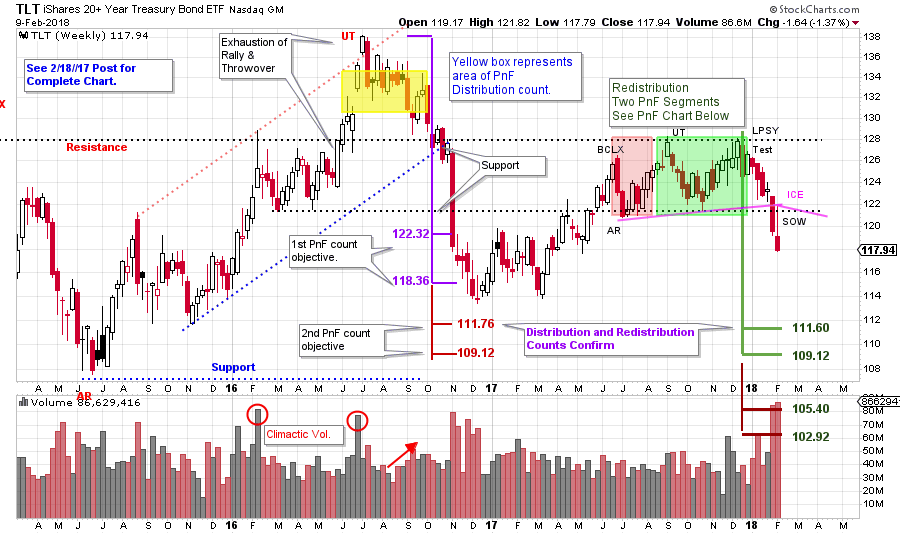
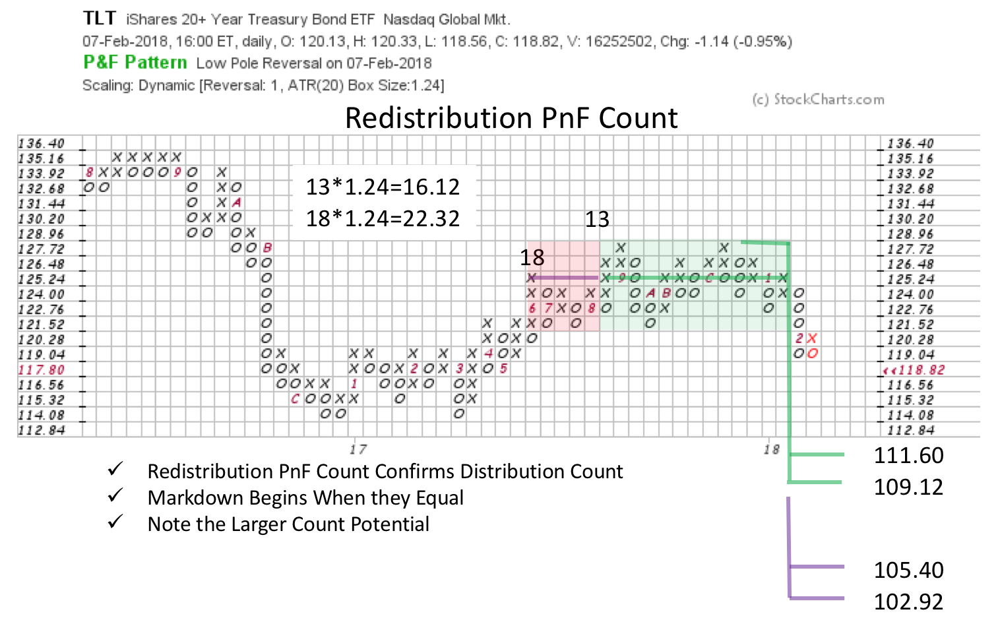

# Bonds Get Clipped

URL: https://articles.stockcharts.com/article/articles-wyckoff-2018-02-bonds-get-clipped/
Date: February 11, 2018 at 09:30 AM
Author: Bruce Fraser

As stocks have been getting roiled over the last two weeks, bonds have been somewhat overlooked. Bond prices began dropping in December 2017, and possibly contributed to the weakness in stock prices weeks later. It has been about a year since we have looked at treasury bonds. What are they indicating now, and could they impact the future direction of stock prices?

---

(click on chart for active version)

A monthly vertical chart illustrates the secular uptrend for treasury bond prices since 2008. In 2015 a Buying Climax (BCLX) signals the beginning of a Range Bound bond market, which is now three years old. Bonds were profiled here upon the completion of the Distribution at the Upthrust (UT) in 2016 (click here for a link). After dropping and fulfilling a PnF count, a rally followed in 2017. This rally is to a lower peak. Now bonds are marking down again. Two Support lines make for compelling price targets. Can we confirm them with Point and Figure studies?

The Commodity Research Bureau Index ($CRB) has been in a secular downtrend and remains at a low level. A rising CRB would be the raw material for future inflation pressures. The CRB returning to the Supply Line would increase inflation and likely cause bond yields to rise. An Accumulation structure may be forming for commodity prices (click here for a recent post). Until this happens, the Street’s fears about inflation are likely greater than the actual economic pressures. We will watch the CRB for an emerging uptrend.

Meanwhile bond prices are falling and interest rates are rising. How far down can bond prices go? Zoom in and study the Distribution that formed at the Upthrust (yellow shaded area on the chart below). Two counts for TLT were generated. The smaller count projected 122.32 / 118.36 and did a good job of estimating the first important low (click here and here to see prior bond posts). The larger Distribution PnF count has not been reached yet. Could bonds be headed there now?

(click on chart for active version)

Bond prices weaken in December 2017 and fall out of a six month range of Redistribution and two counts are generated. The smaller count almost perfectly matches the Upthrust (UT) count. Often when the Redistribution count (green shaded area) equals the Distribution count (yellow shaded area) the downtrend is ready to resume, and that was the case here.

Bonds remained weak as stocks were falling in the last two weeks. Characteristically bonds find a bid and rise when stocks are dropping. Why would bonds and stocks drop together? Wyckoffians might venture a guess, but more importantly, we watch the Tape. Bonds fell into a downtrend in December (and this could be one of the triggers for the recent stock weakness) on widening price spread and expanding volume. On the monthly chart above we see the Automatic Reaction (AR) Support line and the Trend Channel line intersect at about 107. The Distribution and Redistribution PnF counts nest and match at about 111.76 to 109.12.

The secular uptrend channel for TLT is still intact. A return to the Oversold Line is the next likely target for the reasons stated above. We will revisit bonds when, and if, these targets are achieved.

All the Best,

Bruce
