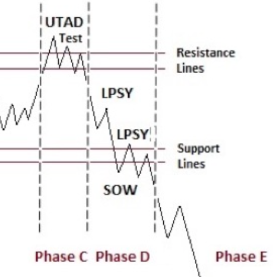
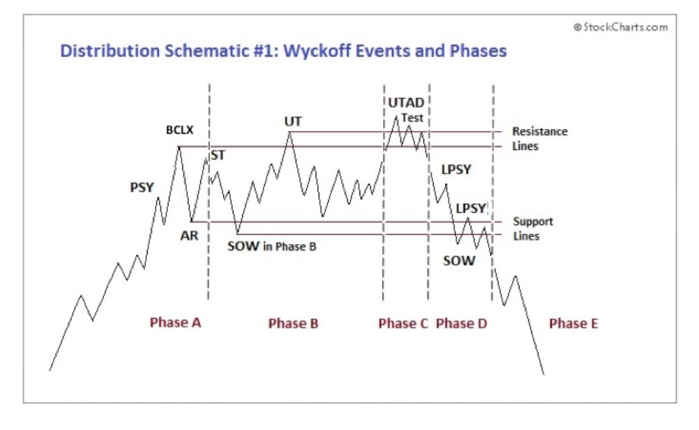
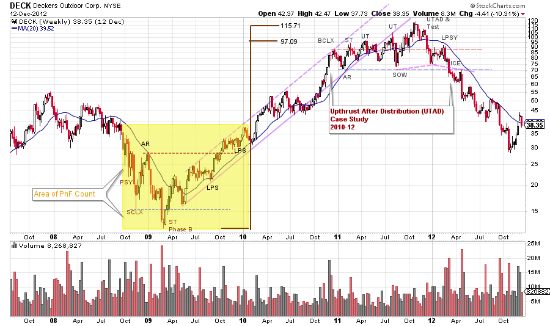

# Distribution Review

URL: https://articles.stockcharts.com/article/articles-wyckoff-2018-02-distribution-review/
Date: February 25, 2018 at 04:07 PM
Author: Bruce Fraser

It has been a long time since we have explored the intricacies of the Wyckoff Distribution structure. But since 2018 has opened with a Bang, by going straight up in January and then early February’s retracement of the prior month’s advance, it is time to review. The year 2018 may well be defined by ‘Two-Way Markets’ with abrupt upward and downward swings that will require deft handling to trade them. Wyckoff is a skill set for doing this.

This coming Thursday I will be Erin and Tom’s guest on MarketWatchers Live (click here to learn more). During my last visit, I promised to introduce the concept of Wyckoff Distribution on this upcoming show. Here is a preview of what we will discuss. As our on-air discussion time is limited, let’s hit the ground running. Please study the schematic below and read the review in the link provided.

---

The market indexes have an immense amount of internal momentum that will likely propel them to higher prices during the year. In 2018 we will also expect more rotation of themes in and out of favor, which is the typical characteristic of markets.

I prefer to trade, invest and participate in rising trends. Bear trends and markets are exhausting, even when making money (my belief). Knowledge and skill at managing Distribution is very important to the long-only investor. And it almost goes without saying these skills are essential to the short seller. With this in mind here we go.

Distribution Schematic #1 is the Upthrust After Distribution (UTAD) with Phases. There are two primary classifications (click here for a review). The nuance is to understand the characteristics of price and volume during the progression through Phases A to E.

(click on chart for active version)

The above DECK chart will be one of the case studies we will review. Take some time to study this classic chart to prepare for our discussion. If you cannot attend the live broadcast there will be a recording available.

See you then,

Bruce

Announcement:

I will be a guest on MarketWatchers LIVE with Erin Swenlin and Tom Bowley on Thursday, March 1stfrom 12-1:30pm EST. If you cannot make our live Wyckoff discussion, a recording will be available. See you then. (click here for more information)
