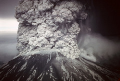
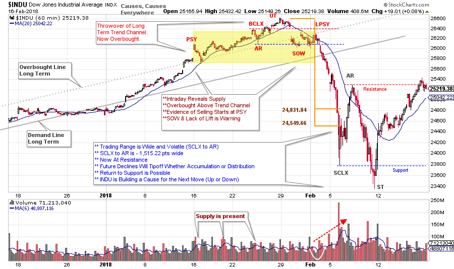
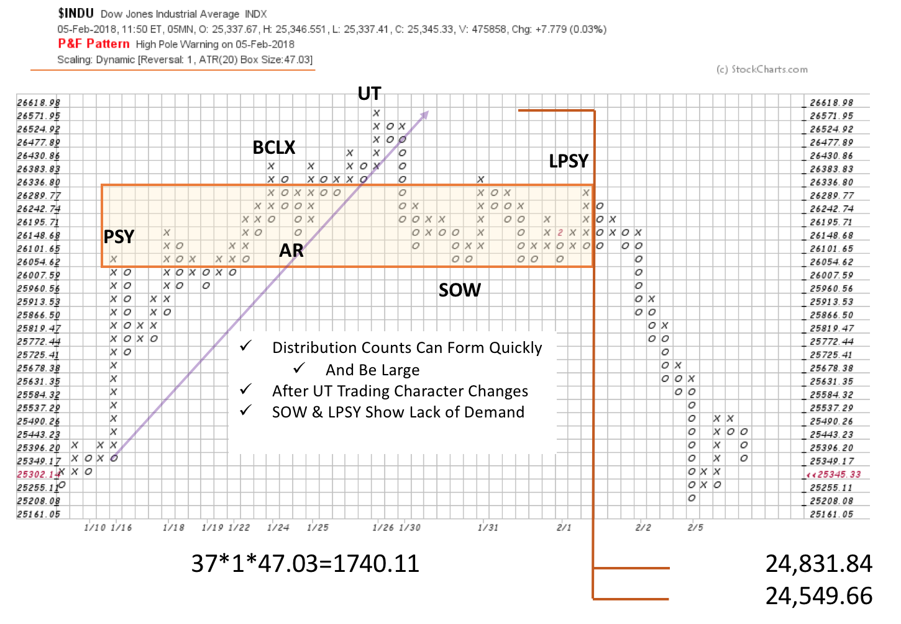

# The Law of Cause and Effect in Action

URL: https://articles.stockcharts.com/article/articles-wyckoff-2018-02-the-law-of-cause-and-effect-in-action/
Date: February 19, 2018 at 12:53 PM
Author: Bruce Fraser

The Law of Cause and Effect is a cornerstone principle of the Wyckoff Method. Cause building on the chart precedes the Effect of a Markup or a Markdown. Wyckoffians meticulously study trading ranges on the charts for Accumulation or Distribution characteristics. Analysis of Phases (Phases A thru E) track the progression of the activities of the Composite Operator (C.O.) in their operations. In Wyckoff analysis, identification of the chart elements that produce the trading range reveals the anchor points for estimating the Point and Figure (PnF) count objectives of the Effect.

Wyckoffians believe a Cause precedes Effect, big and small. Here we will zoom in and study the intraday activity prior to the recent big decline in the indexes. Was there Cause building that revealed the motives of the C.O.?

---

(click on chart for active version)

Preliminary Supply (PSY) produces a throwover of the trend channel on a gap up (and volume surge). There is some Supply on the decline after the PSY, but the volume dries up and the upward trend continues. The next decline after the test of the PSY has a sudden surge of volume and is a warning. Momentum carries the $INDU upward into a gap and a Buying Climax (BCLX) with volume rising on the weakness that follows (more supply). A gap down from the UpThrust (UT) is a clear warning of Supply being present and increasing downward volatility which includes a gap to Support (think Distribution). The subsequent rally has minimal lift and cannot return $INDU to the UT or the BCLX levels. Also note that after the gap, $INDU drops below the AR and this is considered a Sign of Weakness (SOW). When a SOW is produced we are on the alert for a Last Point of Supply (LPSY) next. Point and Figure rules say we count from the LPSY to the PSY.

Causes can be generated in many timeframes. The above vertical chart is an hourly plot. The PnF is a 5 minute plot with ATR scaling. It nicely captures the analysis of the Distribution on the vertical chart. Count objectives of 24,549.66 / 24,831.84 are generated. The ultimate low stretches beyond these counts, which is not unusual in such a fast moving market decline. The intraday Distribution count has been completely fulfilled (in a very dramatic decline). Therefore, we are on the alert for a new Cause.

Returning back to the top chart, we can see another Cause is building. A classic sequence of SCLX, AR and ST set a new trading range. A rally from the ST has reached the Resistance formed by the Automatic Rally (AR) peak. This Resistance should prove formidable with a return back into the range expected. If the recent stopping action is Reaccumulation, Absorption should be evident on the next decline. In either a bullish or bearish scenario, a Cause is already forming in preparation for the next move. For homework consider and make a list of the price and volume characteristics you would expect to see if this, now forming, trading range is Reaccumulation, or if it is Redistribution.

Here we see that a Distribution and Change of Character first appeared in the intraday timeframe. Now we see an unfinished Cause forming that will point the way, when ready, into the next move. Let’s keep honing skills in the interpretation of the many forms of Cause building to fully benefit from the Effect that is produced.

All the Best,

Bruce

Additional Reading on the Wyckoff Laws (click here and here)

Announcement:

I will be a guest on MarketWatchers LIVE with Erin Swenlin and Tom Bowley on Thursday, March 1stfrom 12-1:30pm EST. If you cannot make our live Wyckoff discussion, a recording will be available. See you then. (click here for more information)
