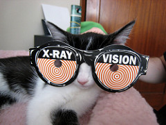
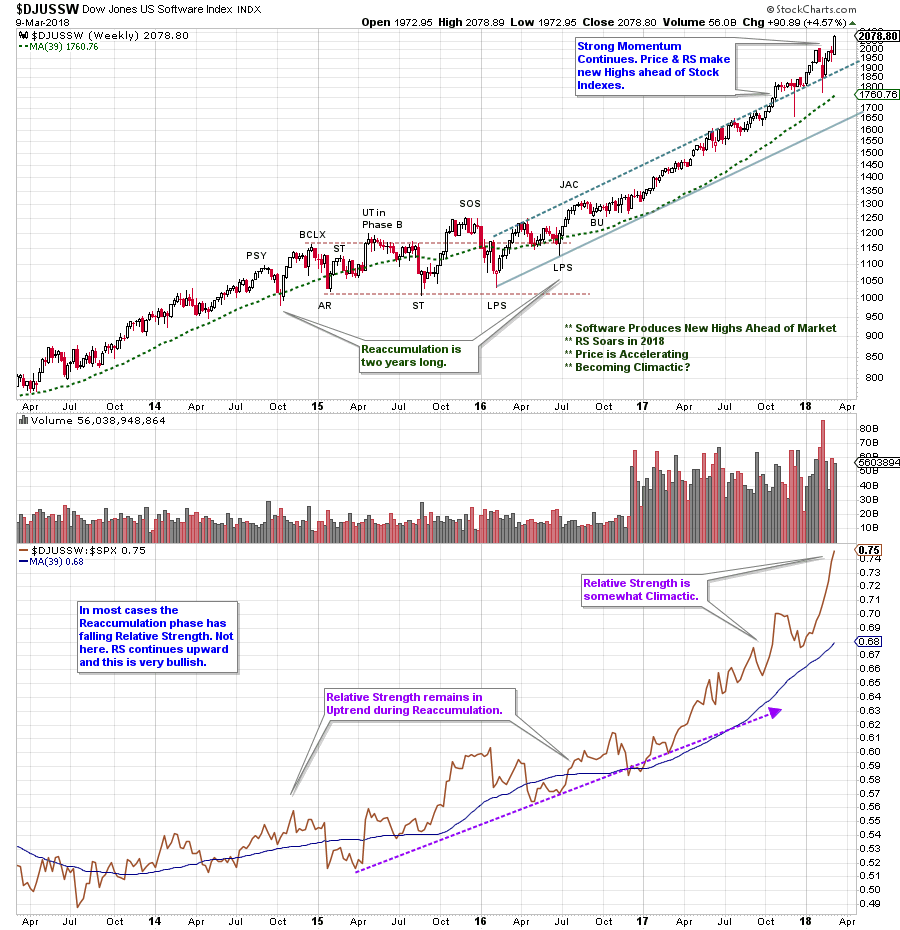
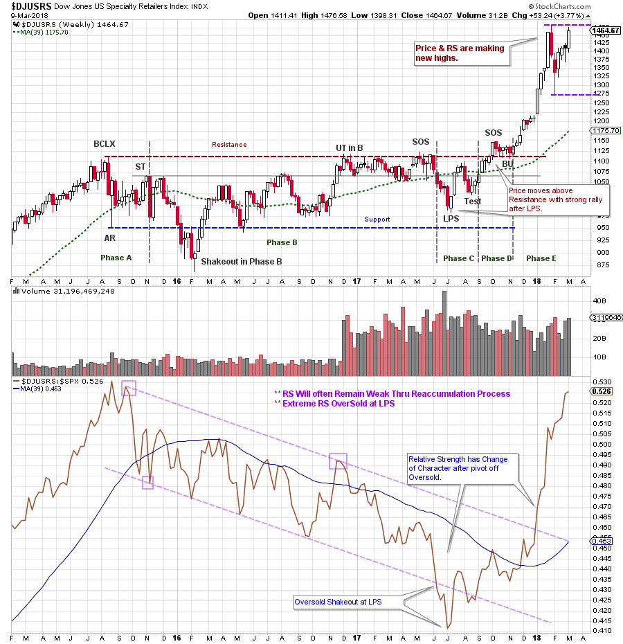
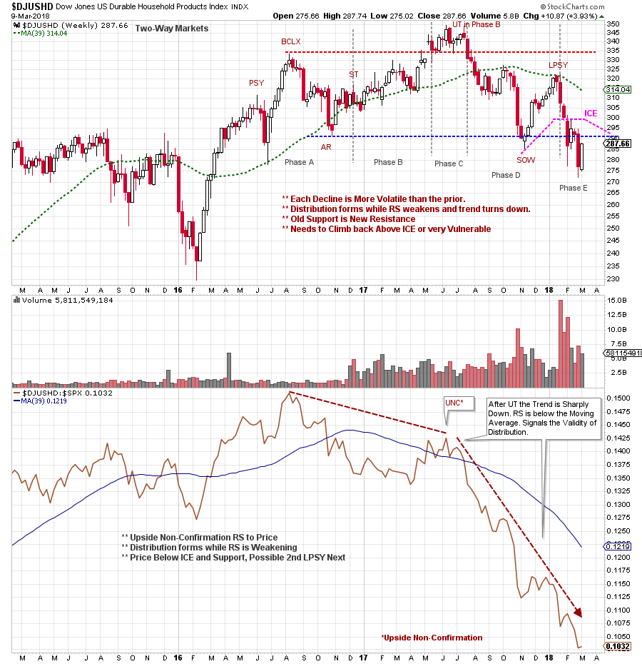
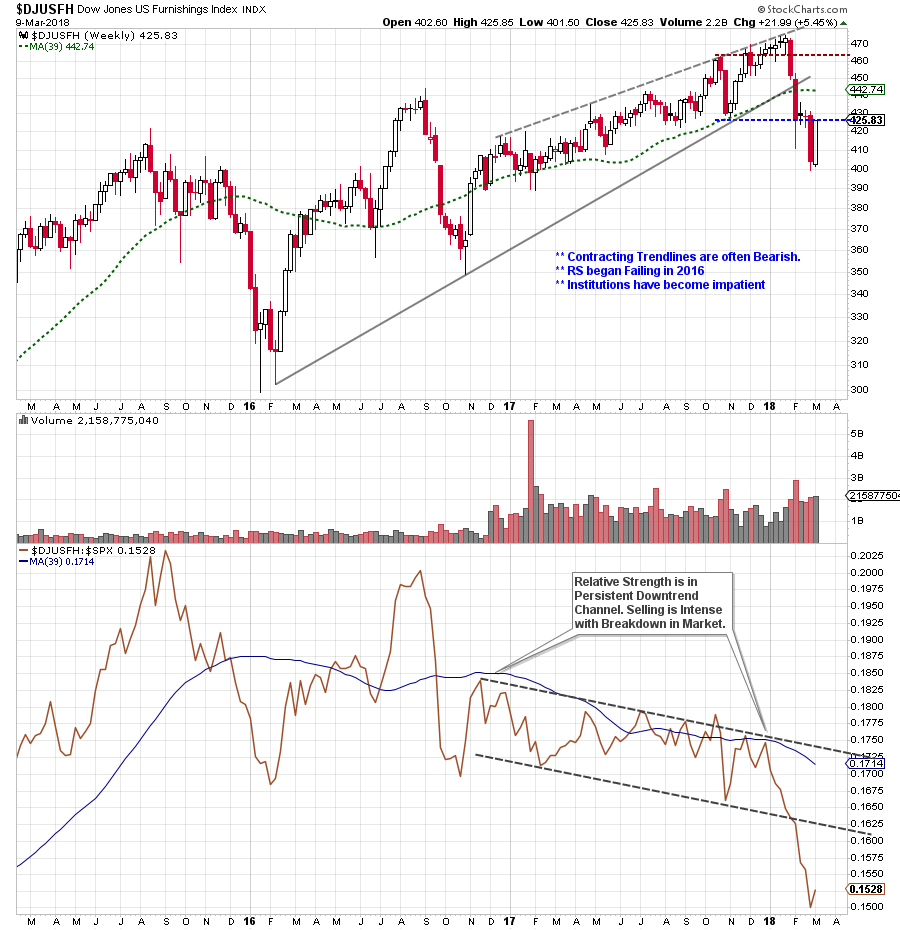

# Combining Wyckoff and Relative Strength to Find Big Trends

URL: https://articles.stockcharts.com/article/articles-wyckoff-2018-03-combining-wyckoff-and-relative-strength-to-find-big-trends/
Date: March 12, 2018 at 07:00 AM
Author: Bruce Fraser

In stock chart analysis the closest thing to X-Ray vision is Relative Strength. Often Relative Strength provides us with early price direction clues. Generally, when Relative Strength (RS) is in a rising trend and price is in a rising trend, this trend will persist. We define a trend as higher highs and higher lows, and above a rising long term moving average. When the trend of price and RS diverge from each other the validity of the price trend comes into question. Let’s look at some examples.

---

(click on chart for active version)

This very long term rising trend for the Software Industry Group ($DJUSSW) is a uniquely bullish example. Typically, when a Reaccumulation structure interrupts a long term uptrend, the RS becomes weak. During the 2015-16 Reaccumulation of $DJUSSW the Relative Strength keeps rising, which is a very bullish indication. The uptrend that follows the Reaccumulation is very strong. RS accelerates which confirms to institutions that these stocks should be held and the portfolio allocation to this group be increased during the uptrend.

(click on chart for active version)

Here is a more typical picture as a Reaccumulation forms over two years in Specialty Retail ($DJUSRS). The RS line is confirmed downward while the price index is tracing out a seeming Reaccumulation. The downward trend channel and the falling moving average line illustrate that institutions are being punished for owning these stocks. Meanwhile the Composite Operator (C.O.) appears to be Accumulating shares for a major bull campaign. The C.O. typically buys stock under the cover of weak Relative Strength which discourages institutions and the public. As Wyckoffians, our job is to patiently wait for the conclusion of Reaccumulation when the stocks in the industry group become active. This would be on the strength of price following the Last Point of Support (LPS). Note how this coincides with an oversold thrust under the RS trend channel and a strong RS rally into the end of 2017. On the price chart the LPS, the Test, and the Back Up (BU) are excellent buy points (with Stops just below those price lows). The steady rise of the RS confirms that Specialty Retail has been Absorbed over the prior two years and is held by very strong hands. We conclude that a major uptrend is underway.

(click on chart for active version)

An Upside Non-Confirmation (UNC) forms at the Upthrust (UT) when the RS makes a lower peak. Price is making a new high while the RS is not, and this is a warning. When the UT fails the RS becomes very weak. Distribution in Durable Household Products ($DJUSHD) is now evident. At the Last Point of Supply (LPSY) the RS line is in a freefall. Relative Strength did a valuable job of warning and confirming the Distribution in this industry group.

(click on chart for active version)

U.S. Furnishings ($DJUSFH) Relative Strength has been making lower peaks since 2016. Meanwhile the price chart has been making minor new highs. Throughout 2017 Relative Strength has been in a narrow declining channel. Weakness in late January for the broad market produces a very sharp decline in $DJUSFH as institutions sell this group aggressively. The declining RS accelerates lower on this selling. This is a subtle, but excellent, example of the power of Relative Strength studies. RS was not confirming the higher prices for $DJUSFH. Institutions used this group as a source of funds as they liquidated holdings and rotated in to better performing industry groups.

Some broad conclusions:

- Strong Relative Strength stocks and industry groups will tend to have their price trends persist. The best uptrending RS groups prior to the recent stock market weakness were most likely to begin rallying and making new price highs before less strong groups.
- Long term divergences between price and RS trends often mean big trend changes are looming. The strongest condition is when price and RS uptrends are confirming each other. The weakest condition is when price and RS downtrends are confirming each other.
- The Composite Operator will typically Accumulate (Reaccumulate) shares of stock when RS is weak. Wyckoffians can (and should) wait for the end of the Accumulation process when the stock becomes surprisingly strong (Phases C & D) and RS turns up, and then commit to the new uptrend. This is potentially a fresh new uptrend that has a long life ahead.

Relative Strength is like X-Ray vision for Wyckoffians. It very often provides a clue about the emerging new direction of the price trend. And it keeps us in the trend for the majority of the move.

All the Best,

Bruce

Wyckoff Power Charting will not be published next week. Have a great week.
