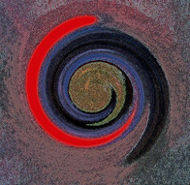
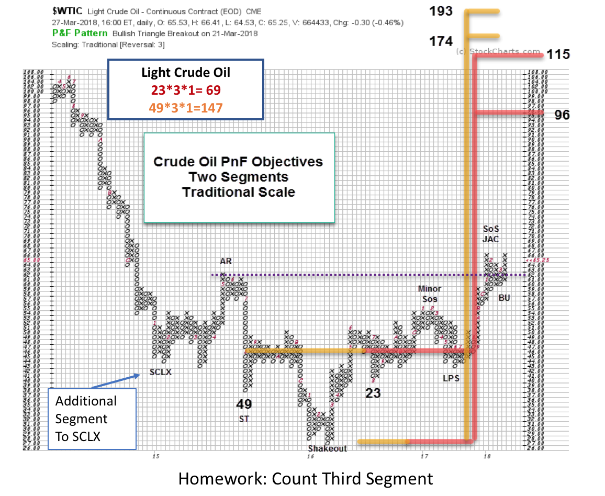
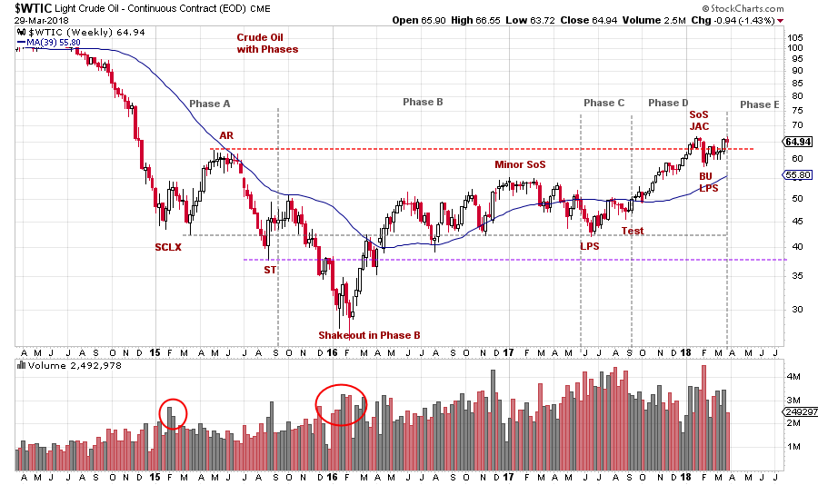
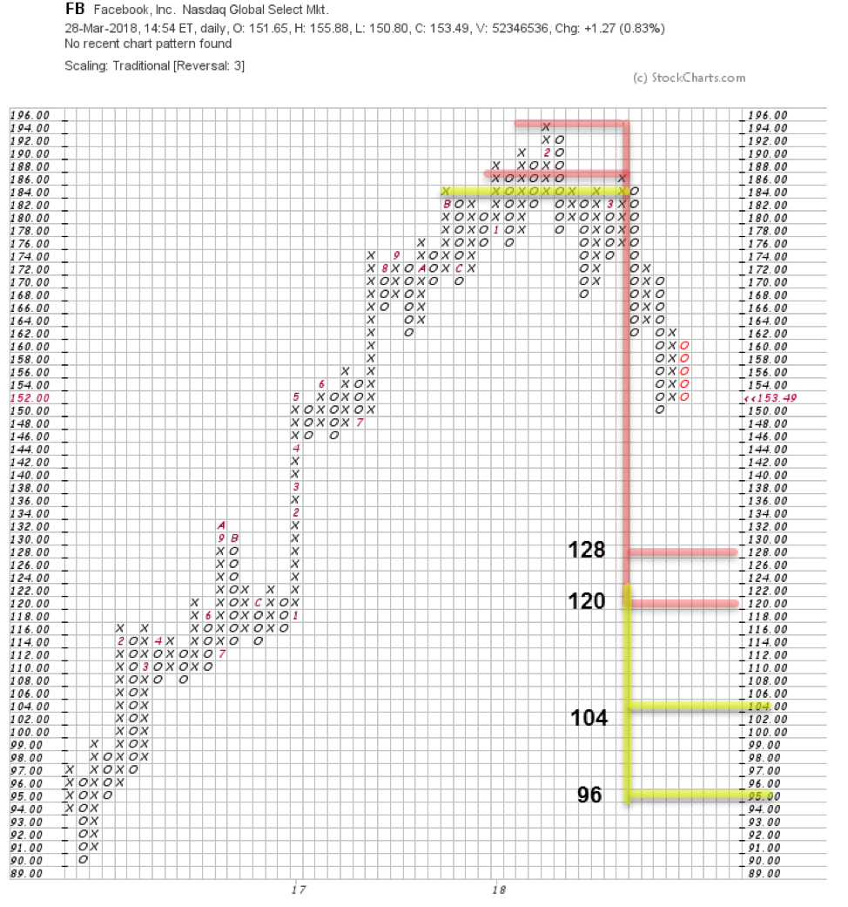
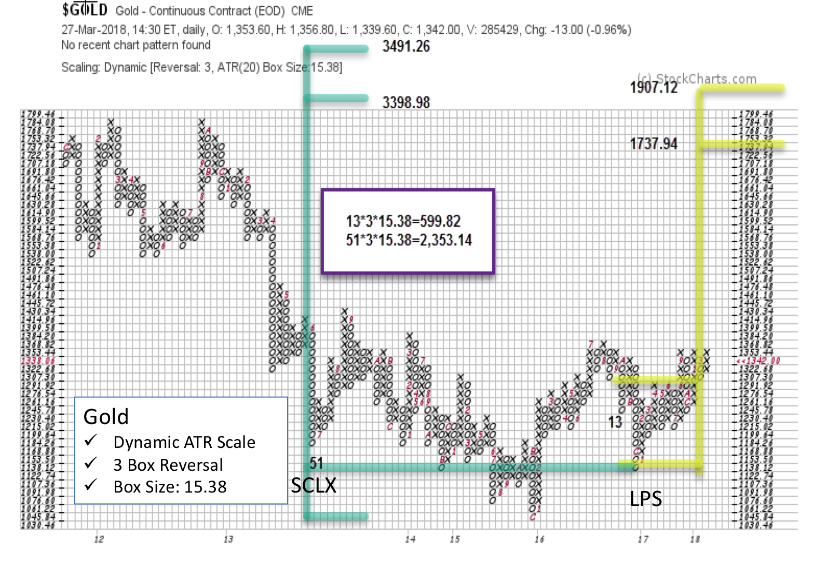

# Detect Rotation with PnF Charts

URL: https://articles.stockcharts.com/article/articles-wyckoff-2018-03-detect-rotation-with-pnf-charts/
Date: March 31, 2018 at 11:25 PM
Author: Bruce Fraser

The winds are shifting in the financial markets. Often Point and Figure charts offer a perspective that other chart types might obscure. Point and Figure chart construction is minimalistic. It keeps the important price swings and discards the rest. PnF charting lends itself to techniques for estimating price objectives from the size of the Accumulation or Distribution. If conditions are in fact shifting in financial markets, horizontal PnF count objectives should reveal these changes.

---

(click on chart for active version)

Crude Oil ($WTIC) descended into a dramatic Bear Markdown making final lows into early 2016 (click here for prior crude oil posts). A large Accumulation structure began forming in 2015 with a Selling Climax (SCLX). The Accumulation appears to be complete which allows for a PnF horizontal count. Here two segments are counted (23 and 49 columns wide, 3 box reversal method). Crude has climbed above the Resistance line formed by the Automatic Rally (AR). After a Sign of Strength and Backup (SoS & BU) Crude is rising again. If $WTIC stays above the Resistance line we would conclude that Accumulation is complete and a final PnF count can be taken. The potential is large. Crude oil and energy are a cost component of virtually every business and should put rising pressure on the price of most goods If a Markup is directly ahead for crude oil does this indicate a shift, or rotation, toward inflation benefitting investments?

The idea of rotation is that investment flows out of one theme and into another. As the PnF Accumulation pattern for Crude nears completion, Distribution has formed in one of the FAANG stocks, Facebook (click here to see recent vertical chart analysis of FB). If the magnificent run is over (for the time being) for these stocks, we would expect rotation of Composite Operator and institutional funds into other assets. Two FB PnF counts suggest that liquidation is not done. We use FB for illustration purposes as this rotation could eventually affect many FAANG type investments as rotation unfolds.

Gold has a trading range that reaches back to 2013 making it even larger than Crude’s. Here we have taken a trading count (in yellow) that reaches up to 1,737.94 / 1,907.12. This would put Gold at the prior peaks. The larger PnF count (in green) is taken from the Last Point of Support (LPS) to the Selling Climax (SCLX) and illustrates a very large potential for Gold (click here for a detailed vertical chart).

Gold is behind $WTIC as it has not cleared the Resistance overhead. The Accumulation is not complete and confirmed until this takes place. Gold looks very promising and is currently pushing up against key near term Resistance but there are three levels that must be exceeded to complete Accumulation. Notice how well PnF identifies these levels. Homework: On the above PnF chart find and draw the three Resistance levels directly above the recent gold price.

These charts are anecdotal of the potential for rotation unfolding in financial markets. They do illustrate how PnF Horizontal count technique provides a view of the amount of fuel imbedded within the rotation (click here to see a recent study of the CRB Index).

All the Best,

Bruce

Announcement:

I will be a guest on MarketWatchers LIVE with Erin Swenlin and Greg Schnell on Thursday, April 5thfrom 12-1:30pm EDT. If you cannot make our live Wyckoff discussion, a recording will be available. See you then. (click here for more information)
