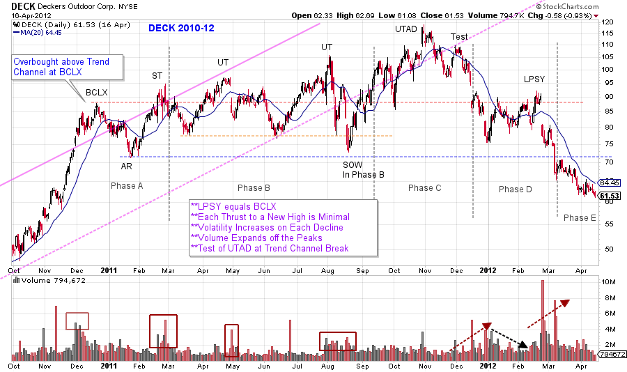
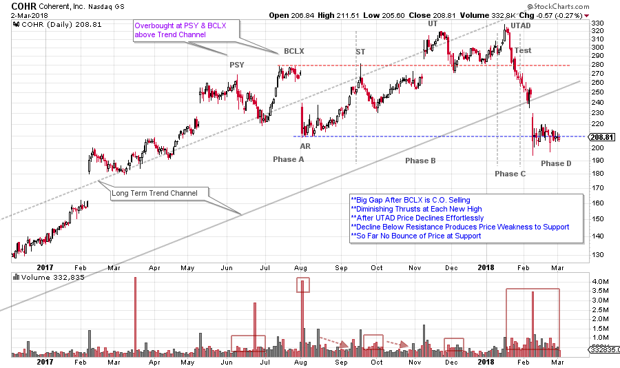
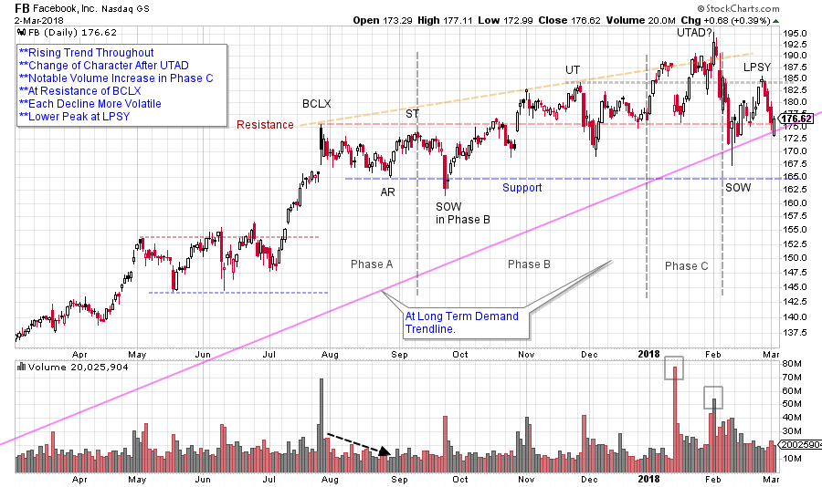
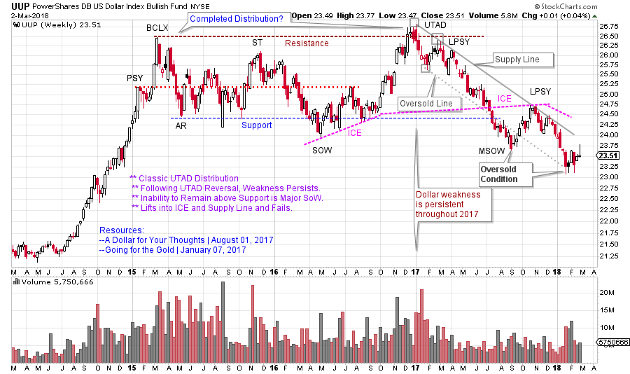

# Divining Distribution

URL: https://articles.stockcharts.com/article/articles-wyckoff-2018-03-divining-distribution/
Date: March 04, 2018 at 03:00 AM
Author: Bruce Fraser

In last Thursday’s MarketWatchers LIVE (recording available here) we discussed the Wyckoff Distribution concept of the Upthrust After Distribution (UTAD). Distribution and Accumulation adhere to a logical path or sequence of price and volume. During Distribution the Composite Operator (C.O.) has determined the area of price where they intend to initiate the selling of their holdings. This process takes time. Each Phase describes the progression of selling. At the completion of the selling process, the stock is in a weakened state and vulnerable to suddenly falling into the Markdown Phase.

Phase analysis offers context to the study of vertical price charts. If the stock begins the Distribution process in the strong hands of the C.O. (Phase A) and is in weak hands at the conclusion of Distribution (Phase D-E), then price and volume should reflect this material change of ownership. Divining this evolution is the essence of Wyckoff Analysis.

---

Here are a few charts for your review that I did not have time to show during the broadcast and the DECK chart which we did study.

(click on chart for active version)

Last week’s post (click here for a link) began with a long term chart of Decker’s Outdoor (DECK). This was a classic example of the entire campaign cycle from Accumulation through Distribution and Markdown. Above we zoom in to study the textbook UTAD Distribution that formed at the conclusion of the bull run. A pronounced Buying Climax (BCLX) and Automatic Reaction form Support and Resistance. This is the start of Distribution by the C.O. Note the ever increasing volatility during Phase B upswings and downswings. This is evidence of C.O. selling. The long term trend channel illustrates the Overbought Throwover at the BCLX and the failure of the trend at the UTAD (visual evidence of the slowing momentum). The higher highs at each Upthrust (UT) keeps most stockholders calm and unaware of the C.O. selling campaign. After the second UT, a Change of Character (CHoCH) produces a Minor Sign of Weakness (SOW) by dipping below the two prior lows before reversing into the rally and into a UTAD. The term UTAD means just what it says, a final Upthrust to a new high after the completion of Distribution. By the conclusion of Distribution at the Upthrust, the C.O. has liquidated their holdings and is no longer engaged in campaigning the stock. The typical response to a UTAD is failure back into the Distribution range and a cascading fall of price to and through Support. The weakness is sudden, unexpected and out of character with the trading that proceeded the UTAD.

UTAD’s commonly occur in stocks and markets with prior robust momentum. During the uptrend, momentum traders are rewarded for buying each breakout on the way up. The UTAD is the classic C.O. move to breakout the stock to draw in the momentum traders one last time before the stock has a massive failure.

(click on chart for active version)

Coherent (COHR) has just shown profound weakness after a UTAD. So far, it has been unable to produce a Last Point of Supply (LPSY) rally and rests on Support with no capacity to lift. COHR is an example of the sudden Change of Character that can follow a UTAD.

(click on chart for active version)

Facebook (FB) has been an important leadership stock during this bull run. Note the upward thrusts following the BCLX. Each new high has a diminishing thrust which is a sign of waning momentum. The declines that follow the thrusts (after the ST, UT and UTAD) are progressively more volatile. During Phase C, volatility and volume become very high. The decline that follows the UTAD could be described as a Change of Character. This decline is the weakest and most volatile since last April. Now price is just above the long term Demand Trendline and the Resistance level. To stay above may be important. FB could become technically weak below these two levels.

(click on chart for active version)

Here is a greater than two year UTAD Distribution in the US Dollar Index (UUP). Note the persistent weakness that follows the UTAD and Test. After a SOW below Support a modest rally fails at the Supply trendline (and prior Support) and the weakness resumes. (click here to see more on UUP and the PnF price objectives).

All the Best,

Bruce

For additional readings on Distribution click here and here and here.

Photo: Wykoff Run, Elk State Forest, Pennsylvania
