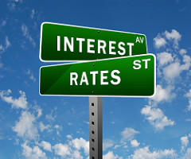
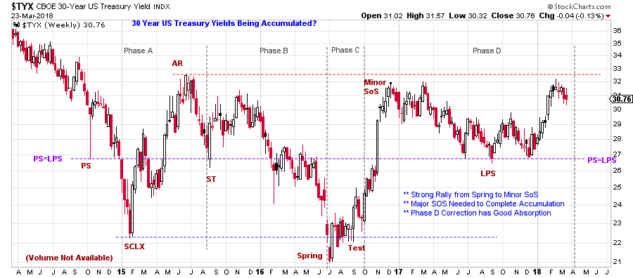
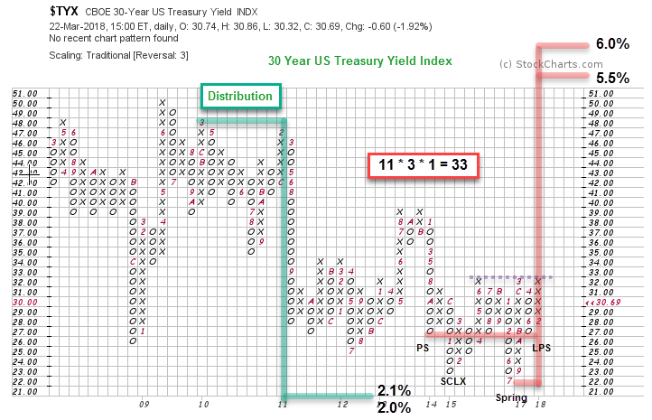

# Interest Rates. How High?

URL: https://articles.stockcharts.com/article/articles-wyckoff-2018-03-interest-rates-how-high/
Date: March 24, 2018 at 08:00 AM
Author: Bruce Fraser

The Federal Reserve Bank (Fed) has indicated their intention to raise interest rates during 2018 and 2019. In fact, US Treasury interest rates have been rising for quite some time. We have been following the movement of bond prices with a Wyckoffian eye during this downtrend of prices (click here and here to review these posts). While the Fed manages the short term end of the yield-curve very closely, they have less influence over the long maturity end of the curve. No one can know how high interest rates will go, but is there a method for estimating the potential for how much they could rise? Wyckoff is a Method for determining the potential of the market from its own trading action. Could we study interest rate data in the same way that price data is evaluated and draw conclusions about the direction and the possible extent of the move?

---

(click on chart for active version)

Interest rates (CBOE 30-Year US Treasury Yield Index) began 2015 with a dramatic decline into a Selling Climax (SCLX). An Automatic Rally (AR) consumed the next six months of the year, setting up a massive range-bound market. Recall that interest rates move inversely to bond prices. Thus, the SCLX was an important secular peak for bond prices. With this case-study we are asking if interest rates can be analyzed in the same manner as bond prices. The Preliminary Support (PS), SCLX and AR set up key Support and Resistance. These three points contain the swings in $TYX for the next two plus years, as interest rates remain range bound.

Now all of the elements necessary to complete an Accumulation in $TYX are present. Phase analysis interpretation establishes this as a late Phase D condition. Phase C has a Spring and a Test followed by a strong rally to a Minor Sign of Strength (rising interest rates equals falling bond prices). The Phase D correction takes all of 2017 to complete, but is gentle and modest, retracing about one half of the prior rally. Since the start of 2018 interest rates have been rallying. Resistance is at about 3.25%. Getting above the Resistance area (red line) with good strength is a key hurdle (this would be labeled a Major Sign of Strength). After a Major Sign of Strength (SOS) we would watch for another Last Point of Support (LPS) as an excellent place to be long interest rates. This would also be the start of Phase E, the beginning of a major new uptrend for yields.

This PnF construction of $TYX yield data uses a traditional 3 box reversal method with standard scaling. Each one point scale change is actually one tenth of a percent. The Distribution is a segmented PnF count. It generates a dramatic down count from 4.8% to 2.0% and comes within one box of fulfilling the minimum objective. The Accumulation count (in red) is taken from points identified on the vertical chart above. The count line is 2.7% and the low is 2.2% (last is 3.069%). We find the LPS and the PS and count the columns from right to left and this is 11 columns multiplied by 3 box reversal method, times 1 point scaling. The count of 33 equals 3.3% of yield potential and produces an objective of 5.5% to 6.0% yield for the 30-year US Treasury Bond.

We can see Resistance just above at 3.2%. A potential for a larger count objective reaching back to 2011 is possible. But we will wait for the needed Sign of Strength and a Phase E rally to consider larger count segments.

The PnF chart above shows that yields have been in a period of lower lows and lower highs since 2009. If this Wyckoff Analysis of Accumulation for the 30-year US Treasury yield becomes a reality, the secular decline of interest rates will be over.

All the Best,

Bruce
