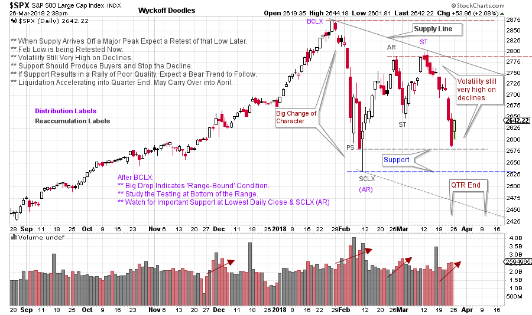

# S&P 500 Notebook

URL: https://articles.stockcharts.com/article/articles-wyckoff-2018-03-sp-500-notebook/
Date: March 26, 2018 at 02:56 PM
Author: Bruce Fraser

I make lots of notes on my charts. As conditions unfold I have a sense for what my thinking was and whether adjustments need to be made in tactics. In the ‘good old days’ stock charts were plotted by hand and notes were jotted onto charts; now we have wonderful annotation tools within stockcharts.com. Briefly let’s take a look at the current, and unfinished business, of the S&P 500 ($SPX).

---

(click on chart for active version)

Here are my current notes, which are always subject to change. The January ascent in the $SPX was a dramatic climactic surge. This Buying Climax (BCLX) was confirmed by the waterfall decline labeled an Automatic Reaction (AR). Resistance and Support lines are drawn on the BCLX and the AR. The ‘Change of Character’ (CHoCH) produced by the BCLX and the AR lead us to the conclusion that $SPX is now ‘Range Bound’ for the foreseeable future. The February/March rally that follows the AR/SCLX cannot reach Resistance (at BCLX level) and is an indication of weakness for the index. The very high liquidating volume on the CHoCH decline into the AR is additional macro evidence of a Range Bound market. As Wyckoffians we expect a Range Bound market to morph into Reaccumulation or Distribution, but it may take months of trading to make the determination of which it will be. Secondary Testing (ST) and more Secondary Testing is in store for the $SPX. After a rally attempt it is expected that the high volume decline into early February will be tested again, and possibly repeatedly. Last weeks decline is such a Test. Two good places for Support to emerge are at the lowest daily close (2,581.00) on February 8th, and the intraday low (2,532.69) on February 9th. The Support lines are drawn on the chart.

The quarter-end can be a magnet for prices, up and down. Now we see prices making a beeline to Support into the end of the first quarter. This is a Test of the prior low, which may be successful, or it may fail. And we may not be able to tell until the middle of April as selling by institutions may persist into the new quarter. What happens to price around the Support zone is important. Price could cut right through all of the Support and accelerate lower, meaning that Distribution is complete and a Markdown is in full force. Support putting a floor under prices is more likely. The rally that follows is all important. A strong reversal toward the 2,800 area is the most bullish (think more Reaccumulation or Distribution). A new price low below the prior February low (Sign of Weakness) followed by a weak and listless (low volume) rally back into the Support zone would be a warning. Any rally that cannot get above the mid-point of the trading range is vulnerable to a quick reversal into a downtrend.

The $SPX is not in strong hands now. This is the reason for the immense volatility. Unexpected reversals off Support and Resistance are the trading conditions of our immediate future. We will watch for signs of the intentions of the Composite Operator as this trading range evolves.

Wyckoff is always about establishing contingencies. The study of the tape indicates what is likely to happen next. Scenario building helps us to be clear about what to look for in our unfolding analysis.

All the Best,

Bruce
