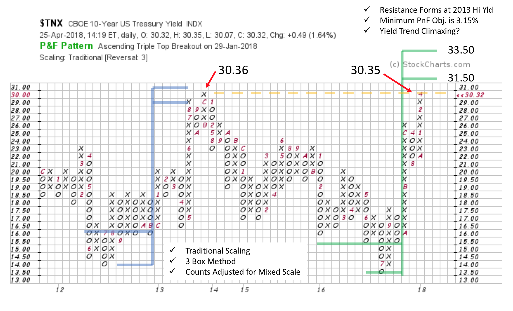
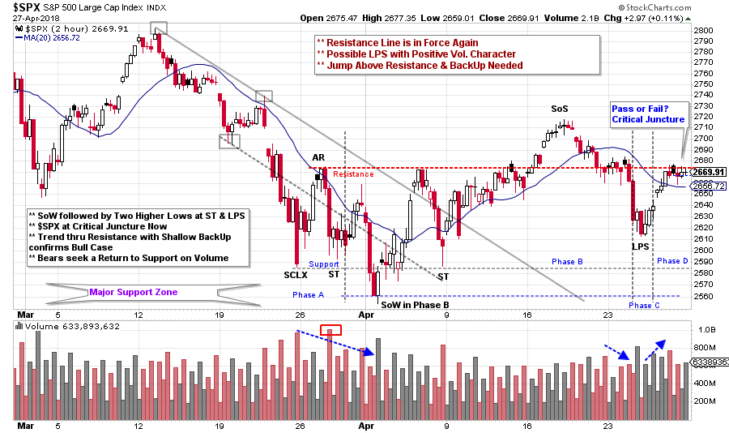

# A Wyckoff Week

URL: https://articles.stockcharts.com/article/articles-wyckoff-2018-04-a-wyckoff-week/
Date: April 28, 2018 at 08:00 PM
Author: Bruce Fraser

Two events happened this week that captured the attention of Wall Street. There was much buzz about both and they seem to be related. On Tuesday the stock market took a big tumble, with the Dow Jones Industrials falling 424 points. The next day the Ten-Year US Treasury Yield ($TNX) touched 3.035% (topping the 3% threshold for the first time since late 2013 when it reached 3.036%). Together, these noteworthy events solidified investor anxiety.

We Wyckoffians might be as anxious as the next investor when such headline events pass by. But then we manage those emotions by turning to the charts with a Wyckoffian eye. Let’s look at the $TNX and $SPX charts to illuminate the current circumstances. An uptrend in yields is considered to be a headwind for stock prices. Interest rates have been in a steady uptrend since the end of 2017 and this likely contributed to the big drop in stocks in February. Now that $TNX has breached the 3% level are yields likely to keep climbing?

---

The 3.0% yield level for the Ten-Year Treasury is a psychological threshold. Late in 2013 this yield briefly exceeded 3% and fulfilled a PnF Accumulation count. This setup a multi-year decline back to the 2012 Support level at 1.4%. Support and Resistance levels have a critical influence on where yields trend and stop. Study the head-snapping turn up in $TNX after touching the 1.350% PnF box in 2016. It has been a straight up march since. PnF objectives are just above the current yield. Two more boxes would meet the minimum objective of 3.15%. The Resistance line, climactic acceleration and nearly fulfilled PnF objectives are formidable stopping forces for 10-year yields. This suggests that yields are likely nearly done rising for the time being. And they could possibly turn down abruptly at any time. This would provide some much needed relief to stock prices. For additional reading on bonds and interest rates click here and here and here.

While interest rates have been rushing upward, stocks have stumbled. In recent weeks we have been studying this illuminating intraday case study provided by the S&P 500 Index ($SPX). Please click here and here for a review. We continue to evaluate current conditions as an Accumulation appears to form (here we use a two-hour intraday chart). Always expect Phase B to be the longest and most volatile phase. Phase C likely begins with a rush down of the index into a Last Point of Support (LPS). This decline coincides with the $INDU -424 down day. After an important Sign of Strength (SoS), Wyckoffians are always on the lookout for an LPS. Volume is high in the vicinity of the LPS low, which we interpret as good demand. The rally that followed was swift and moved easily toward Resistance while retracing the April 24thdecline. If the drop from the SoS had continued all the way to Support we would have concluded that Phase B was still in force. But $SPX stopping and turning at about midpoint of the range and making a higher low is constructive for the Bulls. Wall Street’s anxiety regarding the big down day may prove unwarranted and be a psychological turning point.

The current stopping place for the $SPX is tricky. It went straight to the Resistance line and closed the week there. Wyckoff is most concerned with what to do and where to do it. The Wyckoff Bulls are heartened by the higher low that formed at the LPS (while interest rates were penetrating 3%). A tactical place to buy is on a good demand bar on the pivot up from the LPS. Stops would be placed below the low of the LPS (or below Support). Price strength through the Resistance line, followed by a shallow Backup (BU), would indicate that Absorption of shares is nearly complete and an uptrend is likely.

Bearish traders will be looking for weakness from the Resistance line and a volatile drop (on expanding volume) toward Support. The context of this intraday $SPX case study is a large range-bound stock market (click here for a study) that peaked in January. Two $SPX peaks in this range are important price targets; the prior March peak at 2,801.90 and the January high at 2,872.87. Failure to hold the Support area of this big range will make the $SPX vulnerable to a downtrend. Therefore, this minor Resistance area where the $SPX currently rests could prove to be massively pivotal. We will watch closely.

All the Best,

Bruce

Announcement: The next Wyckoff Trading Course begins on 4/30/2018.Register hereto attend the free introductory webinar. This class taught by Roman Bogomazov is designed to give you a foundational understanding of and ability to start using the Wyckoff Method, which allows traders and investors to anticipate market direction through analysis of price, volume and time, without the need for additional indicators (click herefor a complete course description).
