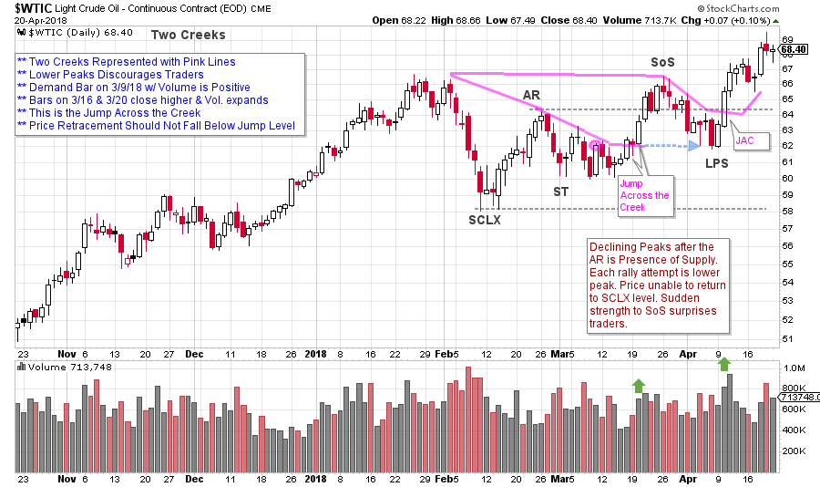
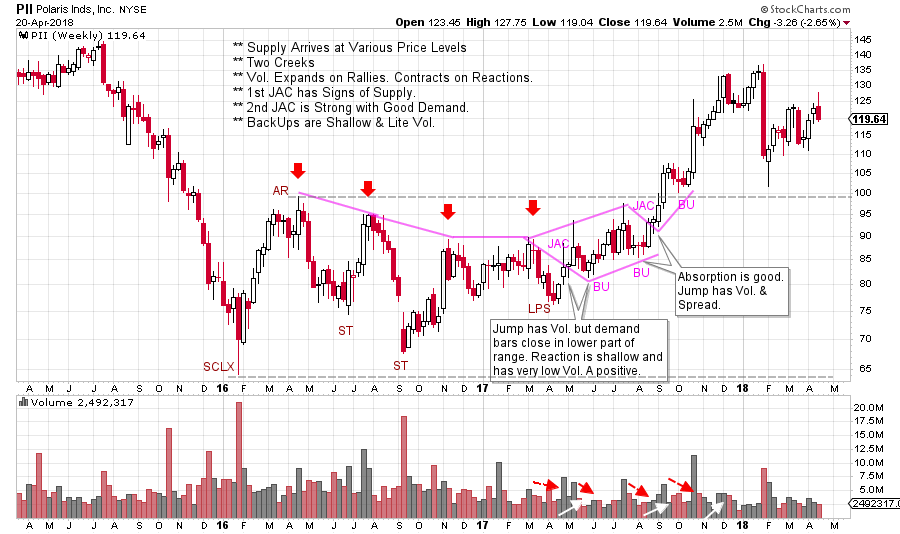
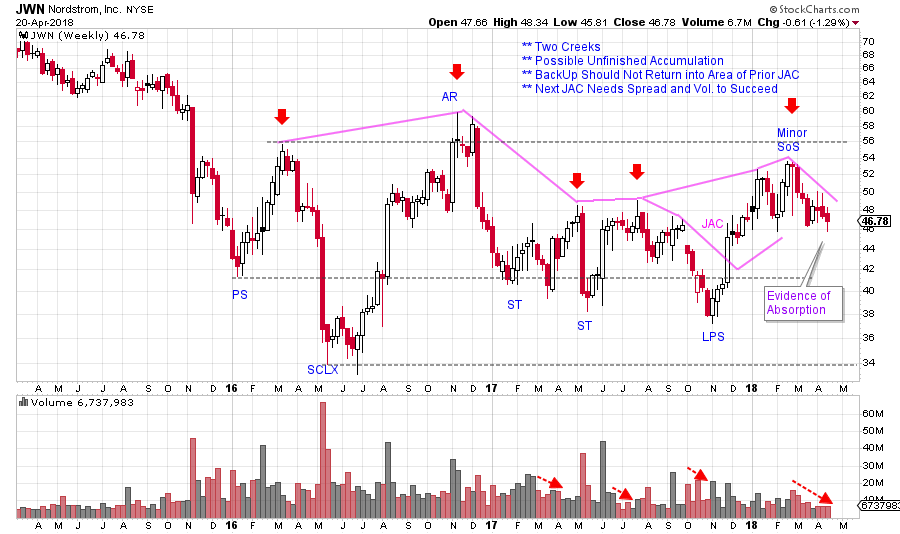

# Jumping the Creek. A Review.

URL: https://articles.stockcharts.com/article/articles-wyckoff-2018-04-jumping-the-creek-a-review/
Date: April 23, 2018 at 06:00 AM
Author: Bruce Fraser

Let’s review the concept of the ‘Creek’. This is a nuanced Wyckoff principle, but once understood, it becomes a very powerful trading edge. Support and Resistance zones are typically understood to exert their influence at linear price levels. Horizontal lines are drawn on charts to represent these important levels. Wyckoffians employ Support and Resistance zones in chart analysis with fervor. To read more on the concept of ‘Jumping the Creek’ click here.

In the area of Accumulation and Reaccumulation the forces of Supply and Demand are competing with each other. Wyckoffians are judging the quality of the Supply and the Demand to determine which force will succeed. Supply (selling) puts downward pressure on prices. If the quality of the Demand is high, eventually the majority of the Supply will be Absorbed by strong hands. The stock will become scarce, difficult to buy, and the trend of the stock price will be upward.

---

The Creek on a chart is a variable line connecting the price peaks. These peaks are where selling emerges and stops the advance toward the Resistance area. Because this selling occurs at differing price levels the line of Resistance is variable (like a meandering creek). At the conclusion of these surges of selling, Wyckoffians seek that pivotal moment when the selling pressure has been exhausted and the stock can begin a new uptrend. We are in search of that moment when dynamic buying reverses the selling and a fresh new uptrend emerges. Let’s hone our trading skills by examining the Creek concept.

(click on chart for active version)

During the Reaccumulation for Crude Oil ($WTIC), selling results in a series of lower peaks starting with the Automatic Rally (AR). The lower Creek is declining. The Jump of this lower Creek would indicate the presence of new demand. This Jump needs to rise above the 3/9 price high, with expanding volume and a close near the high of a strong demand bar. This occurs on 3/16 with follow through on 3/20. Crude oil rallies right to Resistance into a Sign of Strength (SoS). At this Resistance expect a Backup (BU) that should not go below the level of the prior Jump. Next look for a Jump of the upper Creek with good demand bars and volume expansion. When this happens, it takes $WTIC up and out of the Reaccumulation area. Crossing the Creek is not a precise price level, it is an event in a zone that is accompanied by price and volume confirmation.

(click on chart for active version)

A weekly chart of Polaris (PII) shows a lower and upper Creek at work. Four red arrows highlight the various levels or prices where selling emerges. Connecting these peaks illustrates why the Creek metaphor works. We are on the alert for a Jump because the price declines are lacking volume. The lower JAC (Jump Across the Creek) is somewhat suspect as it has good volume but the demand bars lack a dynamic quality. The following Backup (BU) has very low volume and narrow price spread and this puts us on alert that Absorption is occurring. The JAC of the upper Creek has strong bullish demand bars and expanding volume. Traders should initiate a position into the strength of these demand bars, placing stops under the prior low (labeled BU). This Jump produces a rally from about $87 to $106 and has a very shallow BU above the Resistance line. The uptrend is in force.

(click on chart for active version)

Here is an unfinished case study of Nordstrom (JWN). It appears to have Jumped the lower Creek with good price spread and volume. The current Backup should not fall into the area of the prior JAC. And, during the current decline, volume and spread are very low on this weekly chart. We will watch for a pivot upward when this BU is finished. It is important to wait for evidence of dynamic price strength with volume (and it is always possible this will not occur). If the next Jump materializes, a move above the Resistance line is expected to show a Major Sign of Strength and the completion of Absorption.

The brilliant concept of the Creek is a reminder of the dynamic nature of chart analysis. We will continue to do more work on this important Wyckoff concept. Many thanks to all of you who have requested more work on this and other essential Wyckoff techniques. Your feedback is most helpful. And your Wyckoff success stories are truly inspiring. The corollary to the Creek is the ICE during Distribution. We will tackle this in the near future.

All the Best,

Bruce

Announcement: The next Wyckoff Trading Course begins on 4/30/2018. Register here to attend the free introductory webinar. This class taught by Roman Bogomazov is designed to give you a foundational understanding of and ability to start using the Wyckoff Method, which allows traders and investors to anticipate market direction through analysis of price, volume and time, without the need for additional indicators (click here for a complete course description).
