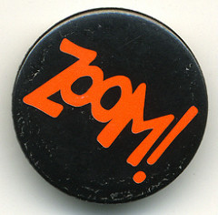
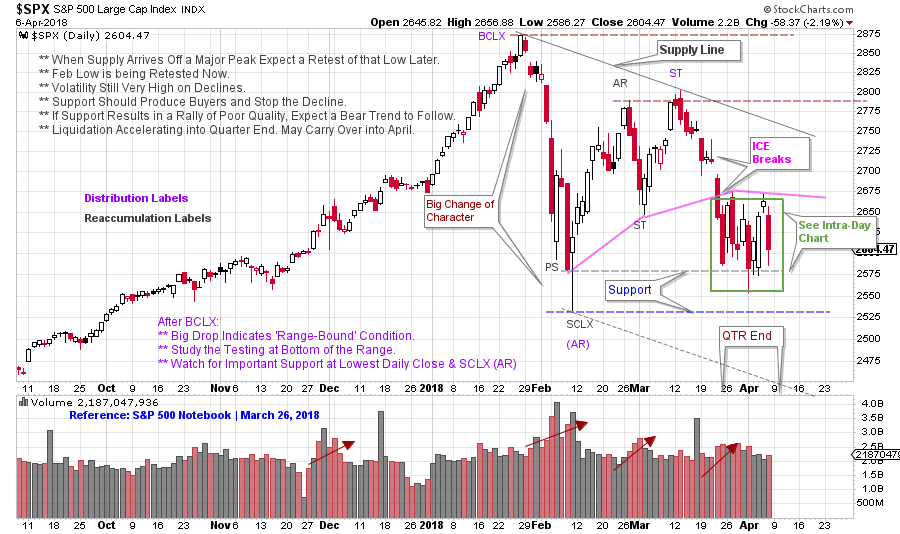
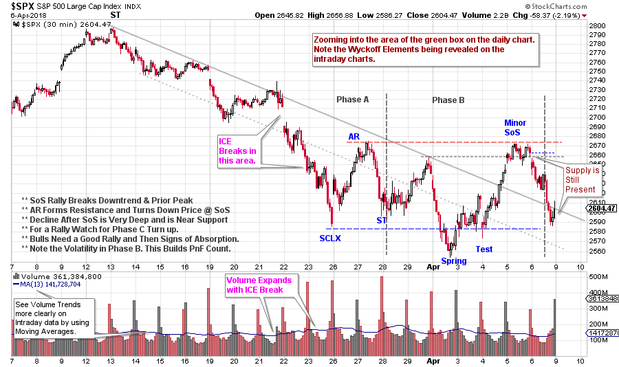

# S&P 500. Zooming In.

URL: https://articles.stockcharts.com/article/articles-wyckoff-2018-04-sp-500-zooming-in/
Date: April 08, 2018 at 01:20 PM
Author: Bruce Fraser

Wyckoff Method tools can be used in multiple time frames. We can often gain clarity by evaluating larger or smaller chunks of time. We recently studied the daily bars of the S&P 500 as it approached important Support. So far, this Support has been respected. Let’s review this chart first published on March 26th(click here for a link) and then zoom down into a smaller view and see if anything is revealed.

---

(click on chart for active version)

Currently the $SPX is respecting the higher Support line drawn on the lowest daily close. The concept of breaking the ICE comes into play here. Breaking the ICE is a subtle concept that is immensely useful, once understood. On the drop from the Secondary Test (ST) a sudden sharp break, on volume, takes the $SPX to Support. This is a ‘Break of the ICE’. The gap that starts the acceleration is a critical clue. A pink line is drawn to approximate the Support that $SPX is trying to hold as it attempts to rise to the Resistance at the Buying Climax (BCLX). Once ICE is broken a repeated attempt is often made to get back above the ICE. That is what is happening currently. It can be difficult to get back above the ICE.

ICE is a concept that is associated with Distribution. Often there are two levels of ICE. We are looking at an example of the first level of ICE. The lower ICE would likely form upon the break of the Support at the Selling Climax (SCLX). Note the congestion of price in the green box nesting at the end of the first quarter. A sudden break of this zone in a comparable manner to the earlier break off the ST, would strongly argue for this lower ICE being cracked. A sudden, sharp drop with wide price bars and high volume, that shatters a Support area, is a candidate for breaking the ICE. An inability to climb back above the broken Support is the confirmation.

The failure of the lower Support would put the market in a place where a downtrend could begin. Is there a possibility that $SPX is poised to rally off of the current Support and thus move away from the danger-zone? Possibly an intraday chart could help.

(click on chart for active version)

On this 30 minute intraday chart, the decline from the daily chart’s Secondary Test (ST) is isolated. The gap down on March 22nd begins the act of breaking the ICE. Wyckoff Elements are at work on this smaller timeframe. A Selling Climax (SCLX) accelerates down out of the Trend Channel. The Automatic Rally (AR) and the SCLX forms Support and Resistance and note how well $SPX remains confined to this area. The Spring is in Phase B. The decline from the Sign of Strength rally is deep and indicates evidence of overhanging Supply. The bulls need a rally soon that shows demand taking control. A rally above the SoS area, followed by a shallow Backup (sign of Absorption) would be a bullish indication.

Earnings season is upon the market. Keeping the market low and near Support into the beginning of earnings announcements is a classic Composite Operator (C.O.) maneuver. This keeps pessimism high. A sudden Jump up and out of this trading range would reveal the intentions of the C.O. to take them up.

The absence of this strength and then the sudden fall below Support with continuation of high volatility would reveal the bears are still in charge. The market is truly on the bubble here.

All the Best,

Bruce
