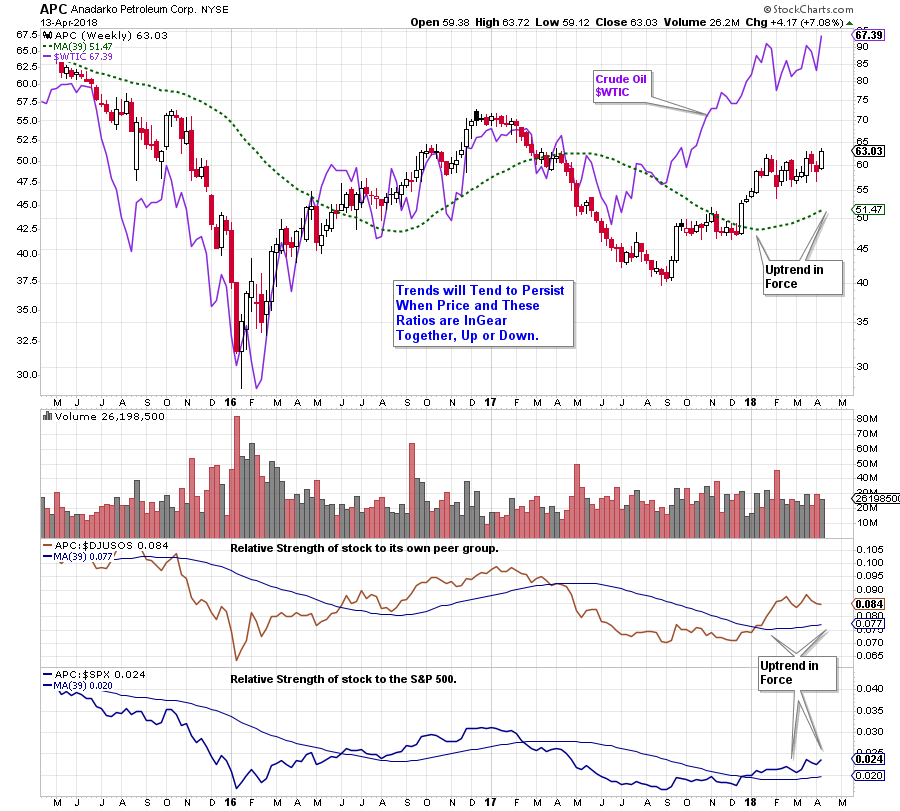
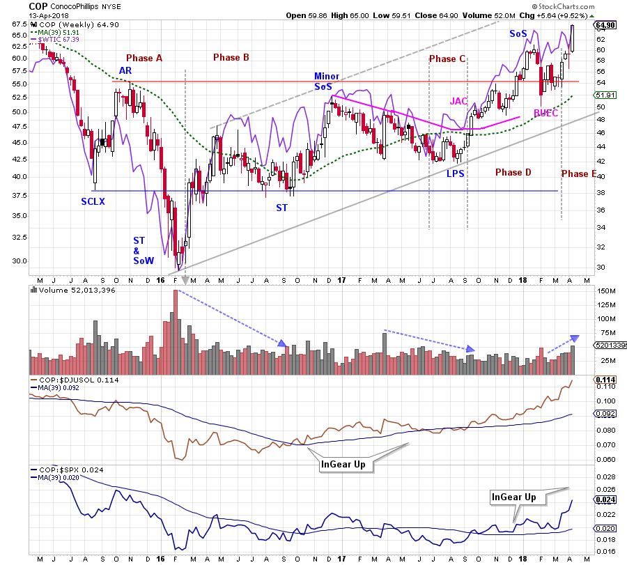
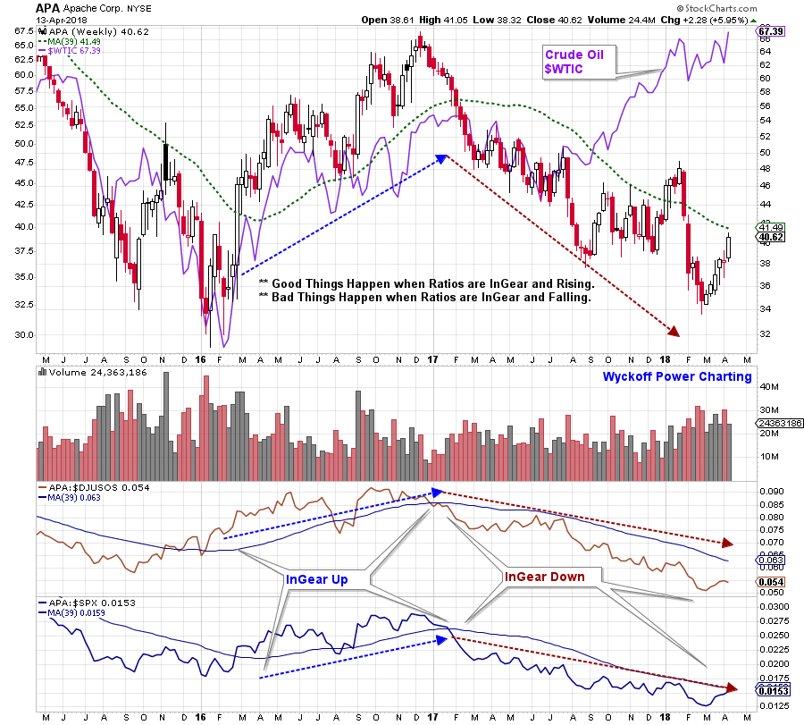

# Win the Race with Relative Strength

URL: https://articles.stockcharts.com/article/articles-wyckoff-2018-04-win-the-race-with-relative-strength/
Date: April 15, 2018 at 03:00 PM
Author: Bruce Fraser

Fellow Wyckoffian, Dan, emailed a very good question this week. Dan is seeing the energy stocks move up and he observes that being a cyclical industry, these stocks typically move in unison. Dan is observing that some of the stocks are completing Accumulation phases while others are already in uptrends. He asks how to select the likely best performers among these stocks.

The Wyckoff Method offers excellent techniques for identifying the best stocks in the best groups. Stockcharts.com has given us great tools for modernizing these concepts. In addition to trendline analysis and Point and Figure studies, Relative Strength is immensely powerful for determining the best stocks to buy or sell. Stockcharts.com offers tools to evaluate entire groups of stocks efficiently. Let’s attempt to build a framework that can produce answers to Dan’s question.

---

(click on chart for active version)

There are three important relationships on this chart that we will focus on. First is the stock price to the 39 week moving average (39 WMA). Next is the relative strength ratio of the stock to its industry group and the 39 WMA. The bottom ratio is the stock to the S&P 500 and its 39 WMA. An uptrend in each is defined as being above a rising moving average. Here we can see that Anadarko Petroleum (APC) is above the moving average in each case. The stock price of APC is in an absolute uptrend by being above its rising long term moving average. APC is also rising faster than its peer group and this is defined in the middle data series, by the relative strength trend being above the rising moving average. The third series represents the performance of APC relative to the stock market (defined as the S&P 500). The relative strength line above the rising 39 WMA indicates that APC is performing better than the index. We choose the S&P 500 as it is the benchmark that many institutional managers are measured against.

Persistence of the uptrend (or downtrend) is more likely when these ratios are InGear together. Portfolio managers will continue to favor a group and the stocks within it when they are rewarded with outperformance from that investment.

(click on chart for active version)

Combining Wyckoff tape reading studies of price action with the relative strength ratios, a message emerges for ConocoPhillips (COP). After the Secondary Test (ST) and Sign of Weakness (SoW), evidence of Absorption develops. At the next ST volume dries up and volatility diminishes. The ST approximately equals the Selling Climax (SCLX) which proves to be important Support. Note that COP begins a confirmed upward trend in relation to its industry group ($DJUSOL) during the rally from the ST to the Minor Sign of Strength (SoS). The descent from the Minor SoS to the Last Point of Support (LPS) is more evidence of Absorption. During this grind downward make note of the COP/$DJUSOL trend. This long decline results in the COP/$DJUSOL ratio returning to the 39 WMA but does not turn the ratio 39 WMA down. The uptrend holds and the rally resumes after the LPS. This rally phase puts price and the two ratios in gear upward. COP is now in a leadership position. It rallies above key Resistance and then has a shallow Backup before resuming the uptrend.

(click on chart for active version)

Apache Corp. (APA) illustrates what can happen when ratios get InGear in a downtrend. While COP is demonstrating attributes of an emerging uptrend, APA is decidedly downward and the ratios are very clear on this point. Note how APA is well correlated to crude oil ($WTIC) until the middle of 2017 when they diverge. The ratios picked up the APA underperformance very early in 2017.

For homework make a directory of the energy stocks (and other industry groups of interest) and use the chart format above to evaluate each stock. You will develop an eye for determining the leaders and laggards in the group. Stay with the leaders.

All the Best,

Bruce

For Additional Resources on Wyckoff and Relative Strength click Here and Here and Here
