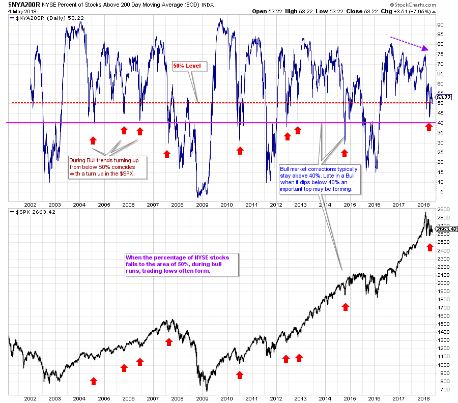

# Does This Market Have Bad Breadth?

URL: https://articles.stockcharts.com/article/articles-wyckoff-2018-05-does-this-market-have-bad-breadth/
Date: May 04, 2018 at 06:53 PM
Author: Bruce Fraser

The percentage of stocks above their 200 day moving average (200dma) is a breadth indicator that I have depended on for many years. It theoretically oscillates from zero to 100 percent. During bull markets this oscillator spends most of its time between 40% and 85%. During bear markets between 60% and 5%.

We chartists pay close attention to the position of our stocks to the 200dma. I seek stocks that are above their rising 200dma. This is a useful definition of an uptrend in force. When the inevitable correction arrives, we will look for the stock price to return to the 200dma and find Support there. Often the stock’s correction will dip below the average for some brief period of time.

When a stock falls below the 200dma and spends significant time there, the average bends downward. A stock below a falling 200dma is an excellent definition of a downtrend in force.

(click on chart for active version)

This oscillator is a unique breadth indicator. It keeps track of the percentage of stocks in the NYSE Composite Index ($NYA) above and below their respective 200dma. A net number is calculated and plotted. We see in aggregate the net percentage of stocks above their 200dma. In a bull market uptrend, the $NYA200R will often dip slightly below 50% during index corrections. Observe what happens as a bear market approaches. The oscillator turns down well before the peak of prices and then persistently falls to about the 30% level (2007 & 2014) before stabilizing. Corrections in a bull will fall to, and stabilize above, the 40% area.

The current correction (from the January high price) has resulted in a shallow break below the 50% level, consistent with prior bull market dips. A bounce followed that returned the indicator back above 50%, and now it is at 53.22%. Fully one half of the stocks in the NYSE Composite are above their 200dma. This indicator is suggesting that we view the current market condition as a correction in a bull market.

Let’s continue to watch this indicator as it should deteriorate in advance of important bull market tops. Also, when it dips into the 30% range it is flashing a warning the majority of stocks are below their 200dma and thus in downtrends. And this is the condition that bear markets are made from. Currently that is not the case.

All the Best,

Bruce

Announcement: Thank you to Erin and Tom for having me as a guest on MarketWatchers LIVE this past Thursday. It was a blast! For you Wyckoffians interested in volume analysis, please check it out. Erin published the slides which you can see by clicking here. To watch the video recording click here.
