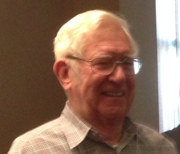
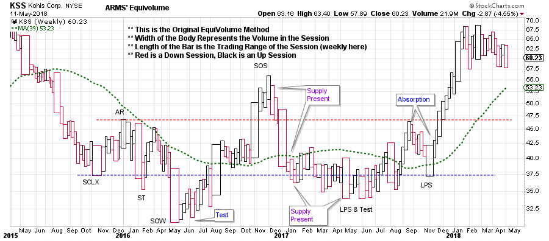
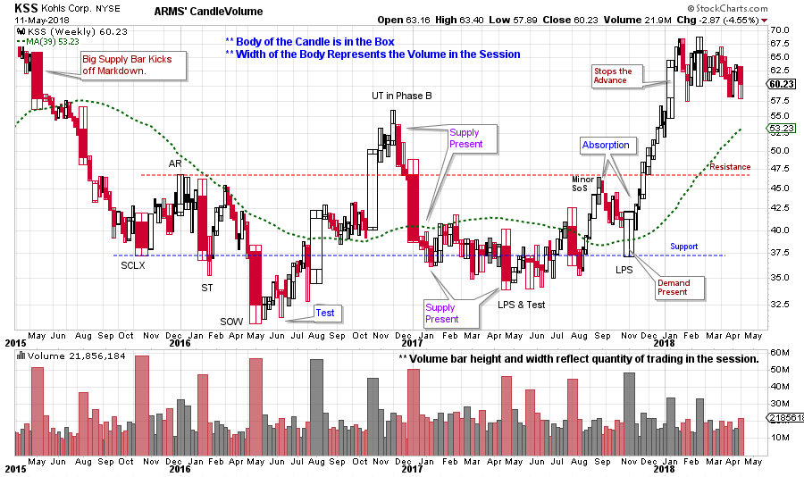

# Richard W. Arms Jr., Wyckoffian

URL: https://articles.stockcharts.com/article/articles-wyckoff-2018-05-richard-w-arms-jr-wyckoffian/
Date: May 12, 2018 at 04:30 AM
Author: Bruce Fraser

Richard (Dick) Arms was a very creative market technician. He tackled one of the most elusive concepts in technical analysis: Volume. He became famous for creating the ‘ARMS Index’ (previously known as the TRIN Index). Dick created the ARMS Index in 1967 and published it in Barron’s Magazine. It caught on very quickly. Because it compared the ratio of advancing and declining stocks to the ratio of up volume to down volume, it was understood to be a sentiment gauge. Quote platforms began to include the ARMS (TRIN) Index on their systems (read more about the Arms Index by clicking here).

---

Dr. Hank Pruden taught a special graduate course on Volume Analysis in the early 80’s, which I attended. It was a fantastic course. During the semester students were required to chart stocks, by hand, using Equivolume Charting devised by Mr. Arms. Equivolume charts plot the high, low and close of the range with the added dimension of including the volume component on the bar. The width of the bar reflects the period’s volume. Narrow bars were light volume periods and wide bars were high volume. These were tricky bars to draw as each needed to be proportionately accurate in width to the other preceding bars.

Dr. Pruden warned us about how rigorous the final would be on the last night of class. So, we all studied hard and prepared carefully for the final. On that last night (we were always sad when one of Dr. Pruden’s classes came to an end) we were informed that the final would actually be a guest lecture by Richard Arms. What a wonderful class that was. Mr. Arms gave the most interesting talk on the many attributes of volume. We didn’t want the evening to end. The entire class then went to dinner with Richard and Hank and the discussion continued.

Over the years that followed Dick and I became friends, largely because we had something very special in common; The Wyckoff Method. We could talk endlessly about all things Wyckoff. He told me that he, first and foremost, considered himself a Wyckoffian. And that the importance of volume was impressed upon him by his Wyckoff studies.

We lost Dick in March of this year. He will be dearly missed. This kind, gentle, brilliant and generous soul contributed a richness of innovation to the study of financial markets. It brings joy to our community to know that Mr. Arms was one of our Wyckoffian Giants.

Let’s celebrate the life of Richard Arms by studying one of his more recent creations, the Arms' CandleVolume chart, featured here at stockcharts.com.

(click on chart for active version)

The above chart is an example of the original ARMS' Equivolume charting method. The price bars vary in width by the amount of volume exchanged in that session. The length of the bar represents the price range for that trading period. CandleVolume charting (below) adds the visual elegance of blending Equivolume with Candlestick charting.

(click on chart for active version)

Inside each CandleVolume box note the body of the candle and the upper and lower shadows (tails). There is such a visual richness of information for Wyckoffians in these bars. Also note that volume bars can be included below the chart and their width also varies.

The Kohl’s (KSS) chart illustrates some analytical features of the ARMS' CandleVolume chart. The May 2015 decline begins with a wide bar (emerging supply) which kicks off a decline into October where a Selling Climax (SCLX) stops the trend with a wide high volume bar. Note how the Automatic Rally (AR) and the SCLX stand out. Support and Resistance is now set. Key lows such as the Sign of Weakness (SOW) and the Last Point of Support (LPS) are volatile and wide bars that stop the decline. A successful Test of those lows are on thin bars and shows that supply has dried up (evidence of Absorption). The final LPS has a wide body and a long tail which is evidence of demand. A good rally out of the trading range follows.

Spend some time studying your favorite stocks and indexes with ARMS' CandleVolume charts and see if it adds a new dimension to your Wyckoff analysis. And thank you Richard Arms for sharing your generous and innovative Wyckoffian spirit with all of us.

All the Best,

Bruce

Announcements:

Wyckoff Market Discussions, Free Session: Roman Bogomazov and I will be celebrating the 100th session of our Wyckoff Market Discussions on May 23rd. To mark this occasion, we will be making this webinar free to attend: please click here to register now! In the Wyckoff Market Discussions we evaluate the present position and probable future direction of major indices, sectors, industry groups and stocks. Our main intention for the WMD is to impart unique Wyckoff-themed education and analysis. Join us on May 23rd from 3pm to 5pm (PDT) for this special (and free) session. To register for the event click here. For more information click here.

MarketWatchers LIVE Announcement: This coming Monday, May 14thfrom 12-1:30pm EDT, I will join Erin Swenlin on MarketWatchers LIVE. Please tune in. Click here for more information.
