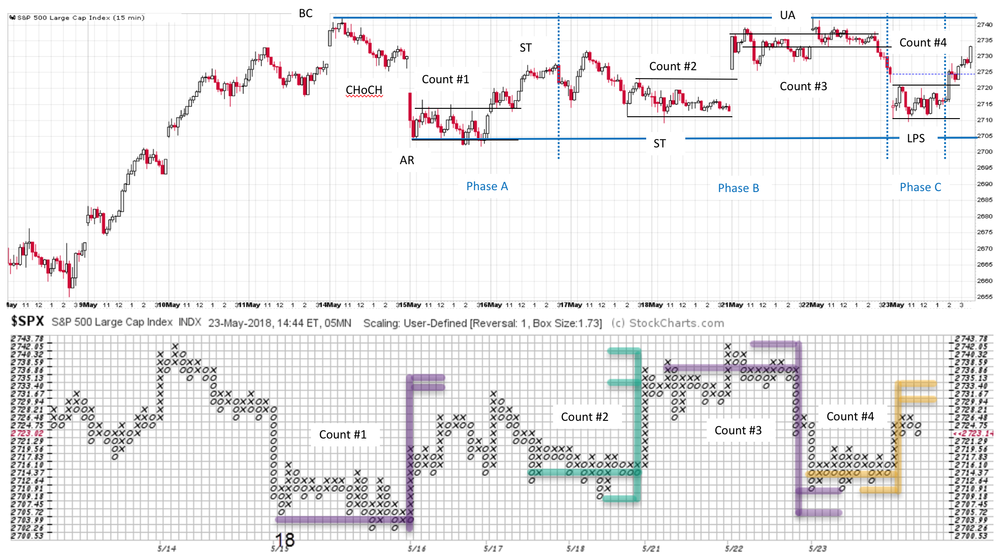
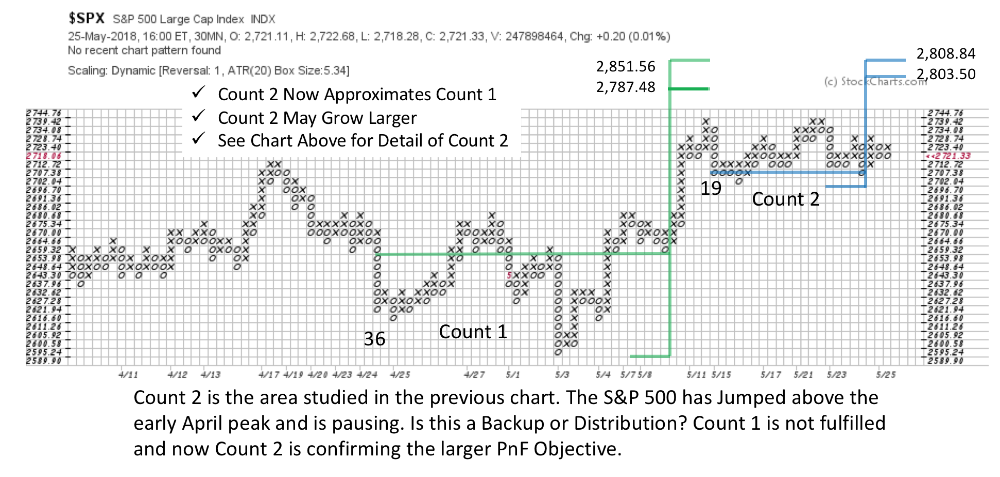

# Ship in a Bottle

URL: https://articles.stockcharts.com/article/articles-wyckoff-2018-05-ship-in-a-bottle/
Date: May 26, 2018 at 01:08 PM
Author: Bruce Fraser

A model ship in a bottle reminds me of the intricate detail, on a minature scale, available with the Wyckoff Method. Wyckoff analysis scales up, into very large timeframes, and down into the shortest of timeframes. Those who study and trade on an intra-day basis should consider adding these Wyckoff tools for analyzing smaller timeframes.

Very large time periods are ideal for campaign trading very long term trends. While intra-day charts are best for short term and swing trading. As a normal practice I keep and count intra-day index Point and Figure charts. This helps keep me in the flow of what the markets are doing. PnF charts simplify the view of the current intra-day market activity making it easier to evaluate conditions. Also, PnF provides the means to measure potential price objectives with the horizontal counting method.

---

Fellow Wyckoffian and teaching partner, Roman Bogomazov, took one of my PnF S&P 500 ($SPX) charts and aligned it to the 15 minute vertical chart. Note how well the trading counts work. When using intra-day data, you will get best results by using ATR scaling. Here 5 minute data is used and is matched up to a 15 minute vertical chart. Roman has labeled my four counts on the vertical and PnF charts. He has also provided the tentative Wyckoff Analysis (with the Phases). These minor PnF counts repeatedly flag (with accuracy) the top and bottom of the trading range that is in force. Meanwhile the entire trading range is developing a PnF count on a larger scale.

Zooming out to the 30 minute PnF chart changes the perspective. Now we can count the consolidation evaluated in the prior (5 minute) view. Often when the two PnF counts are approximately equal, the market is ready to begin trending again. Also Count 1 has not yet been fulfilled, suggesting there is fuel for higher prices ahead. Each of the four counts studied on the prior chart are contained inside the trading range of Count 2. If Count 2 is Distribution we would expect to see volatility increase in the trading range as it concludes and commits to a new downtrend.

All the Best,

Bruce

For additional reading on Intra-day PnF construction click here.

Announcements:

Many thanks to everyone who attended the 100thAnniversary session of the Wyckoff Market Discussion (WMD). Because you were there it was a wonderful Wyckoffian Celebration! Roman and I are thrilled that so many of you signed up for the special WMD promotion. It is not too late to join the party by viewing the recording, which we posted on youtube.com, click here for the link

Also, it is not too late to take advantage of the Special Offer of attending the next three sessions for only $30 (this offer goes through 5/30). Learn more about WMD, and sign up for the promotion by clicking here.

Join me on Twitter. I have just begun tweeting @rdwyckoff. I will be confining my tweets to our favorite subject: The Wyckoff Method. See you there.
