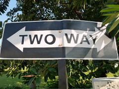
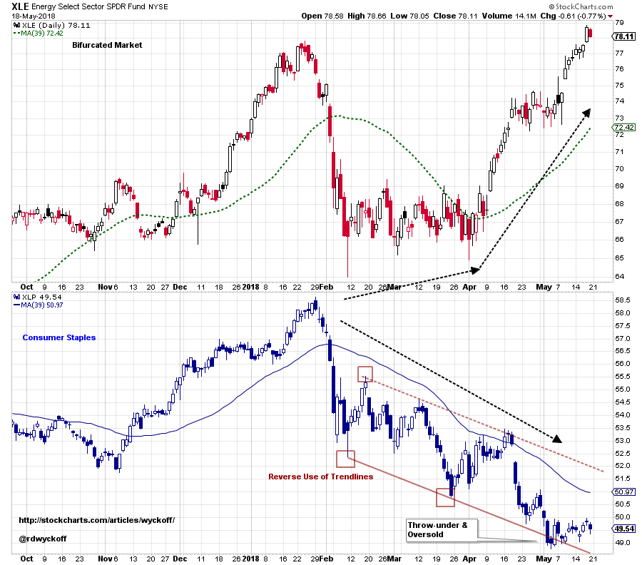
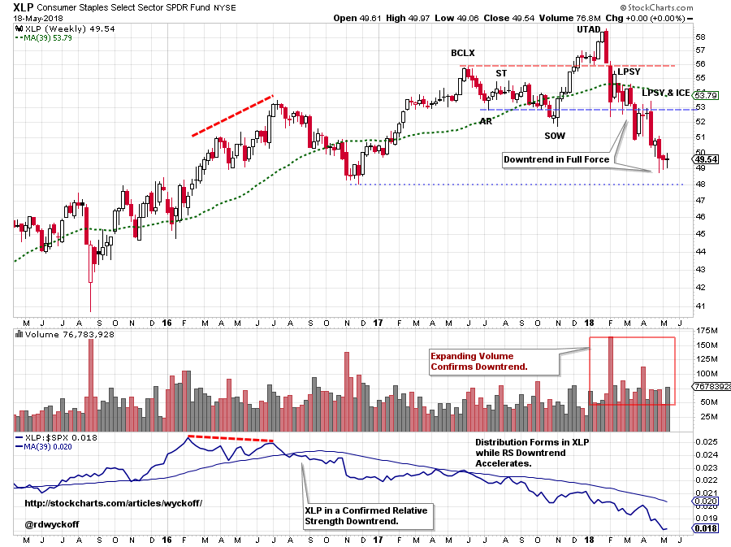
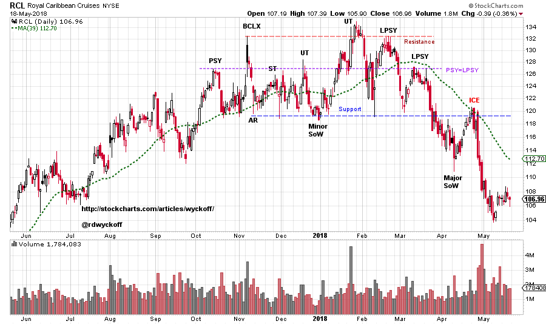
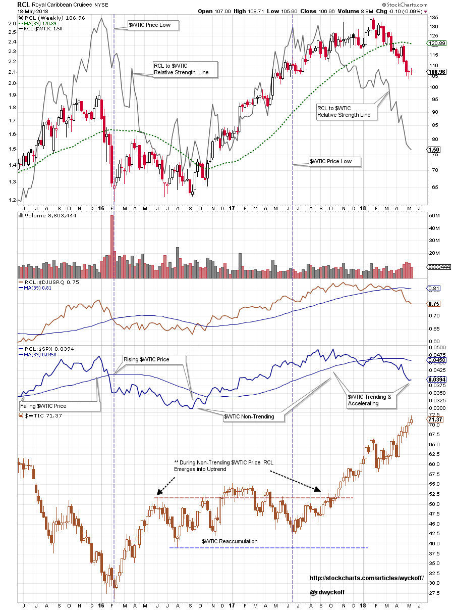
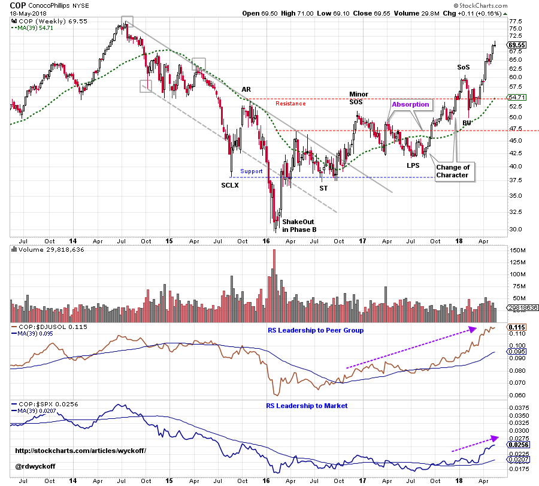

# Two Way Markets

URL: https://articles.stockcharts.com/article/articles-wyckoff-2018-05-two-way-markets/
Date: May 20, 2018 at 02:30 AM
Author: Bruce Fraser

Since 2016 the broad stock market has been in a robust uptrend. Corporations have enjoyed an environment of stable and low interest rates with moderate rates of inflation. Such a backdrop of business conditions allows companies to efficiently manage their costs and grow earnings. Investors are willing to pay higher prices for stable and steadily rising earnings and sales.

One of the biggest cost inputs for corporations is energy costs. The price of energy permeates every aspect of the cost structure. When energy prices are stable or falling macro business conditions benefit. Business dynamics are rocked when energy input prices rise, and even worse, accelerate. Rising and accelerating energy costs eventually become inflationary as businesses must pass these costs on to their customers.

---

These conditions impact stocks in various industries in unique ways. But rising energy costs is a macro issue for the economy. Another macro impact on business and the economy is interest rate trends. Often interest rates and inflation trend together. When they trend upward it can be a toxic brew for corporate finance. As Wyckoffians we intently read the tape and look for the price shifts caused by these large forces. Our belief is that tape reading will reveal more about these tectonic shifts and reveal them earlier.

(click on chart for active version)

The broadly uptrending bull run that began in 2016 is being replaced by a Two-Way market. Sector and Industry Group themes were rising largely in unison and now they appear to be fighting against each other, in many cases. Here the Energy Sector (XLE) and Consumer Staples (XLP) dropped together from the January peak. Then XLP kept declining while XLE caught a bottom and turned upward. Are rising energy costs weighing down Consumer Staples? Where synchronicity was at work before, now these two sectors have become bifurcated. Note that XLP has become oversold below the trend channel, while XLE is having a minor Climax above the January high price.

(click on chart for active version)

Zooming out we see the Consumer Staples sector with emerging Distribution beginning in May of 2017 with a Buying Climax (BCLX). Note that XLP Relative Strength diverges from the price trend in early 2016 and enters a downtrend in August of 2016. Now as Crude Oil is accelerating upward, XLP is dropping into a confirmed downtrend. Note the rapid drop of XLP once the Up Thrust After Distribution (UTAD) is complete.

(click on chart for active version)

Royal Caribbean Cruises (RCL) is a case study in the destabilizing influences of rapidly changing cost inputs. Energy, Interest Rate, Food and Labor cost inputs all affect RCL. When these costs are rising and accelerating it can destabilize the business model and squeeze profits. RCL is a dramatic example but these influences can impact many industries. Wyckoff analysis does a stellar job of signaling early that business conditions are changing.

(click on chart for active version)

There is a lot going on in this weekly RCL chart. A robust uptrend begins in 2016. On the Crude Oil ($WTIC) chart at bottom it can be seen that oil prices are generally stable and trendless during 2016-17. RCL is rising nicely during this period and out-performing both its Industry Group ($DJUSRQ) and the S&P 500. RCL is bull market leadership. Behind the price chart is a Relative Strength chart of RCL to Crude Oil. Note how well this ratio correlates with the stock price. When the ratio is rising RCL is outperforming $WTIC. In mid-2017 the ratio line turns into a downtrend and the RCL uptrend stops. A Distributional top follows. Now as energy prices accelerate upward RCL is dropping quickly.

(click on chart for active version)

The economy is still expanding. In Two-Way markets we Wyckoffians seek what is working and what is not. Above is an example of what is working. Study how a two year Accumulation forms for Conoco-Phillips (COP). After the Minor Sign of Strength, price declines in two long corrections that cannot return to Support. These are attributes of Absorption. The rally that follows is a distinct ‘Change of Character’ where price climbs up and out of the Resistance area. Only a shallow Back Up (BU) follows. Relative Strength analysis tells a story. COP rises into a confirmed RS uptrend to its peer group ($DJUSOL) in the 4thquarter of 2016. Thus, COP is industry group leadership. In the 4thquarter of 2017, COP emerges into a RS uptrend to the S&P 500 Index. COP is in-gear up.

Two-Way Markets is the current reality for stock traders. Having good tools and skill sets to find the best uptrends and avoid the downtrends is the key to the current markets. These are the markets where we can hone our Wyckoffian technique.

All the Best,

Bruce

Announcements:

Wyckoff Market Discussions, Free Session (this Wednesday): Roman Bogomazov and I will be celebrating the 100thsession of our Wyckoff Market Discussions on May 23rd. To mark this occasion, we will be making this webinar free to attend: please click here to register now! In the Wyckoff Market Discussions we evaluate the present position and probable future direction of major indices, sectors, industry groups and stocks. Our main intention for the WMD is to impart unique Wyckoff-themed education and analysis. Join us on May 23rdfrom 3pm to 5pm (PDT) for this special (and free) session. To register for the event click here. For more information click here.
