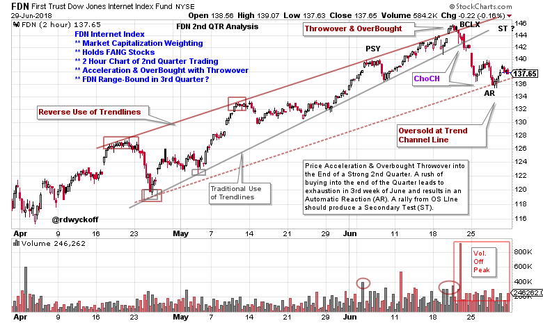
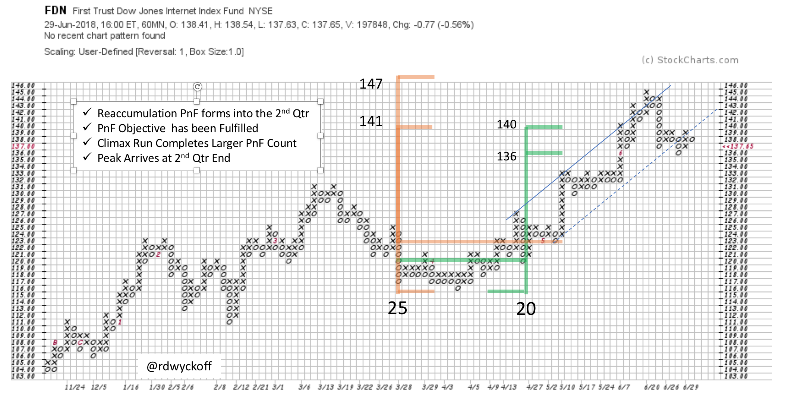

# A Mid-Year Look at FANG Stocks

URL: https://articles.stockcharts.com/article/articles-wyckoff-2018-06-a-mid-year-look-at-fang-stocks/
Date: June 30, 2018 at 07:14 PM
Author: Bruce Fraser

Remember to tune in this coming Thursday, July 5th, when I will be a guest on MarketWatchers Live. I recently promised to drill down into intraday charting using the Wyckoff Method. The Wyckoff technique works very well on smaller timeframes and it is fun to do. On Thursday I will devote my time to this analysis. Please join us.

The First Trust Dow Jones Internet Index Fund (FDN) was a stellar performer in the 2nd quarter gaining 14.23%. A major contributor to FDN performance, were the FANG stocks in this capitalization weighted ETF (AMZN, FB, GOOG, GOOGL, NFLX). Though there are 42 stocks in the fund approximately 35% of the weight is in these five symbols. For the sake of this exercise we will assume that FDN is our imperfect proxy for a FANG index.

---

(click on chart for active version)

Here we construct a 2-hour vertical chart of FDN that captured the action in the 2nd quarter. Note that in May and June the rate of advance of the FDN uptrend accelerated (gray trendline). There appeared to be a Climactic surge that ended with a Throwover of the Trend Channel on expanding volume. This Overbought condition resulted in a failure and reversal, on volume, that fell to the bottom of the uptrend channel. This was a Change-of-Character (CHoCH). The steepening ascent was a rush by large interests to accelerate their buying into the end of the second quarter (typically called portfolio window dressing). The OverBought Buying Climax peak came in the 3rd week of June (just before quarter-end) and resulted in exhaustion of the uptrend. The acceleration of buying into the end of the 2nd quarter will likely lead to a temporary lack of good demand for internet and FANG stocks as the 2nd half of the year begins.

Wyckoffians always wait for a Cause to be built before the next move begins. Recall that an uptrend is stopped with the sequence of Preliminary Supply (PSY), Buying Climax (BCLX), Automatic Reaction (AR) and Secondary Test (ST), often producing a Range-Bound condition. Additional price action is needed to determine if a Reaccumulation or Distribution is forming (which is the development of a new Cause). Note how a 2-hour chart provides excellent detail for analysis. Speaking of developing a Cause let’s look at the Point and Figure Chart (PnF).

A Reaccumulation forms across the last week of the 1st quarter and first month of the 2nd quarter and generates two counts that presciently flag the potential of the advance, and both materialize into the end of the 2nd quarter. This PnF chart is constructed on 60-minute data, with 1-box reversal construction and 1-point scaling. This intraday PnF chart is a reminder that a count will be generated (a Cause) prior to an important price trend. More on this when we meet Thursday on MWL. See you then.

All the Best,

Bruce @rdwyckoff

Announcement:

I will be a guest on MarketWatchers LIVE with Erin Swenlin on Thursday, July 5th from 12-1:30pm EDT. If you cannot make our live Wyckoff discussion, a recording will be available. See you then. (click here for more information)
