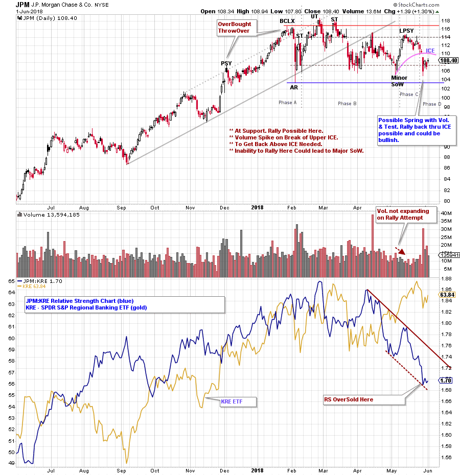
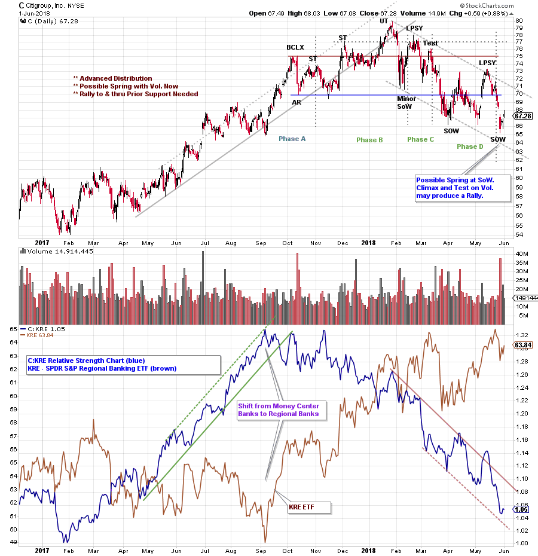
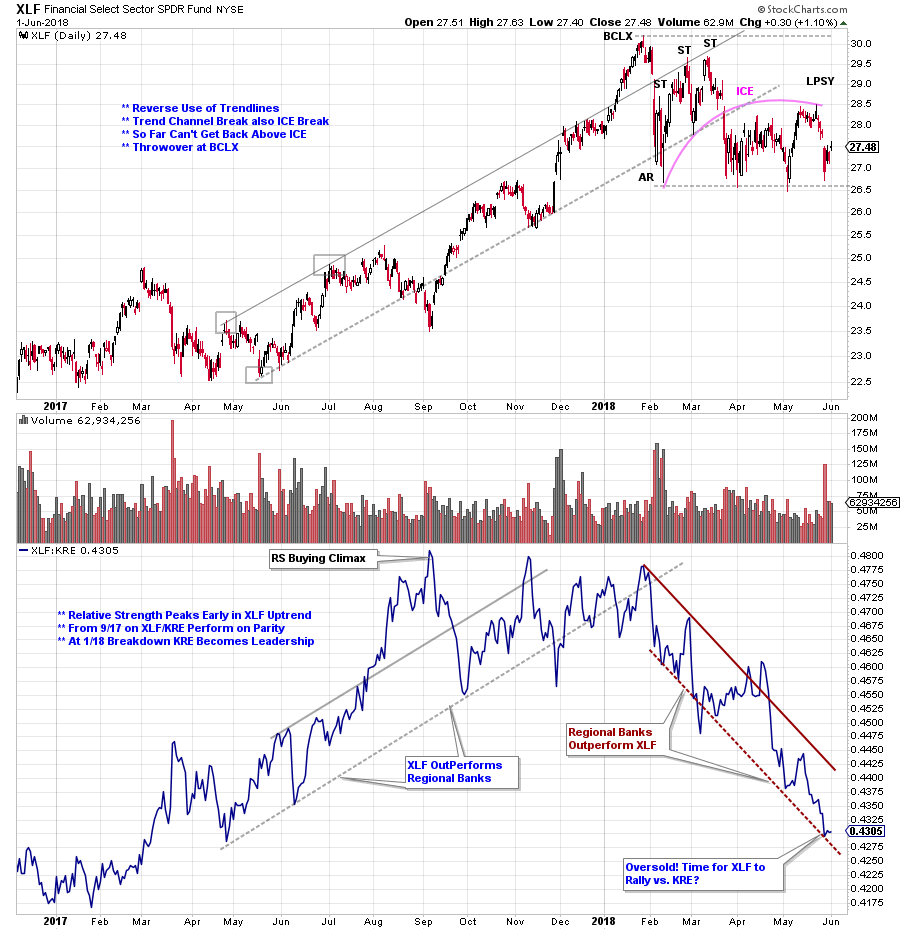

# BankRoll

URL: https://articles.stockcharts.com/article/articles-wyckoff-2018-06-bankroll/
Date: June 03, 2018 at 03:34 PM
Author: Bruce Fraser

Bank stocks are telling an interesting tale. As Wyckoffians we interpret the story the market is telling through the action of the tape. Banks are at the hub of the wheel of the economy. These financial institutions continually inject or remove liquidity from the economy through their operations. It has been said that money flow is the grease that lubricates the economic machinery. When the lubrication of money is being injected into the economy, it keeps the machinery running smoothly.

When banks are telling a tale on the tape it often has consequences for the macro-economy. Let’s have a look at the banks, with a twist, and see if there is a message for us.

---

(click on chart for active version)

J.P. Morgan (JPM) is the largest Money Center Bank in the Financial Sector ETF (XLF). Here we compare JPM to the S&P Regional Banking ETF (KRE). Money Center Banks have an international reach. Their banking footprint is complicated by international business conditions, sovereign debt issues, currency trading, domestic banking and more. Regional Banks are generally closer to their communities and their customers. They are more focused on lending and banking in their respective regions. In the current cycle, as the domestic economy heats up Regional Banking has become Relative Strength leadership. Since March KRE has become distinct leadership in comparison to JPM. Also, we can see that JPM is threatening to turn from Distribution to a Markdown. JPM has reached Support here and should attempt to rally. Stalling below the ICE could lead to a breakdown below important Support.

(click on chart for active version)

Citigroup is another important Money Center Bank. Note the RS leadership of C into September. This is the moment when KRE came to life (brown line) and C entered Distribution. Note how the Relative Strength line of C to KRE signals impending Distribution of Citigroup as bank stock investors favor the uptrend of the Regionals.

(click on chart for active version)

Here we compare the Financial Sector ETF (XLF) to the KRE. XLF encompasses stocks across the entire financial landscape (banks are a major component). The financial sector is well below the pace of the major indexes and the Regional Banks. The relative strength of XLF (to the Regional Banks) is in a steep decline. The combination of an oversold condition in the RS trend channel and being near Support argues that XLF is near a short term rally attempt. The strong domestic economy (and Relative Strength of the KRE) across all parts of the country is testimony to the great job Regional Banks are doing for business and consumers, big and small. Lagging performance of the Money Center Banks may warn of brewing trouble in other parts of the world.

All the Best,

Bruce

Twitter: @rdwyckoff

For Additional Reading on Distribution (click here)

Announcement:

I will be a guest on MarketWatchers LIVE with Erin Swenlin and Tom Bowley on Thursday, June 7thfrom 12-1:30pm EDT. If you cannot make our live Wyckoff discussion, a recording will be available. See you then. (click here for more information)
