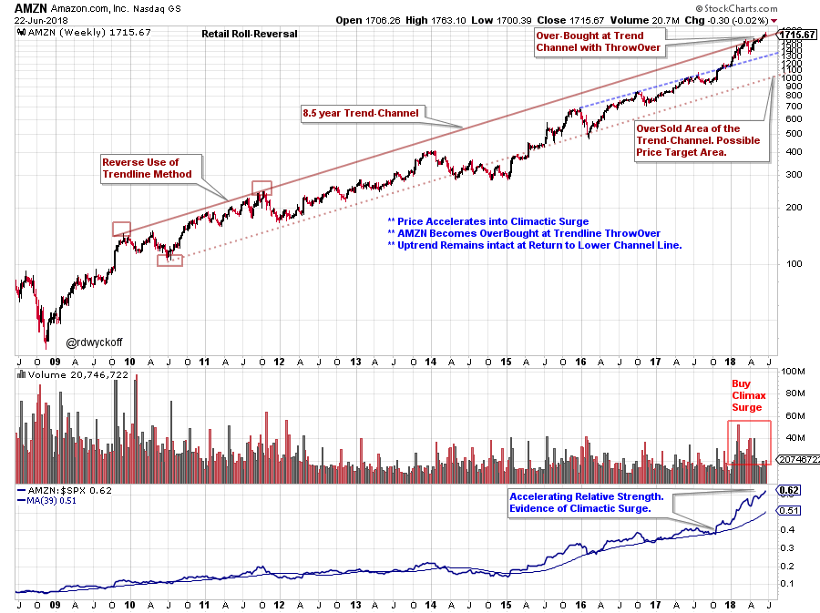
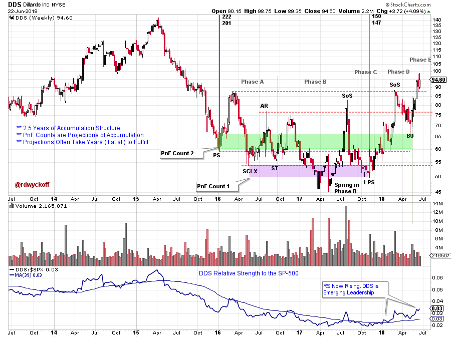
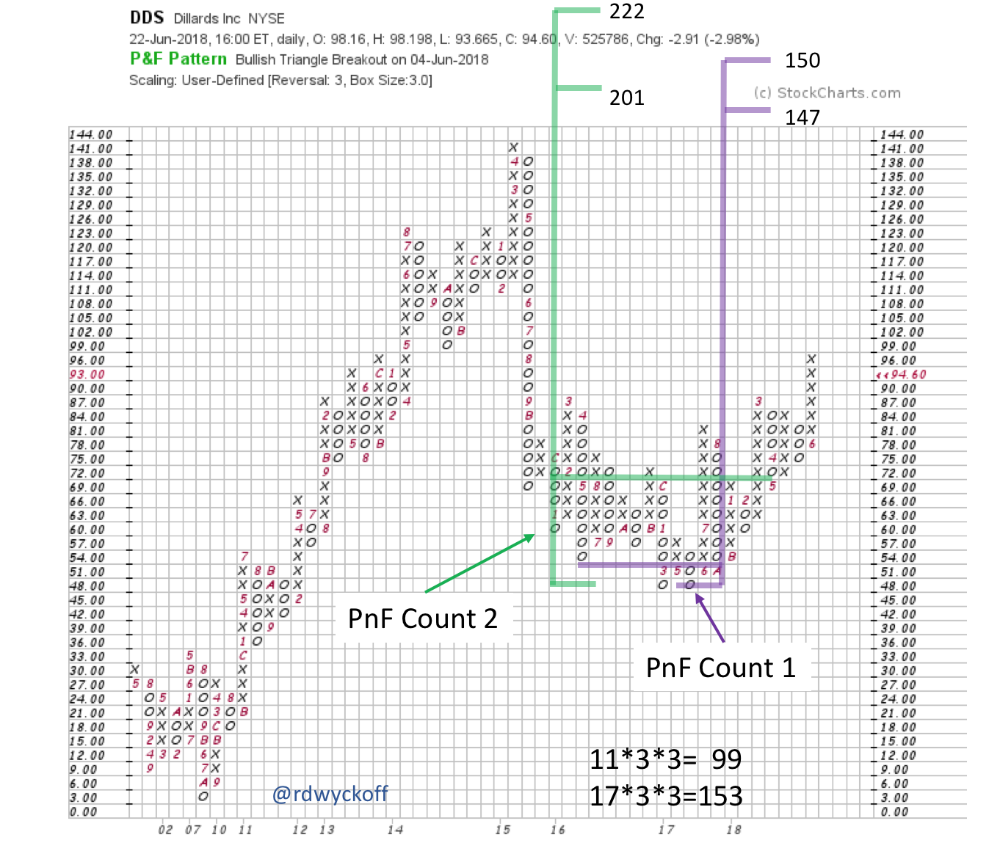

# Retail Roll-Reversal

URL: https://articles.stockcharts.com/article/articles-wyckoff-2018-06-retail-roll-reversal/
Date: June 24, 2018 at 04:07 PM
Author: Bruce Fraser

Internet retailers have not been required to charge sales tax for many online transactions. This has created a major advantage over the brick-and-mortar retailers. A recent court ruling could require internet retailers to include state sales tax on all purchases. Will this breathe new life into the traditional retailing stocks and make them more competitive with their internet counterparts? With the Wyckoff Method we always let the Tape guide our strategy.

---

(click on chart for active version)

Amazon.com (AMZN) is the end-all and be-all of internet retailing. Note the uptrend that has been in force since 2008. A trend-channel forms from 2009 and 2011 peaks which dictates the trend for 8 ½ years (so far). Since the start of the fourth quarter of 2017 AMZN’s rate of ascent has accelerated into the overhead trendline. This is the first throwover of this trendline since forming in 2011 and is an overbought condition. Also, as the second quarter of 2018 is coming to an end there has been a rush of buying in AMZN stock, just as this court ruling was announced. Relative strength also kicked into high gear and is further evidence of a Buying Climax. There is no telling how long a climactic surge can run. The stopping of a climactic surge is followed by a sudden reversal into the price weakness of an Automatic Reaction (AR). Transition into the new quarter often brings a change of character of stock price, and we will be watching AMZN closely for shifts in trading behavior. Until then, the trend remains our friend.

(click on chart for active version)

Internet retailing has created a headwind for some segments of the brick-and-mortar retailing space (see SHLD, FL, M, KSS, TGT, BBBY, TSCO and others). If the pendulum is swinging back to favoring some traditional retailers we would expect; 1) the Composite Operator (C.O.) to see the change very early on and begin building a position, and 2) the ‘Tape’ (Wyckoff chart analysis) to show the footprints of their activities. Our goal as a Wyckoffian is to become active in the stock (or theme) when the C.O. has largely finished their position building and the uptrend is in force.

Dillard’s (DDS) was a relative strength (R.S.) laggard from 2015 to late 2017 while price was in a steep downtrend. Evidence of ‘stopping action’ with Preliminary Support (PS) and a Selling Climax (SCLX), indicates the C.O. is putting a bid under DDS at value prices. The sequence of PS, SCLX, AR, ST defines the start of potential Accumulation by the Composite Operator. Completing Accumulation often takes years. Phase C is the final testing area of Support prior to the Phase D Markup that completes Accumulation. DDS is now out of the Accumulation area. Also, R.S. is now in an emerging uptrend.

Two PnF counts have been taken here. The smaller count returns DDS to just above the prior high price level. The PnF chart reveals a multi-year Accumulation with completion into a new uptrend. This suggests the C.O. has done their work and absorbed major portions of the available DDS stock with the intention of campaigning this stock for years to come.

If AMZN decides to take a rest from its stellar uptrend sometime in the future, institutional attention could shift to the more traditional retailing stocks (which appears to be already happening). This could occur just as they have become tightly held and emerging into the Markup Phase. An excellent combination of events to produce a robust uptrend.

All the Best,

Bruce

@rdwyckoff

For recent analysis of other retailing stocks click here and click here.

Announcement:

I will be a guest on MarketWatchers LIVE with Erin Swenlin and Tom Bowley on Thursday, July 5th from 12-1:30pm EDT. If you cannot make our live Wyckoff discussion, a recording will be available. See you then. (click here for more information)
