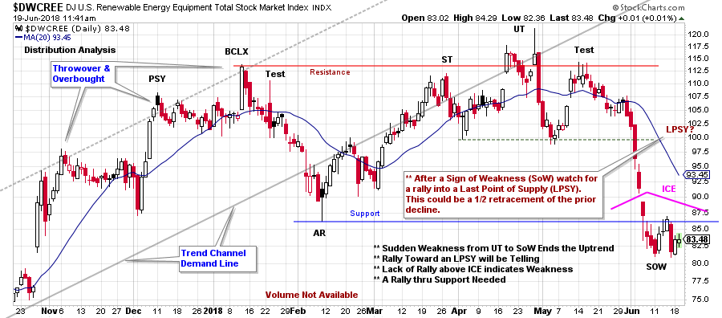
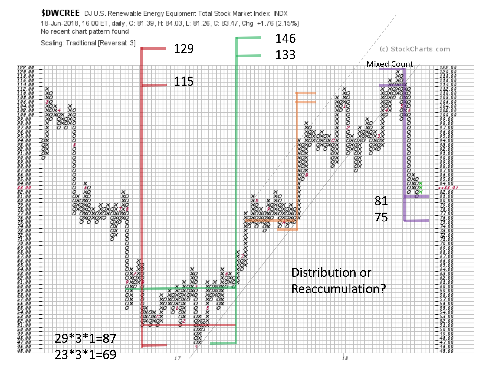

# Solar Stocks Go Dark

URL: https://articles.stockcharts.com/article/articles-wyckoff-2018-06-solar-stocks-go-dark/
Date: June 19, 2018 at 11:51 AM
Author: Bruce Fraser

Since mid-May the renewable energy stocks have tumbled. This may have come as an unexpected surprise to many. Let’s do a mini-blog case study of the Dow Jones Renewable Energy Equipment Index ($DWCREE) to determine if there was advance warning of trouble brewing.

As Wyckoffians we are really in the dark here as volume is not available. To shed some light on this problem, look at two actively traded renewable energy ETFs: TAN and ICLN. They have a family resemblance to $DWCREE (with volume) for study purposes.

---

(click on chart for active version)

Trend channel analysis shows that a prior uptrend was in place, and then broken on the completion of the Automatic Reaction (AR). The Preliminary Supply (PSY) and Buying Climax (BCLX) throw over the channel and fail, a classic overbought sign. The large amount of selling implied by the price weakness into the AR, is a massive Change of Character (CHoCH) that sets up a Range-Bound condition. The Resistance comes into play at the Upthrust (UT) and the Test where the selling of stock engulfs $DWCREE to quickly push prices lower toward Support. Downward volatility is more intense on the decline from the UT to the Sign of Weakness (SoW) than the prior decline to the AR. Classic Distributional qualities. Will the Support hold here? Often, after a SoW, a rally develops back into the trading range and is called a Last Point of Supply (LPSY).

A question to consider; could this be a Reaccumulation rather than Distribution? Let’s have a look at the Point and Figure chart (PnF).

An Accumulation PnF count preceded this robust uptrend of nearly a year and a half. Note the two count segments. The smaller count has been fulfilled and the larger still has some room to run. The severity of the trendline break indicates that work needs to be done to generate a PnF count for another advance. And this could happen, but time will be needed to build a new bullish cause.

A minor PnF trading count has just been fulfilled at $81 which may lead to a rally. A rise of poor quality to a lower high would complete a large Distribution structure. The nature of the next rally will be important for revealing the fate of $DWCREE in the months and years to come.

All the Best,

Bruce

Announcement:

Nearly every Wednesday afternoon, Wyckoff guru Roman Bogomazov and I conduct an online Wyckoff Market Discussion (WMD), during which we review the major U.S. indices, market sectors, several commodities and leading stocks through the analytical lens of the Wyckoff Method.

In our continuing quest to provide exceptional value to WMD participants, Roman and I recently decided to lower the monthly rate for current subscribers from $99 to $79. Until June 20th only, we are offering my blog readers the opportunity to take advantage of our revised WMD pricing policy. After that, the rate for new subscribers will revert to $99/month. Pleaseclick here now to lock in the rate of $79/month!
