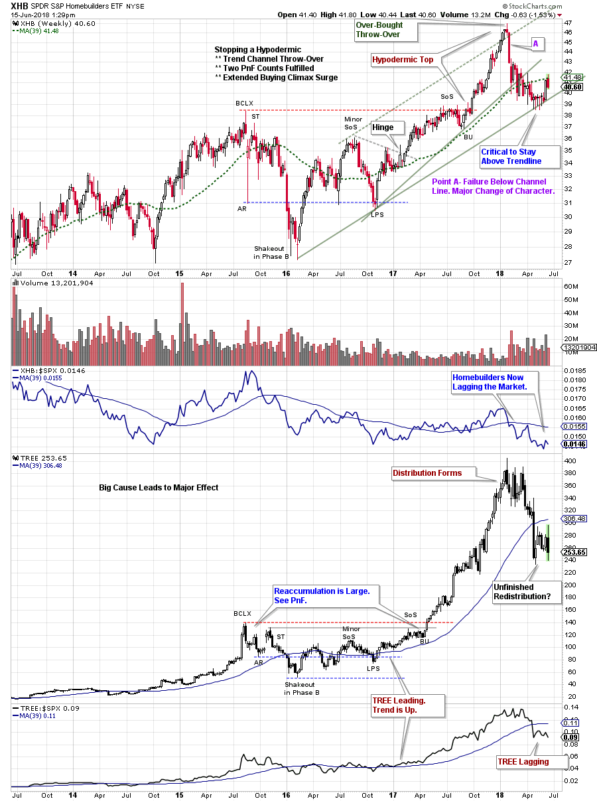
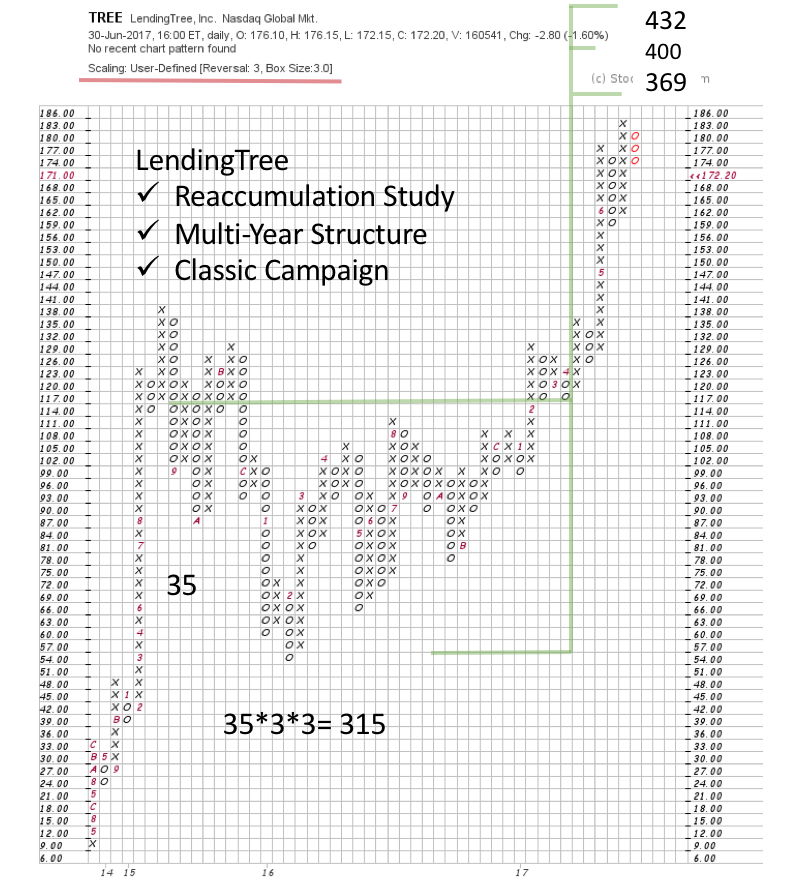
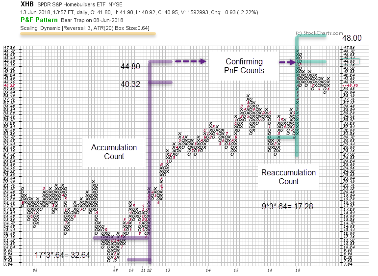

# Tale of the Tape

URL: https://articles.stockcharts.com/article/articles-wyckoff-2018-06-tale-of-the-tape/
Date: June 15, 2018 at 02:46 PM
Author: Bruce Fraser

As Wyckoffians we often generate a hypothesis regarding the forces that propel stocks and industry groups higher (or lower). Homebuilders enjoyed a major uptrend in 2016-17.

In this case study from 2016; interest rates were near historically low levels, thus we could conclude that home purchases would be stimulated. And homebuilding stocks should rally. The Wyckoff Method requires that such a theory be confirmed by market conditions. It is very important that the action of the market itself provide the evidence of the validity of the theory. In other words the 'Tale of the Tape' should be the final arbiter of whether a trade is taken or not.

---

(click on chart for active version)

The Homebuilding ETF (XHB) formed a wide and volatile Reaccumulation from 2015 to the end of 2017. This set up a pivot (or Hinge) that resolved into an uptrend. The ‘Tape’ was making the case for higher prices for Homebuilders. As Wyckoffians we always want to ask; are there other ancillary ways to participate in this emerging investment theme? Mortgage lending is the fuel that propels home sales. LendingTree (TREE) is a large mortgage, commercial, and consumer lending company. At that time when TREE was compared to XHB they formed Reaccumulation structures simultaneously. The lender and the builder were in lockstep! This was reinforcing evidence for the hypothesis of our case study.

The Reaccumulation formed by TREE produced a horizontal Point and Figure (PnF) count that was sizeable. Multi-year in duration this Reaccumulation fueled a major uptrend. From the PnF Countline of $117 a price objective of 369/400/432 was generated. It is customary to mark the mid-point of a PnF objective if the base is deep (volatile) as was the case with TREE. It took about a year for TREE to Jump out of the Reaccumulation and markup to the rally peak of $404.40 (almost perfectly touching the PnF mid-point of $400 – see bar chart above).

XHB is an ETF of the Homebuilders industry group. With this in mind let’s evaluate the PnF potential of the group during Accumulation (in purple) and Reaccumulation (in green). The Accumulation count (from the $12.16 countline) reaches to 40.96/44.80. The Reaccumulation confirms this count by matching the 44.80 objective. These objectives have been achieved with a Hypodermic Buying Climax into early 2018. A Hypodermic will typically not make a Distributional top, and instead will suddenly reverse downward, as happened here. The major warning of upside exhaustion came in three ways: An accelerating Buying Climax (BCLX), a throwover of the Trend Channel, the completion of two major PnF counts.

The tale of the tape is that an important trend was brewing for XHB and TREE. Each confirmed the other by simultaneously building a cause pivoting into major uptrends. They also exhausted their uptrends with dramatic and climactic finishes while fulfilling their respective PnF counts.

Some Wyckoffians prefer to generate a theory for the impending movement of a stock, group or the market. Other Wyckoffians allow the tape to lead them into a trade or campaign, with a willingness to let the market reveal the reasons later. Either way, the Wyckoff Method strengthens the approach. The ‘Tale of the Tape’ will confirm or refute the validity of the macro-analysis.

All the Best,

Bruce @rdwyckoff

Homework:

-Compare XHB and TREE to the TLT during the period of our case study.

-Which homebuilding stocks were leading and thus propelling the XHB higher in 2017?

-XHB has a larger PnF count segment to consider. Calculate that PnF count and flag it on your chart.

Announcement:

Nearly every Wednesday afternoon, Wyckoff guru Roman Bogomazov and I conduct an online Wyckoff Market Discussion (WMD), during which we review the major U.S. indices, market sectors, several commodities and leading stocks through the analytical lens of the Wyckoff Method.

In our continuing quest to provide exceptional value to WMD participants, Roman and I recently decided to lower the monthly rate for current subscribers from $99 to $79. Until June 20th only, we are offering my blog readers the opportunity to take advantage of our revised WMD pricing policy. After that, the rate for new subscribers will revert to $99/month. Please click here now to lock in the rate of $79/month!
